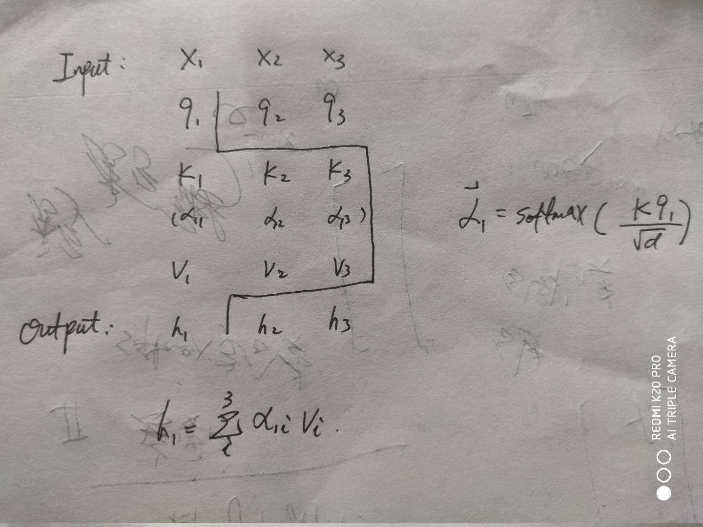

## 注意力机制
    参见《神经网络与深度学习》
### 神经网络的理解和注意力机制的引入
神经网络可以存储的信息量叫做 **网络容量**，一般来说，利用一组神经元来存储信息时，其网络容量与 **神经元数量和网络复杂度成正比**。如果要存储越多的信息，那么神经元数量要越多或者是网络要越复杂，这导致网络的参数成倍的增加，从而需要大量的计算资源。  
为了减少计算复杂度，引入了 **局部连接(CNN)、权重共享(CNN、RNN)** 和 **汇聚操作(CNN)** 来简化网络结构，但我们仍然希望在不增加模型复杂度( **主要是模型参数**) 的情况下，来提高模型的表达能力。  
比如用同一套网络(模型复杂度相同) `RNN` 来解决文本分类问题和阅读理解问题，前者是可行的，因为只要需要编码对分类有用的信息，用一个隐向量来表示文本语义是可行的。但是在阅读理解任务，这个编码向量很难反应文章的所有语义，另外编码时，还不知道可能会接收到什么样的问句，而这些问句可能涉及到文章的所有信息点，因此丢失任何信息都可能导致无法正确回答问题。那么就要提高模型的复杂度。  
有没有方法，在尽量不提高模型复杂度的前提下，增加网络容量呢？  
可以借鉴人脑处理信息的机制， **人脑的工作记忆大概只有几秒钟的时间，类似与神经网络中隐状态**，而人脑接收来自外部的信息相当的庞大，人脑在有限的计算资源下，通过 **注意力机制** 来有效的处理过载的信息。神经网络可以引入注意力机制，提高神经网络存储信息的容量。  
**在计算资源资源有限的情况下**，注意力机制作为一种有效的计算资源分配方案，将计算资源分配到更重要的任务，是解决信息超载的主要手段。  

### 注意力机制和自注意力机制

#### 注意力机制
其实 **最大汇聚(Max Pooling)、门控(Gating)** 都可以近似看作是一种注意力机制；而此处要将的注意力机制，是直接聚焦式的将注意力分布到与任务相关的表示上。给定一个与任务相关的查询向量$q$，从$N$个输入向量$[x_1,...,x_N]$中选择出和某个特定任务相关的信息，这里的 $x_i$ 可以是一篇文档中第 $i$ 个词的特征表示(词向量)。那么如何找到与$q$相关信息的特征向量呢？这里使用的是 `软性选择` 机制，也就是对所有的特征向量都给一个权重，相关的特征向量通过学习后，会给较大的权重，这个权重通过 **相似度**打分，然后通过 `softmax` 函数压缩成权重：
$$
\alpha_i = softmax(s(x_i, q)) = \frac{\exp(s(x_i,q))}{\sum_j^N \exp(s(x_j, q))}
$$
上式有一个要注意的点，那就是 **softmax 函数变量应该是一个向量，如果是矩阵的话，也应该说明是按照行/列进行归一化，而这里变量$s$是一个实数，是不合适的，如此做的原因只是为了表达的方便，后面的展开才是精确形式**。  
其中$s(x_i, q)$就是相似度打分函数，一般使用下面两种：
- 加性模型： $s(x_i, q) = v^T \tanh(Wx_i + Uq)$
- 点积缩放模型： $s(x_i, q) = \frac{x_i^T q}{\sqrt d}$

上面所论述的查询向量$q$ ，是借用了文献检索时所使用的概念，文献检索是这样的，文件信息是以键值对$(K,V)$的形式存储的，比如文件中某一部分的信息是这样的：`(中国总人口数：14亿)`，当我们输入查询： `中国人口`，通过比对(比较相似度)文件中的各个键，发现和 `中国总人口数` 这个键相似度最高，直接就输出该键所对应的值就可以了。  

#### 自注意机制
当用神经网络处理一个 **变长的向量序列**，可以使用**卷积神经网络或循环神经网络**进行编码得到一个相同长度的输出向量序列。  
基于 `CNN/RNN` 都可以看做是一种 `局部编码方式`，只建模了输入信息的 `局部依赖关系`，虽然 `RNN` 理论上可以建立长距离的依赖关系，但是因为 `梯度消失问题(长程依赖问题)`，实际上只能建立短距离的依赖关系。  
建立输入序列之间的长距离依赖关系，可以使用一下两种方法，一个是 **增加网络层数**，一个是 **全连接**。  
**全连接网络是一种非常直接的建立长距离依赖关系的模型，但是无法处理变长序列**。  
而使用注意力机制，可以直接建立长距离依赖关系，因为**注意力机制生成序列中每一个元素的隐向量都融合了整个序列的信息**；  
一句话，因为注意力机制依靠相关性(或说相似度)，序列中每一个元素的隐向量是整个序列各个元素的特征向量的加权平均，每一个隐向量都包含了这个序列的信息，只是包含的侧重点不同。  
而自注意模型是指，$Q、K、V$ 这三个矩阵，都是由输入序列 $X$ 线性变换而来，来自同一个实体，所以是自注意力。  
假设输入序列 $X=[x_1,...,x_N] \in R^{d_1 \times N}$，因为要为 **每一个元素 $x_i$ 生成一个 $q_i、k_i、v_i$，而这3个向量都来自 $x_i$ 的线性变换**，从而有：
$$
Q = W_q X \in \R^{d_3 \times N}\\
K = W_k X \in \R^{d_3 \times N}  \\
V = W_v X \in \R^{d_2 \times N}
$$
这里维度 $d_3、d_2$ 的确定，一般可以选择两者相等，而 $d_2$ 是和 隐向量维度相同，所以确定了隐向量维度，这这两个维度都可以确定。  
隐向量 $h_i$ 的输出的维度是：  
$$
h_i = att((K,V), q_i) \\
= \sum_{j=1}^N \alpha_{ij} v_j \\
= \sum_{j=1}^N softmax(s(k_j,q_i)) v_j
$$
参见图   

 隐变量h的生成过程

使用矩阵的形式来表达所有的隐向量，如下：
$$
H = V softmax( \frac{K^TQ}{\sqrt d})
$$
其中 `softmax` 按照**列进行归一化。**   

需要特别注意的一点是，自注意力模型计算 $h$ 或者说 $\alpha$ 只依赖 $q$ 与 $k$ 的相关性，而忽略了**输入信息的位置信息**。因此单独使用时，自注意力模型一般需要加入 **位置编码** 信息来进行纠正。  

#### 多头自注意力
上面提到的自注意力模型，可以认为是提取了序列间一个方面的 **交互信息**，如果我们使用不同的 $Q、K、V$ ，那么可以获得其他方面的交互信息，多构建几个这样的形式，就是多头注意力模型，最后将每一个头产生的隐变量 $h$ 拼接后在线性变换，得到最终的隐变量。  
$$
MultiHead(H) = W^o [head_1;...;head_M]  \\
head_M = selfatt(Q_m,K_m,V_m)  \\
Q_m = W_q^m X   \\
K_m = W_k^m X   \\
V_m = W_v^m X   
$$
这个应用在 `transformer、bert` 中有使用。  

