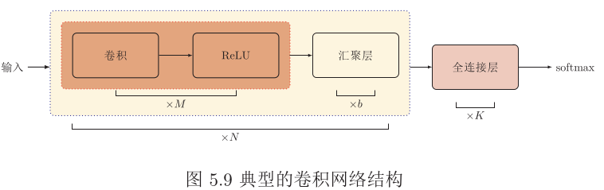
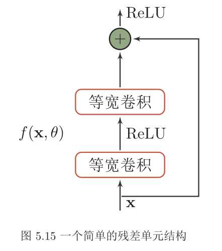

## CNN

- 卷积神经网络 是一种具有 `局部连接`、 `权重共享` 等特性的 **深层前馈神经网络**。注意是一种 `深层前馈神经网络`。  
- `CNN` 一般由 `卷积层`、 `汇聚层`、 `全连接层` 交叉堆叠而成的 `前馈神经网络`，使用 `反向传播算法` 进行训练。  
- `CNN` 有三个结构上的特性： `局部连接`、 `权重共享`、 `汇聚`。  
- `CNN` 主要用于 `图像` 和 `视频分析` 等各种任务上，近年来也应用在 `自然语言处理` 、 `推荐系统` 等领域。  

### 卷积层

`CNN` 也是一种 `前馈神经网络`，只是它是用卷积代替了 `全连接`，这样使得训练参数大为减少，训练效率高。  
卷积层的作用是 `提取一个局部区域的特征`， **不同的卷积核相当于不同的特征提取器**。  

### 汇聚层
汇聚层 (`pooling layer`)，作用是 `特征选择`， 卷积层是特征提取，汇聚层就是对提取到的特征进行选择。从而 `降低特征数量`，从而减少学习参数。  
- 最大汇聚(`maximum pooling`)：提取一个局部区域内所有神经元的最大值；
- 平均汇聚(`mean pooling`)：是一个局部区域内所有神经元的平均值；

### 典型的卷积网络结构  

### 几种典型的神经网络结构

- LeNet-5
- AlexNet
- Inception 网络
- 残差网络(ResNet)：   
    是通过给非线性的卷积层增加 **直连边** 的方式来提高信息的传播效率。  

