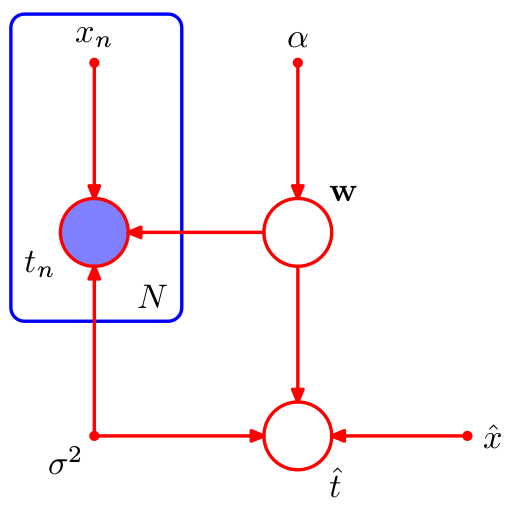

## D-separation的另一种判定方法

本文是一篇文章的译文《d-Separation：How to determine which variables are independent in a bayesian net》。

我认为这篇文章讲述的更为清楚，因为它避免了观测量和未观测量之间带来的歧义问题，像在以前笔记《bayesian network（directed graph）》中，参变量$\bold w$应该画为成带阴影的圈还是空圈，如果是空圈，但$\bold w$可以通过给定后验概率来给定，如果是带阴影的圈，但$\bold w$是未观测量；

通常把$\bold w$画为空圈，那么单纯的从图中看，$p(\hat t|\bold w,\bold t)\neq p(\hat t|\bold w)$，即不关于$\bold w$独立，但是我们通过计算出后验概率$p(\bold w|\bold t)$，则有
$$
p(\hat t，\bold t|\bold w)=\frac{p(\hat t，\bold t,\bold w)}{p(\bold w)}=\frac{p(\hat t|\bold w)p(\bold t|\bold w)p(\bold w)}{p(\bold w)}=p(\hat t|\bold w)p(\bold t|\bold w)
$$

显然是条件独立的，虽然$\bold w$不能说是观测值，但是可以说是给定值。

《d-Separation：How to determine which variables are independent in a bayesian net》没有提及是否是观测值的问题，而是用给定值和是否是边缘独立来的形式提出，清晰明了，译文如下：

《d-Separation：在贝叶斯网络中，如何确定哪些变量是条件独立的》

贝叶斯网络假定：

​	“给定父变量，那么同辈变量之间都是条件独立的”

（译者补充：上面那句话对应了三个例子中之一的同父结构）

毫无疑问，用上面的的陈述来判定独立性是合理的，但是我们可以用d-Separation定理来作为判断独立性的一种更为正式的流程。我们用下面形式中的一种来开始关于独立性的问题：

- 对于给定的值，X和Y是条件独立的么？

- X和Y是边缘独立的么？

例如，如果我们问求解"$p(A|BDF)=p(A|DF)$是否相等？"我们可以把它转化为一个像这样的独立性问题：“给定D和F，A和B是独立的么？”

接下来我们遵循以下流程来解决问题：

1. 画谱系图

   构建概率表达式中所涉及到的所有变量的谱系图（译者注：比如$p(A|BDF)=p(A|DF)$，所涉及到的变量有($A,B,D,F$），这是原概率图的简化版，该简化版的谱系图仅是由所涉及到的变量和他们的祖辈组成(父辈，父辈的父辈，等等)。

2. 给父辈配对

   对每一对拥有共同子变量的父辈，用一条无方向的线将他们连接起来（如果一个变量不止2个父辈，那么这些父辈们两两之间用无方向的线连接）。

3. 通过无方向的线来取代有方向的线（有箭头），使得图去方向化。

4. 删除给定的变量还有他们之间的线

   如果独立性问题中有给定的变量，那么在图中删除这些变量并且移除他们之间的连接（也就是上面所说的无方向的线）。要注意的是，这里所说的给定的变量，是指这样的问题："给定D和F，A和B是条件独立的么？"而不是"$p(A|BDF)=p(A|DF)$是否相等？"，因此给定的变量不包括B。

5. 从剩下的图中得到答案

   1）在这个图中（是指将给定变量和其之间的线去掉后的图），如果变量是断开的，那么他们毫无疑问是独立的

   2）在这个图中，如果变量是相连的，那么不能保证是独立的*

   ​	注意，这里说变量是相连的，意思是他们之间还有一条路径，比如我们有一个路径：$X-Y-Z$，$X$和$Z$是认为相连的，即使他	们之间没有线相连。（译者注，这里的意思是这两个变量不一定是直接相连的，间接用线连接起来，也是相连的）

   3）如果这两个变量中的其中一个或者两者都消失（因为他们是给定的值，所以都删除了），那么他们之间是独立的。（译者注：这	就句话的意思是指这样的问题：给定D和F，并且A和B也给定，A和B是条件独立的么？因为A和B也给定，根据上面的流程，所有	给定的变量都要删除，所以A和B也删除了，或者只给定了A或者B。）

   这里对第2）条*做出解释：第二条说，如果变量相连，那么不能确保独立，我们可以说，就贝叶斯网络而言，变量是相互依赖的，或者说，贝叶斯网络的这些变量不满足独立性，但是单靠d-Separation，我们不能保证独立性，因为变量仍然可以是数值独立的。（比如对所有的A和B，p(A|B)和P(A)恰好相等）

   译者注：这里的第三条为了说明当非条件的变量也给定的时候，怎么考虑独立性，实际上，这样会带来歧义，第3）条应该为非条件的变量在流程中第4步不删除即可。之所以说会带来歧义，可以参照以下的例子。

   

   这个例子在《bayesian network》中讲过，如果给定$\mu$，那么依据第4步，那么图就什么也没有了，依据第5步第3）条，那么$x_i与x_j$是关于$\mu$独立的。但当我们判断$x_i与x_j$是否边缘独立，那么依据第4步，那么图只剩下$\mu$ ，依据第5步第3）条，因为$x_i与x_j$都被删除，所以边缘独立，那么就得出错误的结论了。

   如果将第3）改为非条件变量在第4步中不删除，问题就解决了。如果给定$\mu$，依据第4步，图剩下 $x_i与x_j$，之间没有线连接，那么$x_i与x_j$是关于$\mu$独立的。$x_i与x_j$是否边缘独立，依据第4步，那么图没有删除任何东西，$x_i与x_j$之间有$\mu$作为连接，所以不满足边缘独立。

后记：

这本质是转化为无向图来判断独立性的问题，但又稍有区别。

我们来说明一下，为什么上面的流程是那个样的。这就要讲到bayesian network和markov random field之间的转化了。

我们还需要说明一下：有向图的markov边界，也叫markov 毯。

我们以非$x_i$的其他所有为条件，来看看$p(x_i|x_{j\neq i})$的概率依赖与哪些参数：
$$
p(x_i|x_{j\neq i})=\frac{p(x_1,...,x_D)}{\int p(x_1,...,x_D)dx_i}=\frac{\prod_k p(x_k|pa_k)}{\int \prod_k p(x_k|pa_k)dx_i}
$$

