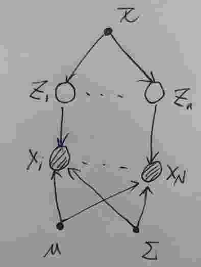

# EM算法、混合高斯模型和混合伯努利分布

[TOC]

## EM算法

+ EM算法从数学优化角度理解
  $$
  p(\bold X|\theta)=\sum_{\bold z}p(\bold X, \bold Z|\theta)   \tag{1.1}
  $$
  其中，$\bold X$是观测变量，$\bold Z$是隐含变量。

  从信息熵散度的角度有：
  $$
  \ln p(\bold X|\theta)=KL[q(\bold Z)||p(\bold Z|\bold X)]+\mathcal L(q,\theta)  \tag{1.2}
  $$
  其中：
  $$
  KL[q(\bold Z)||p(\bold Z|\bold X)]=-\sum_{\bold Z}q(\bold Z)\ln\left\{\frac{p(\bold Z|\bold X,\theta)}{q(\bold Z)} \right\}\\
  \mathcal L(q,\theta)=-KL[q(\bold Z)||p(\bold Z|\bold X)]=\sum_{\bold Z}q(\bold Z)\ln\left\{\frac{p(\bold Z,\bold X|\theta)}{q(\bold Z)} \right\}
  $$
  可见是关于隐藏变量条件散度和联合散度的差值，为了简化推导过程，将参数$\theta$忽略：
  $$
  \ln p(\bold Z,\bold X)=\ln p(\bold X)+\ln p(\bold Z|\bold X)\\
  \Rightarrow \ln p(\bold Z,\bold X)-\ln q(\bold Z)=\ln p(\bold X)+\ln p(\bold Z|\bold X)-\ln q(\bold Z)\\
  \Rightarrow \ln \frac{p(\bold Z,\bold X)}{q(\bold Z)}=\ln p(\bold X)+\ln \frac{p(\bold Z|\bold X)}{q(\bold Z)}\\
  \Rightarrow q(\bold Z)\ln \frac{p(\bold Z,\bold X)}{q(\bold Z)}=q(\bold Z)\ln p(\bold X)+q(\bold Z)\ln \frac{p(\bold Z|\bold X)}{q(\bold Z)}\\
  \Rightarrow \sum_{\bold Z}q(\bold Z)\ln \frac{p(\bold Z,\bold X)}{q(\bold Z)}=\sum_{\bold Z}q(\bold Z)\ln p(\bold X)+\sum_{\bold Z}q(\bold Z)\ln \frac{p(\bold Z|\bold X)}{q(\bold Z)}\\
  \Rightarrow \sum_{\bold Z}q(\bold Z)\ln \frac{p(\bold Z,\bold X)}{q(\bold Z)}=\ln p(\bold X)+\sum_{\bold Z}q(\bold Z)\ln \frac{p(\bold Z|\bold X)}{q(\bold Z)}\\
  \Rightarrow \ln p(\bold X)=-\sum_{\bold Z}q(\bold Z)\ln \frac{p(\bold Z|\bold X)}{q(\bold Z)}+\sum_{\bold Z}q(\bold Z)\ln \frac{p(\bold Z,\bold X)}{q(\bold Z)}\\
  \Rightarrow \ln p(\bold X)=KL[q(\bold Z)||p(\bold Z|\bold X)]-KL[q(\bold Z)||p(\bold Z,\bold X)]
  $$

​	由于散度$KL(q||p)\geq 0$，所以$\mathcal L(q,\theta)$是$\ln p(\bold X|\theta)$的下界。

​	$KL(q||p)\geq 0$证明用到$Jessen$ 不等式：
$$
KL(q||p)=-\int q(x)\ln \frac{p(x)}{q(x)}dx \geq \ln \int q(x)\frac{p(x)}{q(x)}dx=\ln \int p(x)dx=\ln 1=0   \tag{1.3}
$$
​	当$f(x)$凸函数来说，$Jessen$ 不等式
$$
f \left (t x_1 + (1-t) x_2 \right ) \leq t f(x_1)+ (1-t) f(x_2)   \tag{1.4}
$$
​	当是多个点，其拓展就是
$$
f(E[x])\leq E[f(x)]    \tag{1.5}
$$
​	也就是：
$$
f(\int p(x)xdx)\leq \int p(x)f(x)dx  \ \ \ \ \ or  \ \  \ \ f(\sum_x p(x)x)\leq \sum_x(p(x)f(x))
$$
​	当$f(x)$是复合函数，其拓展就是下面的定理：

​		若$g$是一实值可测函数，而$\varphi$在$g$的值域中是凸函数（这句话的意思是$\varphi(x)$是凸函数，而这里$\ln(x)$显然是是凸函数 ），
$$
\varphi\left(\int_{-\infty}^\infty g(x)f(x)\, dx\right) \le \int_{-\infty}^\infty \varphi(g(x)) f(x)\,dx   \tag{1.6}
$$
​	注意，当$g(x)=x$时，那么$(1.6)$就退化到$(1.5)$，也就是说$(1.5)$是$(1.6)$的特例。

​	$(1.3)$中对应的$f(x)=\ln \frac{p(x)}{q(x)}$ 是一个复合函数，所以用$(1.6)$来证明。

​	现在回到$(1.2)$式的讨论：
$$
\ln p(\bold X|\theta)=KL[q(\bold Z)||p(\bold Z|\bold X)]+\mathcal L(q,\theta)\\
\mathcal L(q,\theta)=\sum_{\bold Z}q(\bold Z)\ln\left\{\frac{p(\bold Z,\bold X|\theta)}{q(\bold Z)} \right\}\tag{1.2}
$$
​	我们知道，当$q(\bold Z)=p(\bold Z|\bold X)$时，$KL(q||p)=0$，此时$\ln p(\bold X|\theta)=\mathcal L(q,\theta)$。也就是说当我们选择的$\bold Z$的分布是关于观测数据$\bold X$的后验时，那么下界$\mathcal L(q,\theta)$

​	就等于似然函数$\ln p(\bold X|\theta)$。

​	EM算法是一个两步迭代算法，我们可以用$(1.2)$式的分解来定义EM算法，并说明该算法确实是最大化了对数似然函数$\ln p(\bold X|\theta)$ 。

1. 首先给定$\theta$的初始值$\theta_0$;

2. 假设迭代过程中，第n步的参数是$\theta^{old}$，在E步中，固定$\theta^{old}\,$，选取$q(\bold Z)$来最大化下界$\mathcal L(q,\theta^{old})$ ，我们注意到，$\theta^{old}$固定，那么$\ln p(\bold X|\theta^{old})$也就固定，这是因为$\ln p(\bold X|\theta^{old})$参数已知，$\bold X$又是已知的观察变量，所以$\ln p(\bold X|\theta^{old})$就已知。那么要在固定$\theta^{old}\,$，选取$q(\bold Z)$来最大化下界$\mathcal L(q,\theta^{old})$，则解就是$q(\bold Z)=p(\bold Z|\bold X,\theta^{old})$，这样才能使得散度项消失。

3. 在M步中，固定$q(\bold Z)$，也就是固定$p(\bold Z|\bold X,\theta^{old})$，选取$\theta^{new}$来最大化$\mathcal L(q^{old},\theta)$，那么来看看$\ln p(\bold X|\theta)$的变化：
   $$
   \ln p(\bold X|\theta^{new})-\ln p(\bold X|\theta^{old})=KL[p(\bold Z|\bold X,\theta^{old})||p(\bold Z|\bold X,\theta^{new})]+\mathcal L(q,\theta^{new})-\mathcal L(q,\theta^{old})
   $$
   在$\theta^{new}$下，由于$p(\bold Z|\bold X,\theta^{old}) \neq p(\bold Z|\bold X,\theta^{new})$，所以散度不为0，也就是在M步中，$\ln p(\bold X|\theta)$增加的量要大于$\mathcal L(q,\theta)$ 量。

   当不断重复2,3步，那么当$\mathcal L(q,\theta)$最大时，则就求出了$\ln p(\bold X|\theta)$的最大化。

注意，如果我们把$q(\bold Z)=p(\bold Z|\bold X,\theta^{old})$带入到$(1.2)$下面的式子中，则有：
$$
\begin{aligned}
\mathcal L(q,\theta)
&=\sum_{\bold Z}p(\bold Z|\bold X,\theta^{old})\ln p(\bold Z,\bold X|\theta)-\sum_{\bold Z}p(\bold Z|\bold X,\theta^{old})\ln p(\bold Z|\bold X,\theta^{old})\\
&=E_{z\sim p(\bold Z|\bold X,\theta^{old})}\left[\ln p(\bold Z,\bold X|\theta) \right] + H(p(\bold Z|\bold X,\theta^{old}))\\
&=E_{z\sim p(\bold Z|\bold X,\theta^{old})}\left[\ln p(\bold Z,\bold X|\theta) \right] + const
\end{aligned}\\ \tag{1.7}
$$
可见，**最大化$\mathcal L(q,\theta)$ 就是最大化完整数据对数似然$\ln p(\bold Z,\bold X|\theta)$关于$p(\bold Z|\bold X,\theta^{old})$的条件期望！**

这句话从另外一个角度说明了EM算法出现的动机(motivation)，下面从概率建模的角度在说明EM算法。

+  假设观测数据$\bold X=\left\{x_1,...,x_N\right\}$，我们要求其联合概率分布$p(\bold X)$，怎么建模处理？

  我们引入潜在变量(laten variable)$\bold Z=[z_1,...,z_N]$，假设$\bold Z$是离散的，对于连续型，则下面的求和改成求积分即可。即每一个观测变量$x_n$，都对应一个潜在变量$z_n$，我们把$\left\{\bold X, \bold Z \right\}$称为完整数据，$\left\{\bold X \right\}$称为不完整数据，其对应的对数似然函数分别为：
  $$
  \ln p(\bold X|\theta)=\ln \sum_{\bold Z} p(\bold X, \bold Z|\theta)\\
  \ln  p(\bold X, \bold Z|\theta)   \tag{2.1}
  $$
  从直觉上看，因为$\ln  p(\bold X|\theta)$对数作用在一个求和上，对参数$\theta$ 求导时，将得不到闭式解，而$\ln  p(\bold X, \bold Z|\theta) $对数直接作用在概率上，更容易求解。

  但是现实是，我们只有观测数据$\bold X$，我们得不到具体某个观测$\bold Z$下，$\ln  p(\bold X, \bold Z|\theta) $的概率，对于$ \bold Z$，如果假设了其先验还有其他参数，因为已经假设，是已知的，用$\theta^{old}$表示，我们可以知道其后验$p(\bold Z|\bold X,\theta^{old})$ ，这个可以从下面的贝叶斯公式中得到：
  $$
  p(\bold Z|\bold X,\theta^{old})=\frac{p(\bold X|\bold Z,\theta^{old})p(\bold Z|\theta^{old})}{\sum_{\bold Z}p(\bold X|\bold Z,\theta^{old})p(\bold Z|\theta^{old})} \tag{2.2}
  $$
  虽然我们得不到具体某个观测$\bold Z$下的完整数据的对数似然，但是我们可以用均值来代替；具体说就这样的，你给定不同的观测$\bold Z$，则有不同的$\ln  p(\bold X, \bold Z|\theta) $，因为没法给定$\bold Z$，但我们可以给出$\ln  p(\bold X, \bold Z|\theta) $关于$\bold Z$的均值，也就是期望：
  $$
  \mathcal E(\theta,\theta^{old}) =E_{z\sim p(\bold Z|\bold X,\theta^{old})}\left[\ln p(\bold Z,\bold X|\theta) \right]=\sum_{\bold Z}p(\bold Z|\bold X,\theta^{old})\ln  p(\bold X, \bold Z|\theta)  \tag{2.3}
  $$
  我们用这个均值来代替完整数据的对数似然函数，这对应了EM算法中的E（expection）步，这也是为什么叫E步的原因：根据后验概率$p(\bold Z|\bold X,\theta^{old})$ ，用其条件期望来代替完整数据的对数似然函数。

  要注意的是，$(2.3)$中的$\ln  p(\bold X, \bold Z|\theta)$中的$\theta$ 是未知的，如果它用$\ln  p(\bold X, \bold Z|\theta^{old})$代替，那么$(2.3)$就是具体值了，而不是函数了。另外就是对照$(1.7)$，可以看到是等价的。

  在M步就是求$\mathcal E(\theta,\theta^{old}) $最大值的解：
  $$
  \theta^{new}=\arg\min_{\theta} \mathcal E(\theta,\theta^{old})  \tag{2.4}
  $$

+ 还有一种就是我们直接推导出这个问题答案，也要用到$Jessen$不等式

$$
\begin{align}
\ln p(\bold X|\theta)
&=\sum_{n=1}^{N}\ln \sum_{\bold z_n}p(\bold x_n,\bold z_n|\theta)\\
&=\sum_{n=1}^{N}\ln \sum_{\bold z_n}q(\bold z_n)\frac{p(\bold x_n,\bold z_n|\theta)}{q(\bold z_n)}\\
&\geq \sum_{n=1}^{N}\sum_{\bold z_n}q(\bold z_n)\ln \frac{p(\bold x_n,\bold z_n|\theta)}{q(\bold z_n)} \ \ \  \ \ (jessen不等式第3个拓展)
\end{align}   \tag{3.1}
$$

当上面不等式取等号时，当且仅当$\frac{p(\bold x_n,\bold z_n|\theta)}{q(\bold z_n)}=c$为常数的时候；又$\sum_{\bold z_n}q(\bold z_n)=1$，从而：
$$
\sum_{\bold z_n}q(\bold z_n)=\sum_{\bold z_n}\frac{p(\bold x_n,\bold z_n|\theta)}{c}=\frac{p(\bold x_n|\theta)}{c}=1\\
\Longrightarrow c=p(\bold x_n|\theta)\\
\ \ \ \  \ \ \ \ \ \ \ \ \\ \ \ \ \ \ \ \ \ \ \ \ \ \  \ \ \ \ \Longrightarrow q(\bold z_n|\theta)=p(\bold z_n|\bold x_n,\theta)  \tag{3.2}
$$
$q(\bold z_n|\theta)=p(\bold z_n|\bold X_n,\theta)$带入到$(3.1)$ 式中最后一步：
$$
\begin{align}
\sum_{n=1}^{N}\sum_{\bold z_n}p(\bold z_n|\bold x_n,\theta)\ln \frac{p(\bold x_n,\bold z_n|\theta)}{p(\bold z_n|\bold x_n,\theta)}
&=\sum_{n=1}^N E_{\bold z_n}[\ln p(\bold z_n,\bold x_n|\theta)] + const\\
&=E_{\bold z}[\ln p(\bold z,\bold x|\theta)] + const
\end{align}
$$
综上所述，**EM算法是通过求解完整数据的最大对数似然关于隐变量后验概率的期望来求解观测变量的最大似然对数的！**

## 高斯混合模型

这是EM算法的一个具体的应用。

假设现在有数据$\bold X=\left\{\bold x_1,...,\bold x_N \right\}$，我们用高斯混合模型来进行概率建模：
$$
p(\bold x)=\sum_{k=1}^{K}\pi_k \mathcal N(\bold x|\mu_k,\Sigma_k)   \tag{4.1}
$$
这个模型的来源是可以用采样的角度来分析，假设有$K$个高斯模型，先在$K$个模型中抽取一个高斯模型，再在这个高斯模型采样。用概率图模型就是

其中的$\bold z_n$就是所抽取到的模型的结果，我们用"(1-of-K)"表示法来表示，那么
$$
p(\bold z_{nk}=1)=\pi_k\\
p(\bold x_n|\bold z_{nk}=1)=\mathcal N(\bold x_n|\mu_k,\Sigma_k)  \tag{4.2}
$$
也可以写成
$$
p(\bold z_n)=\prod_{k=1}^{K}\pi_k^{z_{nk}}\\
p(\bold x_n|\bold z_n)=\prod_{k=1}^{K}\mathcal N(\bold x_n|\mu_k,\Sigma_k)^{\bold z_{nk}}  
$$
从而
$$
p(\bold x_n)=\sum_{\bold z_n}p(\bold x_n|\bold z_n)p(\bold z_n)=\sum_{\bold z_n}\prod_{k=1}^{K}[\mathcal N(\bold x_n|\mu_k,\Sigma_k)\pi_k]^{\bold z_{nk}}=\sum_{k=1}^{K}\pi_k \mathcal N(\bold x_n|\mu_k,\Sigma_k)  \tag{4.3}
$$
对照$(4.1)$可以看到结果是相同的。也就说明了高斯混合模型是怎么来的。就是分布采样，因为分布采样的第一步观测不到，是一个隐变量，所以我们用其期望来表示这两步过程的概率，这可以从$(4.1)和(4.3)$式子可以看出：
$$
p(\bold x)=\sum_{k=1}^{K}\pi_k \mathcal N(\bold x|\mu_k,\Sigma_k) =E_{\bold z}[\mathcal N(\bold x|\mu,\Sigma)]   \tag{4.4}
$$
现在我们要说说$p(\bold Z,\bold X|\pi,\mu,\Sigma)$如何求
$$
\begin{align}
p(\bold Z,\bold X|\pi,\mu,\Sigma)
&=p(\bold Z|\pi)p(\bold X|\bold Z,\pi,\mu,\Sigma)\\
&=\prod_{n=1}^N \prod_{k=1}^K(\pi_k)^{z_{nk}}\mathcal N(\bold x_n|\mu_k,\Sigma_k)^{z_{nk}}\\
&=\prod_{n=1}^N \prod_{k=1}^K[\pi_k\mathcal N(\bold x_n|\mu_k,\Sigma_k)]^{z_{nk}}
\end{align}
$$
上面第2步到第3步之所以是这样，是因为$\bold z_n$之间是相互独立的，这个从下面的概率图中根据D-Separation可以说明，$\bold z_i$到$\bold z_j$之间的路径是只有通过$\pi$ ，而参数$\pi$当成已知参数处理，那么就是尾对尾的，所以是独立的。$\bold z_i$到$\bold z_j$之间的路径是不会通过$\bold x_n$的，这从采样的过程已经说明了，每一次都是上一次独立过程完成的，所以$\bold x_n$之间也是独立的，这也是$\ln p(\bold x|\theta)=\sum_{n=1}^{N}\ln \sum_{\bold z_n}p(\bold x_n,\bold z_n|\theta)$成立的原因，更直观的概率图模型应该是这样的。

现在我们想要估计出模型的参数，也就是求$\pi,\mu,\Sigma$，如何操作？

EM算法正好是解决这种问题的利器，要估计参数，求解最大对数似然函数就行了。按照EM算法，E步是求隐变量的后验概率：
$$
\gamma(\bold z_{nk})=p(\bold z_{nk}=1|\bold x_n)=\frac{p(\bold z_{nk}=1)p(\bold x_n|\bold z_{nk}=1)}{\sum_{j=1}^K p(\bold z_{nj}=1)p(\bold x_n|\bold z_{nj}=1)}=\frac{\pi_k \mathcal N(\bold x_n|\mu_k,\Sigma_k)}{\sum_{j=1}^K \pi_j \mathcal N(\bold x_n|\mu_j,\Sigma_j)}   \tag{4.5}
$$
接下来M步就是求
$$
\begin{align}
E_{\bold Z\sim p(\bold Z|\bold X)}[\ln p(\bold X,\bold Z|\pi,\mu,\Sigma)]
&=\sum_{n=1}^{N}\sum_{k=1}^K \gamma(\bold z_{nk}) \ln p(\bold x_n,\bold z_{nk}|\pi_k,\mu_k,\Sigma_k)\\
&=\sum_{n=1}^{N}\sum_{k=1}^K \gamma(\bold z_{nk}) \ln(\pi_k \mathcal N(\bold x_n|\mu_k,\Sigma_k))  
\end{align} \tag{4.6}
$$
这里涉及到这样一个求期望的问题：
$$
E_z[p(x,z)]=\sum_{k=1}^Kz_k\,p(x^{'},z_k)
$$
其中：$x^{'}$是由$z$取$z_k$时引起的，照此可以得到$(4.6)$期望的求法，再说明一下：
$$
\begin{align}
E_{\bold Z\sim p(\bold Z|\bold X)}[\ln p(\bold X,\bold Z|\pi,\mu,\Sigma)]
&=E_{\bold Z\sim p(\bold Z|\bold X)}\left[\sum_{n=1}^{N}\sum_{k=1}^K \bold z_{nk}\ln p(\bold x_n,\bold z_{nk}|\pi_k,\mu_k,\Sigma_k)     \right]\\
&=\sum_{n=1}^{N}\sum_{k=1}^K E_{\bold z_n\sim p(\bold z_n|\bold x_n)} \left[ \bold z_{nk}\ln p(\bold x_n,\bold z_{nk}|\pi_k,\mu_k,\Sigma_k)     \right]\\
&=\sum_{n=1}^{N}\sum_{k=1}^K p(\bold z_{nk}=1|\bold x_n)(\bold z_{nk}=1)\ln p(\bold x_n,\bold z_{nk}|\pi_k,\mu_k,\Sigma_k)\\
&=\sum_{n=1}^{N}\sum_{k=1}^K p(\bold z_{nk}=1|\bold x_n)\ln p(\bold x_n,\bold z_{nk}|\pi_k,\mu_k,\Sigma_k)\\

&=\sum_{n=1}^{N}\sum_{k=1}^K \gamma(\bold z_{nk}) \ln(\pi_k \mathcal N(\bold x_n|\mu_k,\Sigma_k))  
\end{align} \tag{4.7}
$$

上面使用到了
$$
E_{p(\bold X)}[\bold x_i]=E_{p(\bold x_i)}[\bold x_i]   \tag{4.8}
$$
$(4.8)$可参见《变分推断》。

从另外一个角度来重新考虑:
$$
\begin{align}
E_{p(\bold z_n|\bold x_n)}[\bold z_{nk}]
&= \sum_{\bold z_n}\bold z_{nk}p(\bold z_n|\bold x_n)   \\
&= \sum_{\bold z_n}\bold z_{nk}\frac{\prod_j^K(\pi_j\mathcal N(\bold x_n|\mu_i,\Sigma_i))^{\bold z_{nj}}}{\sum_{\bold z_n}\prod_j^K(\pi_j\mathcal N(\bold x_n|\mu_i,\Sigma_i))^{\bold z_{nj}}}   \\
&= \frac{\pi_k\mathcal N(\bold x_n|\mu_k,\Sigma_k)}{\sum_{\bold z_n}\prod_j^K(\pi_j\mathcal N(\bold x_n|\mu_i,\Sigma_i))^{\bold z_{nj}}} \\
&=p(\bold z_{nk}=1|\bold x_n)\\
&=\gamma({\bold z_{nk}})
\end{align}   \tag{4.9}
$$

$\bold z_n$ 可以取$[1,0,..,0],[0,1,0...,0],...,[0,...,0,1]$，仅有一个$\bold z_n$可以使得$\bold z_{nk}=1$，所以结果如上。

现在来考虑
$$
\begin{align}
E_{\bold Z\sim p(\bold Z|\bold X)}[\ln p(\bold X,\bold Z|\pi,\mu,\Sigma)]
&=E_{p(\bold Z|\bold X)}\left[\sum_{n=1}^{N} \ln p(\bold x_n,\bold z_{n}) \right]\\
&=\sum_{\bold z_1}...\sum_{\bold z_N} p(\bold z_1|\bold x_1)...p(\bold z_N|\bold x_N) \left[\sum_{n=1}^{N} \ln p(\bold x_n,\bold z_{n}) \right]    \\
&=\sum_{n=1}^N \sum_{\bold z_n}\left[ p(\bold z_n|\bold x_n)\ln p(\bold x_n,\bold z_{n}) \right] \\
&=\sum_{n=1}^N \sum_{\bold z_n}[p(\bold z_n|\bold x_n)\sum_{k=1}^K\bold z_{nk}(\ln\pi_k+\ln \mathcal N(\bold x_n|\mu_k,\Sigma_k)) ] \\
&=\sum_{n=1}^N \sum_{\bold z_n}[\sum_{k=1}^Kp(\bold z_n|\bold x_n)\bold z_{nk}(\ln\pi_k+\ln \mathcal N(\bold x_n|\mu_k,\Sigma_k)) ] \\
&=\sum_{n=1}^N\sum_{k=1}^K \sum_{\bold z_n}p(\bold z_n|\bold x_n)\bold z_{nk}(\ln\pi_k+\ln \mathcal N(\bold x_n|\mu_k,\Sigma_k))  \\
&=\sum_{n=1}^N\sum_{k=1}^K E_{p(\bold z_n|\bold x_n)}[\bold z_{nk}](\ln\pi_k+\ln \mathcal N(\bold x_n|\mu_k,\Sigma_k))\\ 
&=\sum_{n=1}^N\sum_{k=1}^K \gamma(\bold z_{nk})(\ln\pi_k+\ln \mathcal N(\bold x_n|\mu_k,\Sigma_k)) 
\end{align} \tag{4.10}
$$
其中第2步到第3步用到了：
$$
\begin{align}
E_{p(\bold X)}[\sum_{n=1}^N f(\bold x_n)]
&=\sum_{\bold x_1}...\sum_{\bold x_N}p(\bold x_1,...,\bold x_N)(f(\bold x_1)+...+f(\bold x_N))\\
&=\sum_{n=1}^N [\sum_{\bold x_1}...\sum_{\bold x_N}p(\bold x_1,...,\bold x_N)(f(\bold x_n)]\\
&=\sum_{n=1}^N \sum_{\bold x_n}p(\bold x_n)f(\bold x_n)
\end{align}   \tag{4.11}
$$

再多说一句就是，就是第4步已经可以看出来了：
$$
\sum_{n=1}^N \sum_{\bold z_n}[p(\bold z_n|\bold x_n)\sum_{k=1}^K\bold z_{nk}(\ln\pi_k+\ln \mathcal N(\bold x_n|\mu_k,\Sigma_k)) ] =
\sum_{n=1}^N \sum_{k=1}^K[p(\bold z_n=k|\bold x_n)(\ln\pi_k+\ln \mathcal N(\bold x_n|\mu_k,\Sigma_k)) ]=\sum_{n=1}^N\sum_{k=1}^K \gamma(\bold z_{nk})(\ln\pi_k+\ln \mathcal N(\bold x_n|\mu_k,\Sigma_k)) 
$$

## 混合伯努利分布

上面混合高斯分布对应的是连续变量，离散变量我们来考虑混合Bernoulli分布。

设变量$\bold x=(x_1, ...,x_D)^T$ ，其中每一个特征$x_i$都是二值变量，非0即1。如果每一个特征$x_i\sim Ber(x_i|\mu_i)$，那么
$$
p(\bold x|\boldsymbol \mu)=\prod_{i=1}^D \mu_i^{x_i}(1-\mu_i)^{(1-x_i)}   \tag{5.1}
$$
很容易得出：
$$
E(\bold x)=\boldsymbol \mu\\
cov[\bold x]=diag \left\{\mu_i(1-mu_i)\right\}   \tag{5.2}
$$
现在假设让有限个这样的模型混合，也就是：
$$
p(\bold x|\boldsymbol \mu,\boldsymbol \pi)=\sum_{k=1}^K\pi_k\,p(\bold x|\boldsymbol \mu_k)
$$
从而混合伯努利分布的期望：
$$
E[\bold x]=\sum_{k=1}^K \pi_k\,E[\bold x|\boldsymbol \mu_k]=\sum_{k=1}^K \pi_k\,\boldsymbol \mu_k
$$
对于观测集合$\bold X=(\bold x_1,...,\bold x_N)$，其联合概率
$$
\begin{align}
p(\bold X,\bold Z|\boldsymbol\pi,\boldsymbol\mu)
&=p(\bold Z|\pi)p(\bold X|\bold Z,\boldsymbol\mu)\\
&=\prod_{n=1}^N \prod_{k=1}^K(\pi_k)^{z_{nk}} Ber(\bold x_n|\boldsymbol \mu_k)^{z_{nk}}\\
&=\prod_{n=1}^N \prod_{k=1}^K[\pi_kBer(\bold x_n|\boldsymbol \mu_k)]^{z_{nk}}\\
&=\prod_{n=1}^N \prod_{k=1}^K[\pi_k\prod_{i=1}^D \mu_{ki}^{x_{ni}}(1-\mu_{ki})^{(1-x_{ni})}]^{z_{nk}}
\end{align}   \tag{5.3}
$$
E步求隐变量的后验：
$$
\gamma(\bold z_{nk})=p(\bold z_{nk}=1|\bold x_n)=\frac{\pi_k \,p(\bold x_n|\boldsymbol \mu_k)}{\sum_{j=1}^K \pi_k \,p(\bold x_n|\boldsymbol \mu_k)}  \tag{5.4}
$$
M步求
$$
\begin{align}
E_{\bold Z\sim p(\bold Z|\bold X)}[\ln p(\bold X,\bold Z|\boldsymbol\pi,\boldsymbol\mu)]
&=\sum_{n=1}^{N}\sum_{k=1}^K \gamma(\bold z_{nk}) \ln p(\bold x_n,\bold z_{nk}|\pi_k,\mu_k)\\
&=\sum_{n=1}^{N}\sum_{k=1}^K \gamma(\bold z_{nk}) \ln(\pi_k Ber(\bold x_n|\mu_k)) 
\end{align} \tag{5.5}
$$

## 应用在最大后验分布(MAP)上的EM算法

我们注意到上面的EM算法用在的是最大似然函数上的，为什么这么说呢？我们可以所要求的问题的表达：求完整数据的对数似然关于隐变量后验分布的期望，也就是：
$$
L=E_{p(\bold Z|\bold X,\boldsymbol \theta)}[\ln p(\bold X,\bold Z|\boldsymbol\theta)]\tag{6.1}
$$
这里已经说明了是对似然函数进行操作了。

E步就是用当前的给定的参数$\boldsymbol \theta^{old}$来求出$(6.1)$的期望表达式:
$$
L(\boldsymbol \theta,\boldsymbol \theta^{old})=E_{p(\bold Z|\bold X,\boldsymbol \theta^{old})}[\ln p(\bold X,\bold Z|\boldsymbol\theta)]\tag{6.2}
$$
在M步就是求最大似然解：
$$
\boldsymbol \theta^{new}=\arg \max_{\boldsymbol \theta}L(\boldsymbol \theta,\boldsymbol \theta^{old})   \tag{6.3}
$$
如果是最大后验怎么求解呢？其实很简单，那就是：求完整数据的后验关于隐变量分布的期望：
$$
L=E_{p(\bold Z|\bold X,\boldsymbol \theta)}[\ln p(\boldsymbol\theta|\bold X,\bold Z)]\tag{6.4}
$$
但是后验分布通过贝叶斯定理知道，如果不是共轭的话，并不好求，并且我们知道最大后验求法并不需要精确知道后验分布的形式，根据贝叶斯定理：
$$
p(\boldsymbol\theta|\bold X,\bold Z)\propto p(\bold X,\bold Z|\boldsymbol\theta)p(\boldsymbol\theta)  \tag{6.5}
$$
所以呢，求解$(6.4)$就是等价与求解$(6.5)$，也就是：
$$
L=E_{p(\bold Z|\bold X,\boldsymbol \theta)}[\ln p\left\{(\bold X,\bold Z|\boldsymbol\theta)p(\boldsymbol\theta)\right\}]\\
\Rightarrow L=E_{p(\bold Z|\bold X,\boldsymbol \theta)}[\ln p(\bold X,\bold Z|\boldsymbol\theta)+\ln p(\boldsymbol\theta)]\tag{6.6}
$$
比较$(6.1)$和$(6.6)$可见，就是多了一个关于参数的先验而已，EM步骤和基于最大似然的时候是相同的。

## 生成模型

生成模型就是可以给出数据生成过程的模型，也就是能给出输入和输出联合概率的模型，因为联合概率能够解释数据的生成，可以通过该分布人为的生成新的数据。对于分类问题而言，没有把输入纳入到概率分布中的模型都不是生成模型，也就是判别模型：

比如Logistic regression，svm，传统的神经网络，Nearest Neighbor，GRF(条件随机场)，LDA(线性判别分析)，Boosting, 线性回归，k近邻，最大熵模型。

生成模型有：

GDA(高斯判别分析)，朴素贝叶斯，贝叶斯网络，Mixtures of Multinomials，高斯混合模型，Mixtures of Experts，隐马尔科夫模型，Sigmoidal Belief Networks，马尔科夫随机场，LDA(潜在狄立*克雷分配*)

通过对输入引入合适的先验概率分布 p(x) ，我们可以将模型变为生成式模型，代价是增加了模型的复杂度。

而我们最熟悉的线性回归模型就不是生成模型，因为没有与输入变量 x 相关联的概率分布，因此无法从这个模型中人工生成数据点。

## 最大似然函数和最小KL散度

