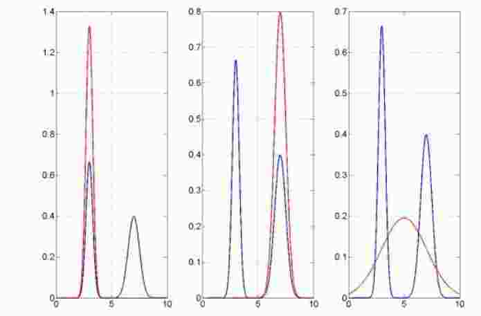

# KL散度的思考

我们知道$KL(q||p)$来独立两个概率分布的相似性，其定义为
$$
KL(q||p)=\int q(x)\ln\frac{q(x)}{p(x)}dx
$$
很明显，KL散度不具有对称性，但既然都是来衡量分布相似程度，那么KL(q||p)和KL(p||q)有什么不同的效果呢？

假定上面的红线表示的是$q(x)$分布，蓝线是$p(x)$分布，假设我们现在寻求一个分布$q(x)$来使得KL(q||p)最小，也就是
$$
q^*(x)=\arg\min_{q(x)} \,KL(q||p)=\arg\min_{q(x)}\,\int q(x)\ln\frac{q(x)}{p(x)}dx
$$
要使得KL(q||p)最小，那么当$p(x)\to 0$，那么$q(x) \to 0$，又由于q(x)受到归一化的限制，既然在$p(x)\to 0$的区域，$q(x) \to 0$，那么在其他p(x)$较大的区域，$$q(x)$也应该较大。这样看来，min KL(q||p)寻找的q(x)拟合的是p(x)众数，也就是$seeking-mode$。上图中左中两个图，为什么是两种结果，因为我们做最优化的时候，算法不同，迭代初始值不同等等，会得到不同的局部最优解，左中两个就是两个局部最优解。同样可以分析min KL(p||q)，q拟合的是p的均值和方差，如果是单峰，KL(q||p)和KL(p||q)区别不大，如果是双峰或者是多峰分布，那么min KL(p||q)的q的均值和峰值是就是综合效果，见右图。

