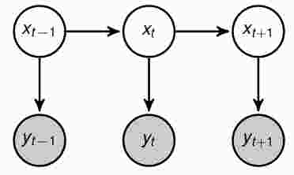

## Kalman Filter

[TOC]

Kalman Filter是一种线性动态系统（linear dynamic system：LDS），HMM模型的状态空间是离散的，当状态空间是连续的时候，且前后状态之间、状态与观测之间是线性关系时，就是Kalman Filter模型，其图模型和HMM的相同：

 

线性关系：
$$
\bold x_t=A\bold x_{t-1}+B+\bold v\\
\bold y_t=H\bold x_t+C+\bold w\\
\bold v \sim \mathcal N(\bold v|0,\bold Q)\\
\bold w \sim \mathcal N(\bold w|0,\bold R) 		\tag{1.1}
$$

我们要求的问题是$p(\bold x_t|\bold y_1,...,\bold y_t)$，为什么叫滤波（filter）呢？可以这样考虑，$\bold x_t$是我们需要知道的信号值，但是往往我们不能直接测得，而是通过传感器测得$\bold y_t$的值，但是传感器测数据存在噪音$\bold w$，我们的目标就是过滤掉噪音，估计出真实的$\bold x_t$。

因为推导过程中要用到联合高斯分布，所以提前将联合高斯分布的性质写在下面：
$$
p(\bold x)=\mathcal N(\bold x|\mu,\Sigma)\\
p(\bold y|\bold x)=\mathcal N(\bold y|A\bold x+B,L)\\
p(\bold y)=\int p(\bold x)p(\bold y|\bold x)d\bold x=\mathcal N(\bold y|A\mu +B, A\Sigma A^T+L)  \tag{1.2}
$$
现在来推导$p(\bold x_t|\bold y_1,...,\bold y_t)$的求法，为了简化写法，我们将$p(\bold x_t|\bold y_1,...,\bold y_t)$写成$p(\bold x_t|\bold y_{1:t})$。
$$
p(\bold x_t|\bold y_{1:t})\propto p(\bold x_t,\bold y_{1:t}) \propto p(\bold y_{t}|\bold x_t,\bold y_{1:t-1})p(\bold x_t,y_{1:t-1})\propto p(\bold y_{t}|\bold x_t)p(\bold x_t|\bold y_{1:t-1})   \tag{1.3
$$