# ]bayesian network (directed graph)

[TOC]

## bayesian network 来源

+ 从名字就可以知道和bayesian 定理有关，其实就是bayesian定理展开（联合概率展开），bayesian network又叫directed graph，graph的方向表示的

  是变量之间的依赖关系，看下图

  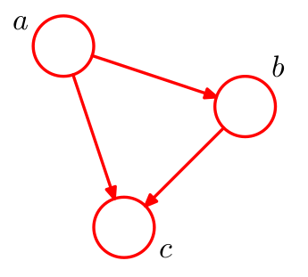
  $$
  p(a,b,c)=p(a)p(b|c)p(c|a,b)  \tag{1}
  $$
  上图被称为**全链接图**，因为每一对变量都有链接，这也对应了bayesian的展开；但是当某些变量不依赖某些变量时，也就是某些变量之间是某种程度上的独立(条件独立)，那么联合概率展开后，所要求的参数大大减少，比如下图：

  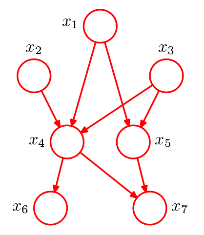

  

$$
p(x_1,...,x_7)=p(x_1)p(x_2)p(x_3)p(x_4|x_1,x_2,x_3)p(x_5|x_1,x_3)p(x_6|x_4,)p(x_7|x_4,x_5)  \tag{2}
$$

总结一下就是：
$$
p(\bold x)=\prod_{k=1}^{K}p(x_k|pa_k)   \tag{3}
$$
其中$\bold x=[x_1,...,x_K]$，$pa_k$表示$x_k$所依赖变量(parent)的集合。

这在实际建模应用中是很有作用的，假如我们通过实际的经验分析或者假设某些变量只依赖与其中部分变量，与其他变量无关，那么我们在构建联合概率分布的时候就会极大减少。

## D-Separation

《D-Separation的另一种判定方法》中，有更为简单明了的判断流程，可供参考。

+ 有时候我们不是求整个联合概率，我们需要求某些条件概率，那么怎么判断某些变量之间是相互独立的呢？如上图，如果要求$p(x_7|x_4,x_6)$，那么$x_6和x_7$是相关的么？或者说在什么情况下可以是独立的，使得$p(x_7|x_4,x_6)=p(x_7|x_4)$呢？有个定理叫**D-Separation**，现在先讲3个例子来引出这个定理。

1. 同父结构(尾到尾)

   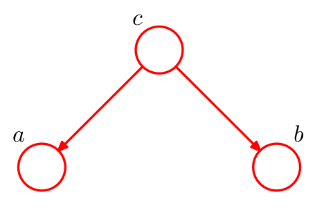

   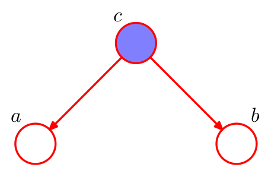

   上图的意思是，变量$c$是未被观测到的变量，下图的阴影表示被观测到。

   联合概率分布

   这里第一种情况，c不是观测值，在没有具体说明c是可以推导，或者给定的前提下，则考虑其边缘独立：
   $$
   p(a,b)=\sum_cp(a|c)p(b|c)p(c)  \tag{4.1}
   $$
   上式不能满足：$\sum_cp(a|c)p(b|c)p(c)\neq p(a)p(b)$，即使某些情况下，恰好相等，也只是数值上的独立，而不是变量关系的独立，所以不是边缘独立的。

   第二种情况
   $$
   p(a,b|c)=\frac{p(a,b,c)}{p(c)}=\frac{p(a|c)p(b|c)p(c)}{p(c)}=p(a|c)p(b|c)  \tag{4.2}
   $$
   显然条件独立。

   当然还有一种情况是，即使$c$未被观测到，但是$c$可以通过其他的方式得到，或者是确定性参数，这时也认为c是已知的，相当于c被观测到。比如下面的一个例子：

   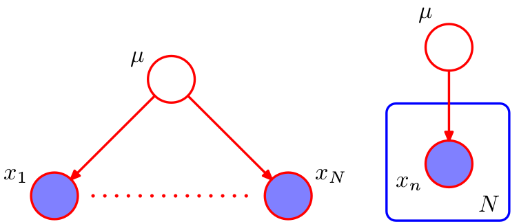

   假设一维目标变量服从高斯分布，训练集$\bold x=[x_1,...,x_N]$，假设方差已知，均值未知，我们来估计$\mu$，如果把$\mu$当做是确定性的未知参数，那么$\mu$就不再是随机变量，那么
   $$
   p(\bold x|\mu)=\frac{p(\bold x, \mu)}{p(\mu)}=\frac{\prod_{i=1}^{N}p(x_i|\mu)p(\mu)}{p(\mu)}=\prod_{i=1}^{N}p(x_i|\mu)    \tag{4.3}
   $$
   可以看出$x_i与x_j,(i\neq j)$关于$\mu$是相互独立的。

   如果把$\mu$当成是随机变量，那么如果你能确定$p(\mu)$的概率分布，依旧可以列出$(4)$式，也就是说，给定$\mu$，也即给定$p(\mu)$分布（比如先验分布），那么依旧是条件独立的。

   如果把$\mu$当做是未观测变量(latent / hidden variable)，那么联合概率就不再是$p(\bold x,\mu)$，因为$p(\bold x, \mu)$表示的是$\bold x和\mu$同时发生的概率，现在$\mu$是latent variable，无法确定其分布，所以再看独立性的时候，就不能看关于$\mu$ 的条件独立，这种情况下，说明$\mu$根本不重要才会不给定其值(给定其值的意思是：是未知确定值或者是给定其分布)，这时的独立性就是看$p(\bold x)=\prod_{i=1}^{N}p(x_i)$ 是否成立就行了。
   $$
   p(\bold x)=\sum_c \prod_{i=1}^{N}p(x_i|c)p(c)\neq \prod_{i=1}^{N}p(x_i)   \tag{4.4}
   $$
   可见当$\mu$未知时，是不独立的。

   这里的一个应用就是可以解释prml贝叶斯预测过程的一个具体分析，就是prml第$(1.68)$式，具体见下面的应用一节。

2. 顺序结构(头到尾)

   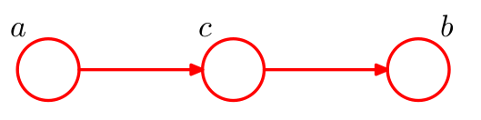

   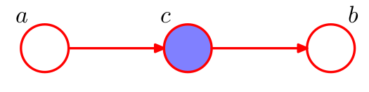

   第一种情况，是否边缘独立：
   $$
   p(a,b)=\sum_cp(a)p(b|c)p(c|a)= p(a)p(b|a)  \tag{4.5}
   $$
   a，b不是边缘独立的，但是这里说明：$\sum_c p(b|c)p(c|a)= p(b|a)$，这是一个有意思的性质。

   第二种情况，是否条件独立：
   $$
   p(a,b|c)=\frac{p(a,b,c)}{p(c)}=\frac{p(a)p(c|a)p(b|c)}{p(c)}=\frac{p(c,a)p(b|c)}{p(c)}=p(a|c)p(b|c)  \tag{4.6}
   $$
   条件独立。

3. $V$ 字结构

   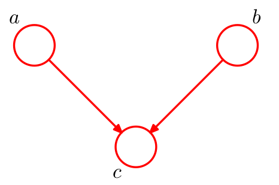

   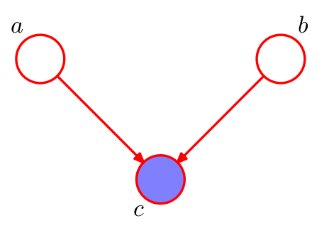

   第一种情况，是否边缘独立：
   $$
   p(a,b)=\sum_cp(a)p(b)p(c|a,b)= p(a)p(b)  \tag{4.7}
   $$
   

   边缘独立。

   第二种情况，是否条件独立：
   $$
   p(a,b|c)=\frac{p(a,b,c)}{p(c)}=\frac{p(a)p(b)p(c|a,b)}{p(c)}\neq p(a|c)p(b|c)  \tag{4.6}
   $$
   所以不是条件独立的。

+ 现在来总结一下D-Separation定理：

  关于$A,B$是否关于$C$独立，当然这里不能说全是条件独立，有一部分的边缘独立；当满足下面的一条，就可以说是独立的：

  1. $A$到$B$的所有路径当中，节点是同父结构（尾到尾的）或者是顺序结构（头到尾的），该节点在集合$C$中
  2. $A$到$B$的所有路径当中，节点是V字结构（头到头的），该节点以及其后继都不在集合$C$中	

## 应用

+ 在prml第一章$1.2.5～1.2.6$节中，我们学习了bayesian polynominal regression，没有给出$(1.68)$式成立的根本缘由，只是凭着intuition写出。现在用probability graph model 来详细剖析一下。

  其概率图是：

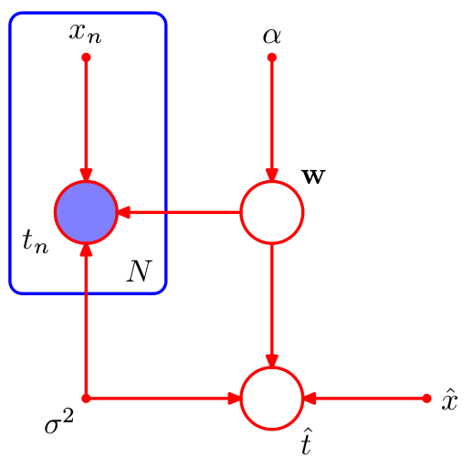

​	简要说明一下关系：
$$
\bold w\sim \mathcal N(\bold w|0,\alpha) \ \ \ \ \ \ \ \ \ \ \ 这是w的prior\\
t=\bold w^T\phi(\bold x)+\epsilon    \ \ \ \ \ \ \ \ \ \ \ \ \ \  \epsilon\sim \mathcal N(\epsilon|0,\sigma^2)\\
p(t|\bold w)=\mathcal N(t|\bold w^T\phi(x), \sigma^2) \ \ \ \ \ \ \ \ \ \ \ \ \
$$
​	那么有
$$
p(\hat t, \bold w,\bold t)=p(\hat t|\bold w,\bold t)p(\bold w|\bold t)p(\bold t)
$$
​	从而
$$
p(\hat t, \bold w|\bold t)= p(\hat t|\bold w,\bold t)p(\bold w|\bold t)
$$
​	想要预测$\hat t$，则需要将$\bold w$给integrate out ，即：
$$
p(\hat t|\bold t)= \int p(\hat t|\bold w,\bold t)p(\bold w|\bold t)d\bold w
$$
​	这里关键来$p(\hat t|\bold w,\bold t)和p(\bold w|\bold t)$ ，$p(\bold w|\bold t)$是$\bold w$ 后验概率，其求法
$$
p(\bold w|\bold t)\propto p(\bold w)\prod_{n=1}^{N}p(t_n|\bold w)
$$
​	再来看看$p(\hat t|\bold w,\bold t)$ ，$\bold t$ 和$\hat t$ 是关于$\bold w$条件独立的么？从图中可以看出，在后验概率已经求出的情况下，同父结构的$\bold w$阻断了$\bold t$ 和$\hat t$ 之	间的联系，所以就是独立的，即
$$
p(\hat t|\bold w,\bold t)=p(\hat t|\bold w)
$$
​	所以：
$$
p(\hat t|\bold t)= \int p(\hat t|\bold w)p(\bold w|\bold t)d\bold w
$$
​	而这$p(\hat t|\bold w)$就是，也就是prml P31中所说：“Here $p(t|x,\bold w)$ is given by (1.60)”的原因了。

+ 独立同分布(iid)

  

  独立同分布数据的概念提供了条件独立和d-划分的另外一个例子，考虑一元高斯分布的后验概率分布问题。这可以表示为上面的概率图，这是因为每一个观测值的生成都是以参数$\mu$的高斯分布得到的，而彼此之间$x_i,x_j$之间并没有直接的依赖关系（直接的依赖关系表现为$x_i,x_j$ 直接用有向线相连），也就是假设数据是独立地从模型中抽取的，从上面的概率图中可以看出，如果给定$\mu$，那么$x_i,x_j$是相互独立的。

+ naive bayesian model

  上面两种情况是对目标变量进行条件独立分析的，对于输入特征量也可以进行独立性的假设，使问题得到简化。朴素贝叶斯模型就是特征量每一个元素对目标类别独立进行了假设。假设观测变量由D维向量$\bold x=(x_1,...,x_D)^T$组成，我们想将$\bold x$的观测值分配到K个类别中的一个，使用"1-of-K"表示方式，即使用一个K维的二值向量$\bold Z$表示。然后我们可以定义这样一个生成模型：引入类别标签上的多项式先验概率分布$p(\bold Z|\boldsymbol  \mu)$，其中$\boldsymbol \mu$的第k个元素$\mu_k$表示类别$C_k$的先验概率，再引入观测变量条件概率分布$p(\bold x|\bold Z)$。

  naive bayesian model 关键的假设是：给定类别$\bold Z$，$x_i,x_j$是条件独立的。但是$x_i,x_j$不是边缘独立的。

  这个从下面的概率图可以得到直观的看出，而这个图又是怎么画出来的呢？这是由于在采用过程中，$x_i,x_j$的采样都只是类别$z$的概率分布有关，所以如是画。   

  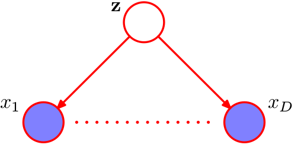

​	这里特别要说明朴素贝叶斯的优点，prml说的很好，这里大部分摘录：当输入空间的维度$D$很大时，在完整的$D$维空间进行密度估是比较困难的（维度灾难）。此时贝叶斯假设很有作用。如果变量既包含离散变量也包含连续变量，那么朴素贝叶斯假设也很有意义，因为每一个变量都可以用适当的模型来表示。例如用伯努利分布来表示二值观测，用高斯分布来表示实值变量。这个模型中条件独立性假设显然过于强烈，可能会导致对类条件概率密度的表示相当差，尽管如此，即使这个假设无法精确满足，但是模型仍能给出较好的分类效果因为决策边界对类条件概率的细节不敏感。

+ GMM model 

  混合高斯模型用于聚类，

  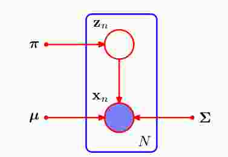

  GMM的模型图为什么不是像朴素贝斯模型的图，而要搞出一个$z_n$呢？这是因为我们获取数据的过程是这样的，我们可以从采样的角度来考虑，其实有向图可以用祖先采样、逻辑采样、重要性采样和MCMC采样来获取，混合高斯模型就是先采样出一个具体的类别$z_n$，该类别决定了使用哪一个高斯模型。如果我们的有向图像朴素贝叶斯那样，如果给定$z$，那么就意味着训练集$(x_1,...,x_N)$都是从相同的类别得到的，显然是不对的。而朴素贝叶斯模型，输入空间的元素$(x_1,...,x_D)$就是来源一个类别。下图中的贝叶斯回归模型$\bold w$给定的情况下，训练集${t1,...,t_N}$是可以来自同样的参数$\bold w$的，训练集是可以来自任意的$\bold w$的，此时的$\bold w$没有固定。

  现在来看看GMM model 是如何独立的，从采样的过程可以知道$(z_{n-1},x_{n-1})\bot (z_{n},x_{n})$。

  

+ markov chain 和HMM model

  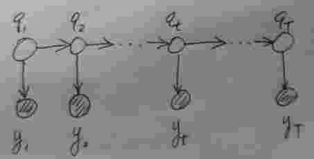

  HMM model可以看成是GMM在时序上的拓展，markov chain是没有下面的$y$。

+ Gaussian process

## 优点和缺陷

