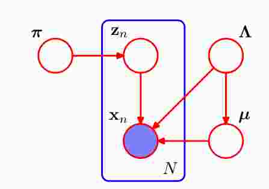
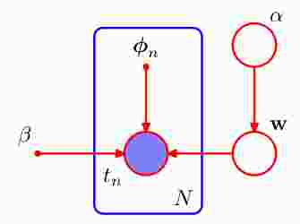

# 变分推断

[TOC]

## 变分推断基础推导  

+ 在EM算法中，我们要计算隐变量的后验概率$p(\bold Z|\bold X)$，但是现实中有时候$p(\bold Z|\bold X)$很难求解，我们希望用一个简单的模型来近似它。在EM算法中，$\bold Z$表示隐变量，不包括参数，在变分推断方法中，我们将参数也放到$\bold Z$中，也就是将参数也看成为变量。我们希望找到这样一个简单模型

$$
q(\bold Z) \approx p(\bold Z|\bold X)\\
q(\bold Z)=\prod_{i=1}^M q(\bold Z_i)  \tag{1.1}
$$

​	我们在求模型参数的时候，使用的最大似然函数的方法：
$$
\ln p(\bold X)=\ln p(\bold X,\bold Z)-\ln p(\bold Z|\bold X)\\
\Rightarrow \ln p(\bold X)=\ln \frac{p(\bold X,\bold Z)}{q(\bold Z)}-\ln \frac{p(\bold Z|\bold X)}{q(\bold Z)}\\
\Rightarrow E_{q(\bold Z)}[\ln p(\bold X)]=E_{q(\bold Z)}[\ln \frac{p(\bold X,\bold Z)}{q(\bold Z)}]-E_{q(\bold Z)}[\ln \frac{p(\bold Z|\bold X)}{q(\bold Z)}]\\
\Rightarrow \ln p(\bold X)=E_{q(\bold Z)}[\ln \frac{p(\bold X,\bold Z)}{q(\bold Z)}]+KL(q(\bold Z)||p(\bold Z|\bold X))\\   
\Rightarrow \ln p(\bold X)=\mathcal L(q(\bold Z))+KL(q(\bold Z)||p(\bold Z|\bold X))\\\tag{1.2}
$$

​	在EM算法中，我们寻找使得下界$\mathcal L(q(\bold Z))$最大的$q(\bold Z)$，就是找到KL=0的$q(\bold Z)$，我们得出$q(\bold Z)=p(\bold Z|\bold X)$，但是在这里，由于我们说$\bold Z$的后验概率$p(\bold Z|\bold X)$求不	出，或者很复杂，所以我们需要找到一个简单的$q(\bold Z)$来近似$p(\bold Z|\bold X)$，但是我们找到的$q(\bold Z)$要足够相似$p(\bold Z|\bold X)$才行，也就是说需$KL(q(\bold Z)||p(\bold Z|\bold X))$要足够的小	才行，由于$\ln p(\bold X)$是一个与$q(\bold Z)$无关的函数，且由于$\bold X$是观测量，所以$\ln p(\bold X)$是一个定值，所以要使得散度最小，也就是求$\mathcal L(q(\bold Z))$最大。我们假设找到的	$q(\bold Z)$是具有$(1.1)$式所说的性质，则有：
$$
\begin{align}
\mathcal L(q(\bold Z))=E_{q(\bold Z)}[\ln \frac{p(\bold X,\bold Z)}{q(\bold Z)}]
&=\int \prod_i^M q(\bold Z_i)\ln p(\bold X,\bold Z)d\bold Z-\int \prod_i^M q(\bold Z_i)\ln q(\bold Z)d\bold Z
\end{align}  \tag{1.3}
$$
​	**这里我们采用对每一个因子$q(\bold Z_i)$作优化来达到整体的最优化。**(什么时候可以这样做？在朴素贝叶斯算法中，我们在最大后验概率等于期望风险最小化的时候，	用到了为了使得期望风险最小，我们使用了对$\bold X=x$逐个极小化，具体可见文后附注)

​	单独考虑$q(\bold Z_j)$：
$$
\begin{align}
\mathcal L(q(\bold Z))
&=E_{q(\bold Z)}[\ln \frac{p(\bold X,\bold Z)}{q(\bold Z)}]\\
&=\int \prod_i^M q(\bold Z_i)\ln p(\bold X,\bold Z)d\bold Z-\int \prod_i^M q(\bold Z_i)\ln q(\bold Z)d\bold Z\\
&=\int q(\bold Z_j)\left\{\int \ln p(\bold X,\bold Z)\prod_{i\neq j}^M q(\bold Z_i)d\bold Z_i\right \}d\bold Z_j-\int q(\bold Z_j)\ln q(\bold Z_j)d\bold Z_j -\sum_{i\neq j}^M \int q(\bold Z_i)\ln q(\bold Z_i)d\bold Z_i  \\
&=\int q(\bold Z_j) E_{\prod_{i\neq j}^M q(\bold Z_i)}[\ln p(\bold X,\bold Z)]  d\bold Z_j-\int q(\bold Z_j)\ln q(\bold Z_j)d\bold Z_j +C_0  \\
&=\int q(\bold Z_j)\ln \hat p(\bold Z_j,\bold X) d\bold Z_j-\int q(\bold Z_j)\ln q(\bold Z_j)d\bold Z_j +C_0\\
&=\int q(\bold Z_j)\ln \frac{\hat p(\bold Z_j,\bold X)}{q(\bold Z_j)}d\bold Z_j+C_0\\
\end{align}  \tag{1.4}
$$
​	可见当$q(\bold Z_j)=\hat p(\bold Z_j,\bold X)$时有最大值，即：
$$
\\
\Rightarrow \ln q(\bold Z_j)=\ln\hat p(\bold Z_j,\bold X)=E_{\prod_{i\neq j}^M q(\bold Z_i)}[\ln p(\bold X,\bold Z)]+C  \tag{1.5}
$$
​	其中$C$是归一化系数。

​	$(1.5)$式中包含了迭代的关系，比如我们用$\bold Z_2,...,\bold Z_M$来求$\bold Z_1$，但当求$\bold Z_2$时，就用新求出的$\bold Z_1$和其他来求，$\bold Z_3$依次等同，不断迭代，直到所求的下$\mathcal L(q(\bold Z))$最	大为止。

+ 我们可以直接寻找$q(\bold Z)\approx p(\bold Z|\bold X)$来推导：
  $$
  q(\bold Z)=\prod_{i=1}^{M}q(\bold Z_i)\approx p(\bold Z|\bold X)\\
  \Rightarrow \ln\prod_{i=1}^{M}q(\bold Z_i)= \ln p(\bold Z|\bold X)+C_0\\
  因为\,\,p(\bold Z|\bold X)\propto p(\bold Z,\bold X)\\
  \Rightarrow \ln q(\bold Z_j)= \ln p(\bold Z,\bold X)-\sum_{i\neq j}^{M}\ln q(\bold Z_i)+C_1\\
  \Rightarrow E_{\prod_{i\neq j}^M q(\bold Z_i)}[\ln q(\bold Z_j)]=E_{\prod_{i\neq j}^M q(\bold Z_i)}[\ln p(\bold X,\bold Z)]-E_{\prod_{i\neq j}^M q(\bold Z_i)}[\sum_{i\neq j}^{M}\ln q(\bold Z_i)]+C_1\\
  \Rightarrow \ln q(\bold Z_j)=E_{\prod_{i\neq j}^M q(\bold Z_i)}[\ln p(\bold X,\bold Z)]-\sum_{i\neq j}^{M} E_{q(\bold Z_i)}[\ln q(\bold Z_i)]+C_1\\
  \Rightarrow \ln q(\bold Z_j)=E_{\prod_{i\neq j}^M q(\bold Z_i)}[\ln p(\bold X,\bold Z)]+C_2  \tag{1.6}
  $$
  这种直接的方法的缺点是，可解释性较差，每一步为什么这么做的直观原因不好说清楚。

## 高斯混合中的应用

​	虽然对于高斯混合模型，我们可以直接采用EM算法解决，但是这里我们对混个高斯模型采用变分方法来解决是为了说明变分法如何具体应用。

​	对于高斯混合模型，先分析一下其因变量和参数有哪些，隐变量$\bold Z$，隐变量参数$\boldsymbol \pi$，高斯变量的参数$(\boldsymbol \mu,\boldsymbol \Lambda)$，将参数也看成变量，那么整体的隐变量就是$(\bold Z,\boldsymbol \pi,\boldsymbol \mu, \boldsymbol \Lambda)$，（我们的目标是找到$q(\bold Z_i)$来近似后验概率$p(\bold Z_i|\bold X)$，通过上面的推导，我们知道要求$\ln p(\bold X,\bold Z)$的期望，自然要求$p(\bold X,\bold Z)$表达式 ，$p(\bold X|\bold Z)$容易表达，但是先验$p(\bold Z_i)$需要自己选择，为了好求后验$p(\bold Z_i|\bold X)$，好的做法是使用共轭先验，这样我们就很容易的自然而然推导出$q(\bold Z_i)$表达式（$q(\bold Z_i)$就是后验$p(\bold Z_i|\bold X)$），而无需先假定$q(\bold Z_i)$的表达形式，注意这里的$\bold Z$不光是隐变量，还包括参数。）

​	对于高斯混合模型，我们知道：
$$
p(\bold X|\bold Z,\boldsymbol \mu,\boldsymbol \Lambda)=\prod_n^N\prod_k^K \mathcal N(\bold x_n|\boldsymbol \mu_k,\boldsymbol \Lambda_k^{-1})^{\bold z_{nk}}  \tag{2.1}
$$

$$
p(\bold Z|\boldsymbol \pi)=\prod_n^N\prod_k^K (\pi_k)^{\bold z_{nk}} \tag{2.2}
$$

为了求$p(\bold X,\bold Z,\boldsymbol \pi,\boldsymbol \mu,\boldsymbol \Lambda)$，我们还要给出$(\boldsymbol \pi,\boldsymbol \mu,\boldsymbol \Lambda)$的先验，为了给出$\boldsymbol \pi $ 共轭先验，观察$(2.2)$式，可见其共轭先验应该是Dirichlet distribution，Dirichlet distribution的形式是：
$$
p(\boldsymbol{\pi})=Dir(\boldsymbol\pi|\boldsymbol\alpha)=\frac {\Gamma(\alpha_0)}{\Gamma(\alpha_1)...\Gamma(\alpha_K)}\prod_{k=1}^K\pi_k^{\alpha_k-1}\\
\alpha_0=\sum_k^K \alpha_k   \tag{2.3}
$$

这里我们做了简化，就是对每一个$\pi_k$都使用相同的参数$\alpha_0$(注意这里的$\alpha_0$对应在(2.3)式中不是$\alpha_0$，而是$\alpha_k$)。那么
$$
p(\boldsymbol{\pi})=Dir(\boldsymbol\pi/\boldsymbol\alpha)=\frac {\Gamma(K\alpha_0)}{\Gamma(\alpha_0)^K}\prod_{k=1}^K\pi_k^{\alpha_0-1}=C(\alpha_0)\prod_{k=1}^K\pi_k^{\alpha_0-1}   \tag{2.4}
$$
对于$(\boldsymbol \mu,\boldsymbol \Lambda)$ 的先验，我们在《常用概率分布的思考(下)》中说明过，共轭先验是Gaussian-Wishart distribution，那么
$$
\begin{align}
p(\boldsymbol \mu,\boldsymbol \Lambda)
&=p(\boldsymbol \mu|\boldsymbol \Lambda)p(\boldsymbol \Lambda)\\
&=\prod_k^K \mathcal N(\boldsymbol \mu_k|\bold m_0,(\beta_0\boldsymbol \Lambda_k)^{-1})  \mathcal W(\boldsymbol \Lambda_k|\bold W_0,\nu_0)
\end{align}  \tag{2.5}
$$
这里需要注意的是，《常用概率分布的思考(下)》中的Gaussian-Wishart distribution对应的是单个的高斯分布，现在的分布是高斯混合分布，要为高斯混合中的每一个高斯分布都引入对应的Gaussian-Wishart distribution，所以是(2.5)式所示。

根据我们的分析，我们可以画出概率图，如下

从图中很容易看出联合概率分布：
$$
p(\bold X,\bold Z,\boldsymbol \pi,\boldsymbol \mu,\boldsymbol \Lambda)=p(\bold X|\bold Z,\boldsymbol \mu,\boldsymbol \Lambda)p(\bold Z|\boldsymbol \pi)p(\boldsymbol \pi)p(\boldsymbol \mu|\boldsymbol \Lambda)p(\boldsymbol \Lambda)  \tag{2.6}
$$
$(2.6)$式右边的量都可以表达出，其中$p(\boldsymbol \mu,\boldsymbol \Lambda)=p(\boldsymbol \mu|\boldsymbol \Lambda)p(\boldsymbol \Lambda)$，接下来就是用变分推断来计算。

我们把整体隐变量分为隐变量和参变量两部分：
$$
q(\bold Z,\boldsymbol \pi,\boldsymbol \mu,\boldsymbol \Lambda)=q(\bold Z)q(\boldsymbol \pi,\boldsymbol \mu,\boldsymbol \Lambda)\tag{2.7}
$$
现在来求$\ln q^{*}(\bold Z)$：
$$
\begin{align}
\ln q^{*}(\bold Z)
&=E_{q(\boldsymbol \pi,\boldsymbol \mu,\boldsymbol \Lambda)}[\ln p(\bold X,\bold Z,\boldsymbol \pi,\boldsymbol \mu,\boldsymbol \Lambda)] + C_0  \\
&=E_{q(\boldsymbol \pi,\boldsymbol \mu,\boldsymbol \Lambda)}[\ln p(\bold X|\bold Z,\boldsymbol \mu,\boldsymbol \Lambda)]+E_{q(\boldsymbol \pi,\boldsymbol \mu,\boldsymbol \Lambda)}[\ln p(\bold Z|\boldsymbol \pi)]+E_{q(\boldsymbol \pi,\boldsymbol \mu,\boldsymbol \Lambda)}[\ln p(\boldsymbol \pi)]+E_{q(\boldsymbol \pi,\boldsymbol \mu,\boldsymbol \Lambda)}[p(\boldsymbol \mu,\boldsymbol \Lambda)] + C_0  \\
&=\sum_{i=1}^{N}\sum_{k=1}^{K}\bold z_{nk}\ln (\rho_{nk}) +C_1  \tag{2.8}
\end{align}
$$
我们将无关于$\bold Z$的量$E_{q(\boldsymbol \pi,\boldsymbol \mu,\boldsymbol \Lambda)}[\ln p(\boldsymbol \pi)]+E_{q(\boldsymbol \pi,\boldsymbol \mu,\boldsymbol \Lambda)}[p(\boldsymbol \mu,\boldsymbol \Lambda)]$ 并入到$C_0$中，
$$
\ln \rho_{nk}=E_{q(\boldsymbol \pi,\boldsymbol \mu,\boldsymbol \Lambda)}[-\frac{1}{2}(\bold x_n-\boldsymbol \mu_k)^T\boldsymbol \Lambda_k(\bold x_n-\boldsymbol \mu_k)]+\frac{1}{2}E_{q(\boldsymbol \pi,\boldsymbol \mu,\boldsymbol \Lambda)}[\ln |\boldsymbol \Lambda_k|]-\frac{D}{2}\ln 2\pi
+E_{q(\boldsymbol \pi,\boldsymbol \mu,\boldsymbol \Lambda)}[\ln \boldsymbol \pi_k]  \tag{2.9}
$$
其中$D$是$\bold x_n$的维度。

从而：
$$
q^{*}(\bold Z)\propto\prod_n^N\prod_k^K \rho_{nk}^{\bold z_{nk}}
$$
将上式归一化就可以得到$q^{*}(\bold Z)$：
$$
q^{*}(\bold Z)=\prod_n^N\prod_k^K r_{nk}^{\bold z_{nk}}\\
r_{nk}=\frac{\rho_{nk}}{\sum_j^K\rho_{nj}}
$$
从而可以看出$q^{*}(\bold Z)$是一个多重categorical distribution，要注意的是$\bold Z$ 的元素$\bold z_n$是用1-of-K表达的二值向量。从上式可见$\bold Z$的每一个元素都是

这里由于我们不知道$q(\boldsymbol \pi,\boldsymbol \mu,\boldsymbol \Lambda)$的表达式，所以$(2.9)$没法求期望。

再来看看$\ln q^{*}{(\boldsymbol \pi,\boldsymbol \mu,\boldsymbol \Lambda)}$求法：
$$
\begin{align}
\ln q^{*}{(\boldsymbol \pi,\boldsymbol \mu,\boldsymbol \Lambda)}
&=E_{q(\bold Z)}[\ln p(\bold X,\bold Z,\boldsymbol \pi,\boldsymbol \mu,\boldsymbol \Lambda)] + C_0  \\
&=E_{q(\bold Z)}[\ln p(\bold X|\bold Z,\boldsymbol \mu,\boldsymbol \Lambda)]+E_{q(\bold Z)}[\ln p(\bold Z|\boldsymbol \pi)]+E_{q(\bold Z)}[\ln p(\boldsymbol \pi)]+E_{q(\bold Z)}[\ln p(\boldsymbol \mu,\boldsymbol \Lambda)] + C_0  \\
&=\sum_{n=1}^{N}\sum_{k=1}^{K}E_{q(\bold Z)}[\bold z_{nk}]\ln \mathcal N(\bold x_n|\boldsymbol \mu_k,\boldsymbol \Lambda_k^{-1})+\sum_{n=1}^{N}\sum_{k=1}^{K}E_{q(\bold Z)}[\bold z_{nk}]\ln \pi_k+\ln p(\boldsymbol \pi)+\ln p(\boldsymbol \mu,\boldsymbol \Lambda) +C_0\\ 
&=\sum_{n=1}^{N}\sum_{k=1}^{K}E_{q(\bold Z)}[\bold z_{nk}]\ln \mathcal N(\bold x_n|\boldsymbol \mu_k,\boldsymbol \Lambda_k^{-1})+\sum_{n=1}^{N}\sum_{k=1}^{K}E_{q(\bold Z)}[\bold z_{nk}]\ln \pi_k+(\alpha_0-1)\sum_k^K\ln \pi_k+\ln p(\boldsymbol \mu,\boldsymbol \Lambda) +C_1
\\\tag{2.10}
\end{align}
$$
从上式可以看出，$\boldsymbol \pi$ 和$(\boldsymbol \mu,\boldsymbol \Lambda)$ 分别出现在右式不同的部分，所以呢，$\boldsymbol \pi$ 和$(\boldsymbol \mu,\boldsymbol \Lambda)$ 是独立的，而与$(\boldsymbol \mu,\boldsymbol \Lambda)$相关的项只是和单个$(\boldsymbol \mu_k,\boldsymbol \Lambda_k)$有关，所以$(\boldsymbol \mu_k,\boldsymbol \Lambda_k)$之间也是独立的，即
$$
q(\boldsymbol \pi,\boldsymbol \mu,\boldsymbol \Lambda)=q(\boldsymbol \pi)\prod_k^{K} q(\boldsymbol \mu_k,\boldsymbol \Lambda_k)  \tag{2.11}
$$
与$\boldsymbol \pi$ 相关的项是：
$$
\begin{align}
\ln q(\boldsymbol \pi)
&=\sum_{n=1}^{N}\sum_{k=1}^{K}E_{q(\bold Z)}[\bold z_{nk}]\ln \pi_k+(\alpha_0-1)\sum_k^K\ln \pi_k+C_2\\
&=\sum_k^K\ln \pi_k^{(\sum_n^NE_{q(\bold Z)}[\bold z_{nk}])}+\sum_k^K\ln \pi_k^{(\alpha_0-1)}+C_2\\
&=\sum_k^K\ln \pi_k^{N_k}+\sum_k^K\ln \pi_k^{(\alpha_0-1)}+C_2\\
&=\sum_k^K\ln \pi_k^{(\alpha_0-1)+N_k}+C_2\\
&=\ln(\prod_k^K\pi_k^{(\alpha_0+N_k-1)})+C_2 \\
\tag{2.12}
\end{align}
$$
可得：
$$
q(\boldsymbol \pi)\propto \prod_k^K\pi_k^{(\alpha_0+N_k-1)}   \tag{2.13}
$$
可见$q(\boldsymbol \pi)$是一个Dirichlet distribution：
$$
q(\boldsymbol \pi)=Dir(\boldsymbol\pi|\boldsymbol\alpha) \\
\boldsymbol\alpha的每一个元素：\,\,\,\,\,\,\,\alpha_k=\alpha_0+N_k \tag{2.14}
$$
其实上面是无需这么推导，可以直接得到的，因为我们取的是共轭先验，所以后验仍然是Dirichlet distribution。

与$(\boldsymbol \mu,\boldsymbol \Lambda)$相关的额项：
$$
\begin{align}
q(\boldsymbol \mu,\boldsymbol \Lambda)
&=\sum_{n=1}^{N}\sum_{k=1}^{K}E_{q(\bold Z)}[\bold z_{nk}]\ln \mathcal N(\bold x_n|\boldsymbol \mu_k,\boldsymbol \Lambda_k^{-1})+\ln p(\boldsymbol \mu,\boldsymbol \Lambda) + C_3  	\tag{2.15}
\end{align}
$$
同样根据共轭，后验$q(\boldsymbol \mu,\boldsymbol \Lambda)$也是Gaussian-Wishart distribution。
$$
q(\boldsymbol \mu_k,\boldsymbol \Lambda_k)=\mathcal N(\boldsymbol \mu_k|\bold m_k,(\beta_k\boldsymbol \Lambda_k)^{-1})  \mathcal W(\boldsymbol \Lambda_k|\bold W_k,\nu_k)
$$

其中$(\bold m_k,\beta_k,\bold W_k,\nu_k)$可以通过后验概率表达式用配方法求出。具体形式可以参见prml。

**补充说明：**

这里要说明的是$E_{q(\bold Z)}[\bold z_{nk}]$ 的求法，我们先来考虑一般形式，D维的变量$\bold X=(\bold x_1,...,\bold x_D)$的每个元素是连续型变量：
$$
\begin{align}
E_{p(\bold X)}[\bold x_i]
&=\int...\int \bold x_i p(\bold X)d\bold X\\
&=\int...\int \bold x_i p(\bold x_1,..,\bold x_D)d\bold x_1...d\bold x_D\\
&=\int\bold x_i\int...\int  p(\bold x_1,..,\bold x_D)d\bold X_{-i}d\bold x_i\\
&=\int\bold x_ip(\bold x_i)d\bold x_i\\
&=E_{p(\bold x_i)}[\bold x_i]\\
\end{align}  \tag{2.16}
$$
如果D维的变量$\bold X=(\bold x_1,...,\bold x_D)$的每个元素是离散变量，那么
$$
\begin{align}
E_{p(\bold X)}[\bold x_i]
&=\sum_{\bold X}\bold x_ip(\bold X)\\
&=\sum_{\bold x_1}...\sum_{\bold x_D} \bold x_ip(\bold x_1,...,\bold x_D)\\
&=\sum_{\bold x_i}\bold x_i\left[\sum_{\bold x_1}...\sum_{\bold x_D} p(\bold x_1,...,\bold x_D)\right]\\
&=\sum_{\bold x_i}\bold x_ip(\bold x_i)\\
&=E_{p(\bold x_i)}[\bold x_i]
\end{align}  \tag{2.17}
$$
我们推导的过程中并没有要求$\bold X$元素之间独立，另外重要的是**当我们对某个元素/函数求期望的时候，无关与这个元素/函数的分布可以忽略，这也是为什么prml中$(10.44)$写成$\ln q^{*}(\bold Z)=E_{\boldsymbol \mu,\boldsymbol \Lambda}[\ln p(\bold X|\bold Z,\boldsymbol \mu,\boldsymbol \Lambda)]+E_{\boldsymbol \pi}[\ln p(\bold Z|\boldsymbol \pi)]+常数$的原因**。

现在再来看看$E_{q(\bold Z)}[\bold z_{nk}]$，同样也是求联合分布$q(\bold Z)$关于某一个元素变量$\bold z_{n}$的期望，所以
$$
E_{q(\bold Z)}[\bold z_{nk}]=E_{q(\bold z_n)}[\bold z_{nk}]=\sum_{\bold z_n}\bold z_{nk}\prod_i^K q(\bold z_{ni}=1)^{\bold z_{ni}}=q(\bold z_{nk}=1)   \tag{2.18}
$$
对于最后一部分析一下，$\bold z_n$可以取得的值是$[1,..,0],[0,1...,0],...,[0,...,1]$，仅有一个$\bold z_n$可以使得$\bold z_{nk}=1$ 。  

要想对$(\bold m_k,\beta_k,\bold W_k,\nu_k)$参数更新就要求$E_{q(\bold Z)}[\bold z_{nk}]$，而更新后的$(\bold m_k,\beta_k,\bold W_k,\nu_k)$也可以用来更新$E_{q(\bold Z)}[\bold z_{nk}]$。

所以其迭代策略是用当前的参数$(\bold m_k,\beta_k,\bold W_k,\nu_k)$来求出$E_{q(\bold Z)}[\bold z_{nk}]$，然后用求出的$E_{q(\bold Z)}[\bold z_{nk}]$来更新$(\bold m_k,\beta_k,\bold W_k,\nu_k)$，直到变分下界不增加为止。

## 预测分布

虽然我们可以通过迭代求得局部最优化参数，但是的兴趣点是预测分布，在用EM算法来求解混合高斯模型中，预测是很好进行的，混合高斯模型的参数都已得到，那么对于新的输入点$ \hat {\bold x}$ ，其分布为：
$$
p(\hat{\bold x})=\sum_k \boldsymbol \pi_k \mathcal N(\hat{\bold x}|\boldsymbol \mu_k, \boldsymbol \Sigma_k)   \tag{3.1}
$$
现在我们通过变分法推导，将参数也看成了随机变量，其迭代后的结果得到的不是参数的点估计，而是参数的概率分布，所以没法直接带入到上面的式子中，我们可以用下面的式子解决：
$$
p(\hat{\bold x}|\bold X)=\int\int\int \sum_{\hat{\bold z}}p(\hat{\bold x}|\hat{\bold z},\boldsymbol \mu,\boldsymbol \Lambda^{-1})\,p(\hat{\bold z}|\boldsymbol \pi)\,p(\boldsymbol \mu,\boldsymbol \Lambda^{-1},\boldsymbol \pi |\bold X)d\boldsymbol \mu\,d\boldsymbol \Lambda\,d\boldsymbol \pi  \tag{3.2}
$$
这里和前面用到的贝叶斯方法是相同的，比如：
$$
p(\hat t |\bold t)=\int p(\hat t|\bold w)p(\bold w|\bold t)\,d\bold w \tag{3.3}
$$
这里我们在用贝叶斯方法时，也是将参数看为随机变量(当然不是对所有的参数都当成随机变量，只是将与模型复杂度相关的权重向量$\bold w$看为随机变量)，也引入了关于参变量的先验$p(\bold w)$，那么在预测新的输入结果时，为什么上式使用的是关于参变量的后验概率，而不是先验$p(\bold w)$？这是因为**我们模型训练的就是参数的后验**，如果使用先验，那么模型相当于没有训练。我们在接下来的线性回归应用中还会看到这一点。

## 线性回归中的应用

线性模型变量满足以下分布：
$$
p(t)=\mathcal N(t|\bold w^T\Phi(x),\beta^{-1})\\
p(\bold w)=\mathcal N(\bold w|\bold 0,\alpha^{-1}\bold I)   \tag{4.1}
$$

我们假定参数$\beta$是已知的，也就是超参数，参数$\alpha$当成是变量，我们给出$\alpha$ 的共轭先验Gamma分布：
$$
p(\alpha)=Gam(\alpha|a_0,b_0)\tag{4.2}
$$
我们的目标是预测给定新的输入$\boldsymbol {\hat x}$，输出$\hat t$的值：
$$
p(\hat t|\boldsymbol {\hat x},\bold t,\beta)= \int p(\hat t|\boldsymbol {\hat x},\bold w,\beta)\,p(\bold w|\bold t)d\bold w  \tag{4.3}
$$
那么我们的推断目标就是$\bold w$的后验概率$p(\bold w|\bold t)$，它可以用$p(\bold w|\bold t)\approx q(\bold w)$来近似。

预测的时候为什么没有参变量$\alpha$呢？这很好理解，因为$p(\hat t|\boldsymbol {\hat x},\bold w,\beta)$ 没有依赖$\alpha$，另外需要注意的一点是，我们可以将$p(\hat t|\boldsymbol {\hat x},\bold w,\beta)$看成是$\hat t$的先验分布，将$p(\hat t|\boldsymbol {\hat x},\bold t,\beta)$看成是后验分布。

如果将参数$\beta$也看成是变量，那么同样可以处理，我们给出$\beta$的先验分布，同样是Gamma分布：
$$
p(\beta)=Gam(\beta|c_0,d_0)\tag{4.4}
$$
此时的预测$\hat t$的分布是：
$$
p(\hat t|\boldsymbol {\hat x},\bold t)=\int \int p(\hat t|\boldsymbol {\hat x},\bold w,\beta)\,p(\bold w,\beta|\bold t)d\bold wd\beta  \tag{4.5}
$$
那么推断目标就是$(\bold w,\beta)$的后验概率$p(\bold w,\beta|\bold t)$。

其中$p(\bold w,\beta|\bold t)$可以用下面的近似：
$$
p(\bold w,\beta|\bold t)\approx q(\bold w)q(\beta)\tag{4.6}
$$
**可以看到推断目标的选择是依据输出$\hat t$的先验所依赖的参变量而定，注意是参变量，不是参数，推断目标就是求所依赖的参变量的后验分布**。

