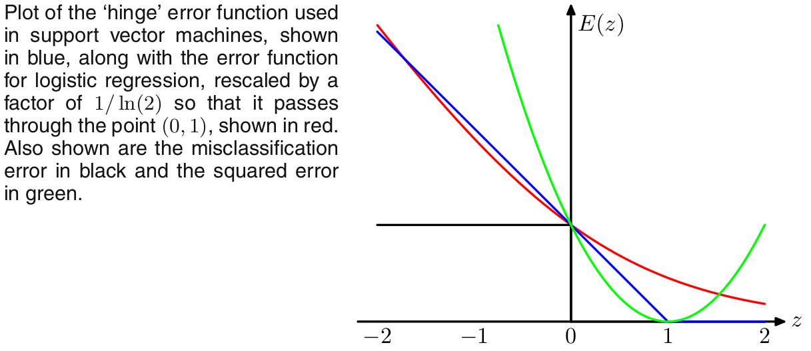
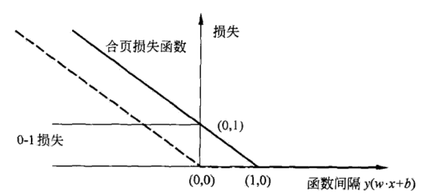
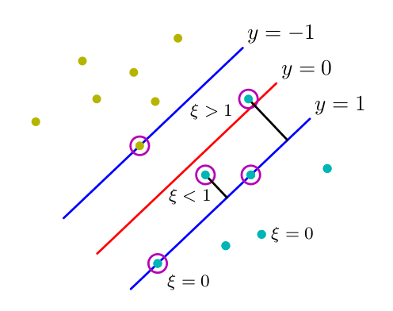

## 合页损失函数(hinge loss)

+ hinge loss function 定义：
  $$
  [z]_+=\left\{
  \begin{array}{rcl}
  z && {z > 0}\\
  0 && {z \le 0}
  \end{array} \right.   \tag{1}
  $$

  因为其函数图像像一个合页，所以叫合页损失函数。

  

  上图给出了0-1损失(黑色)，hinge loss(蓝色，对应的是$[1-z]_+$)，缩放$1/\ln(2)$后的logistic损失(红色)，均方损失(绿色)。

  当$z=y(w^T\bold x+b)$时，横轴就代表函数间隔。

+ 感知机

    考虑二分问题(binary)，输出$y$两种类别用{+1,-1}表示，假设我们要找的决策面是$w^T\bold x+b=0$，对于训练集$\left\{(\bold x_1,y_1),...,(\bold x_N,y_N)\right\}$，我们将$w^T\bold x_i+b>0$的分为+1，将$w^T\bold x_i+b<0$的分为-1。那么$y_i(w^T\bold x_i+b)>0$时，被正确分类，当$y_i(w^T\bold x_i+b)<0$时，分类出现错误。

​	{图中虚线是合页损失函数：$[0-y(w^T\bold x)]_+$，实线是：$[1-y(w^T\bold x)]_+$}

​	我们可以用0-1损失来表达感知机：
$$
L=\sum_{i=1}^N I(y_i(w^T\bold x_i))\\
I(z)=1,当z<0;I=0,当z>0   \tag{2}
$$
​	但是0-1损失是分段常函数，其导出几乎处处为0，那么我们就没有方法使用随机梯度下降法，就不容易求解。我们采用合页损失
$$
L=\sum_{i=1}^N [0-y_i(w^T\bold x_i)]_+=-\sum_{i=1}^N [y_i(w^T\bold x_i)]_+   \tag{3}
$$
​	当正确分类时，损失为0，当错误分类时，损失是$-y_i(w^T\bold x_i)$；这样就是可导的了，合页损失被成为0-1损失的代理损失函数        	(surrogate function)。

+ SVM(support vector machine)

  SVM对应的合页损失函数是：
  $$
  L=\sum_{i=1}^N [1-y_i(w^T\bold x_i +b)]_+  \tag{4}
  $$
  

  也就是说，当函数间隔$y_i(w^T\bold x_i +b)>1$时，损失为0；当函数间隔$y_i(w^T\bold x_i +b)<1$时，损失为$1-y_i(w^T\bold x_i +b)$。

  相比于感知机的合页损失，svm不仅要正确分类，还要确信度足够高时损失才为0。

  对于线性不可分函数，我们知道

  
  $$
  y_i(w^T\bold x_i)\ge 1-\xi_i\\
  \xi_i\ge 0
  $$
  当$\xi_i=0$时，数据点被正确分类，要不在边缘上，要不在边缘的正确一侧。当$0<\xi_i\le1$时，数据点在边缘和决策边界之间，被正确分类；当$\xi_i>1$时，数据点被错误分类。

  我们的目标是最大化边缘$\frac{1}{2}||w||^2$，并且以比较柔和的方式惩罚位于边界上错误一侧的点，于是目标函数：
  $$
  L=C\sum_{i=1}^N \xi_i + \frac{1}{2}||w||^2\\
  s.t. \ \  \ y_i(w^T\bold x_i+b)\ge1-\xi_i\\
  \ \ \  \xi_i\ge0,\ \ i=1,2,...,N\tag{5}
  $$
  其中$C$起着控制松弛变量惩罚和最大边缘之间折中，当$C\to \infty$时，$L=\frac{1}{2}||w||^2$，就变成了用与线性可分数据的向量机了。

  我们现在为svm对应的hinge loss function 加上正则化项：
  $$
  L=\sum_{i=1}^N [1-y_i(w^T\bold x_i +b)]_+ + \lambda||w||^2\tag{6}
  $$
  我们从合页损失角度得到的损失函数$(6)$和从几何角度得到的损失函数$(5)$之间是什么关系？本质上是一个东西么？

  答案：是的。

  现在我们来证明一下，从$(6)$式推导出$(5)$。

  令：
  $$
  [1-y_i(w^T\bold x_i +b)]_+=\xi_i\\   \tag{6.1}
  $$
  可得：
  $$
  \xi_i\ge0\\
  L=\sum_{i=1}^N \xi_i + \lambda||w||^2=\frac{1}{C}(C\sum_{i=1}^N \xi_i + \frac{1}{2}||w||^2),\ \  \ 其中\lambda=\frac{1}{2C}   \tag{6.2}
  $$
  当$1-y_i(w^T\bold x_i +b)>0$时，可得：
  $$
  1-y_i(w^T\bold x_i +b)=\xi_i  \tag{6.3}
  $$
  当$1-y_i(w^T\bold x_i +b)\le 0$时，可得：
  $$
  \xi_i=0 \\
  y_i(w^T\bold x_i +b)\ge1-0=1-\xi_i\tag{6.4}
  $$
  综合$(6.3-4)$，可得：
  $$
  y_i(w^T\bold x_i +b)\ge1-\xi_i  \tag{6.5}
  $$
  综合$(6.2)和(6.5)$，就推出了和$(5)$等价的结果。

+ 现在来看看缩放后的logistic loss function:

  对Logistic模型取对数似然函数并加上正则化项：
  $$
  L=\sum_{i=1}^N (y_i\ln\sigma(w^T\bold x_i)+(1-y_i)\ln\sigma(w^T\bold x_i))+\lambda||w||^2   \tag{7}
  $$
  上式存在思想上的模糊，那就是对数似然函数加上正则化项具不具备作为损失函数的性质？答案是不具备的，这是因为我们取似然函数是求似然函数最大，其背后包含的思想是已经发生的对应的概率就大，也就是我们让已经发生的样本对应的概率最大化，目标是对似然函数最大化，如果我们求$(7)$式最大值，那么正则化项就其不到作用，让$||w||\to \infty$，那么$L\to \infty$，自然最大了；同时也违背了让损失函数最小的目标。

  那么如何做呢？很简单，那就是让似然函数取负值，那么求似然函数最大，就是求负的似然函数最小，在这里就是取负对数似然，再加上正则化，就可以构成损失函数了。那么$(7)$式改为：
  $$
  L=-\sum_{i=1}^N (y_i\ln\sigma(w^T\bold x_i)+(1-y_i)\ln\sigma(w^T\bold x_i))+\lambda||w||^2   \tag{7.1}
  $$
  上式是将目标变量为$y\in(0,1)$的时候，为了和svm作比较，我们取$y\in(-1,1)$。那么此时$p(y=1|w)=\sigma(w^T\bold x)$，那么$p(y=-1|w)=1-p(y=1|w)=\sigma(-w^T\bold x)$，从而：
  $$
  p(y_i|w)=\sigma(y_iw^T\bold x_i)   \tag{7.2}
  $$
  则负对数似然函数加上正则化项为：
  $$
  L=\sum_{i=1}^N \ln(1+\exp(-y_iw^T\bold x_i)) +\lambda||w||^2    \tag{7.3}
  $$
  为了能和其他误差函数进行比较，将负似然对数除以$\ln 2$，使其经过$(0,1)$
  $$
  L=\sum_{i=1}^N \ln(\frac{1+\exp(-y_iw^T\bold x_i)}{2}) +\lambda||w||^2    \tag{7.4}
  $$
  这就是第一张图中红色的曲线，其中横坐标$z=yw^T\bold x$。

  对比$(6)和（7.4)$式，可以看出svm合页损失和Logistic损失函数形式上类似，只是svm平台区域带来了稀疏解。这是由合页函数本身的性质带来的稀疏性。

  **合页损失函数由于其平台区域，天然具备稀疏解!**

  这里说明一下，什么叫做稀疏解？稀疏解是指参数$w$最终解依赖的数据只是训练集中很少的一部分。svm就是一个例子，参数$w$只依赖支持向量，也就是最大边缘上的数据，显然是极少的，svm也叫稀疏核，如此叫的原因，不过是将特征$\bold x$进行空间变换为基函数$\bold \phi(\bold x)$，将$w^T\bold x$换为$w^T\bold \phi(\bold x)$而已，当然我们不必给出基函数$\bold \phi(\bold x)$的具体形式，因为推导后$w$的结果依赖$\phi(\bold x_i)^T\phi(\bold x_j)$，而$\phi(\bold x_i)^T\phi(\bold x_j)=k_{ij}$可以用核函数表示。

  反过来，也说明了svm的损失函数为什么是合页损失。

  

+ 现在来思考一下，为什么线性可分数据，用支持向量机，对应的损失函数没有合页损失？对于线性可分的svm：
  $$
  L=\min\frac{1}{2}||w||^2\\
  s.t. \ \  \ y_i(w^T\bold x_i+b)\ge1，\ \ i=1,2,...,N\tag{8}
  $$
  这是因为对于线性可分的数据，所有的数据点距离决策边界都大于等于1，此时的损失为0，将$(4)$式svm的合页损失函数写在下面：
  $$
  L=\sum_{i=1}^N [1-y_i(w^T\bold x_i +b)]_+=0  \tag{8.1}
  $$
  所以当数据线性可分的时候，svm合页损失加上正则化项就是$(8)$式，不用推导，直接对应。

