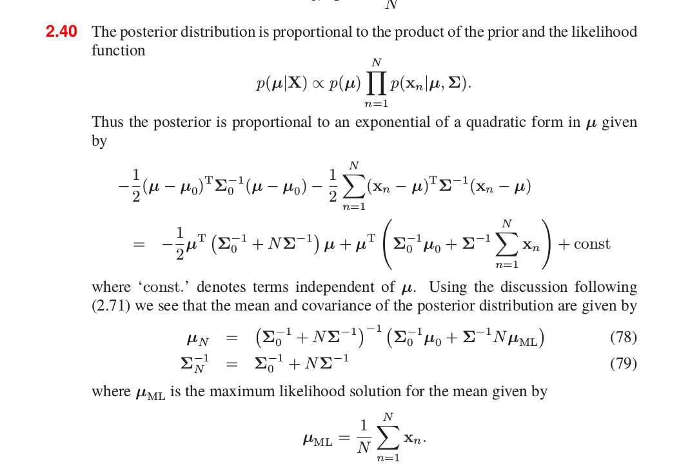

## 高斯分布

高斯分布需要仔细踏实的学个明白，这在机器学习中占据了基础性的位置，后面很多的都要用到它。

* 独立同分布的一元高斯分布

  先从简单的单变量的独立同分布来推导多变量，假设$x_i$独立，且$x_i\sim N(x_i/\mu,\sigma)$，那么：
  $$
  \begin{aligned}
  p(\bold x)
  &=p(x_1,...,x_n)=\prod_{i=1}^n N(x_i/\mu,\sigma)\\
  &=\prod_{i=1}^n\frac {1}{\sqrt{2\pi}\sigma}exp(-\frac{(x_i-\mu)^2}{2\sigma^2})\\
  &=\frac{1}{(2\pi)^{n/2}\sigma^n}exp(-\frac{\sum_{i=1}^n (x_i-\mu)^2}{2\sigma^2})\\
  &=\frac{1}{(2\pi)^{n/2}\lvert\Sigma\rvert^{1/2}}exp(-\frac{1}{2}(\bold x-\boldsymbol\mu)^T\Sigma^{-1}(\bold x-\boldsymbol\mu))
  \end{aligned}   \tag 1
  $$
  其中：
  $$
  \Sigma=
  \left[
  \begin{smallmatrix}
   \sigma^2 \\
   &\sigma^2 \\
   & & \ddots  \\
   && & \sigma^2      \\
  \end{smallmatrix}
  \right]
  $$
  可见，如果$\bold x$是$n$维向量，那么$\Sigma$就是一个$n\times n$维矩阵。

+ 一般化的多元高斯分布

  多元高斯分布，通常每一元相互之间是不独立的，其相互影响体现在协方差矩阵$\Sigma$上，此时的$\Sigma$矩阵不再是对角阵了：
  $$
  p(\bold x)=\frac{1}{(2\pi)^{n/2}\lvert\Sigma\rvert^{1/2}}exp(-\frac{1}{2}(\bold x-\boldsymbol\mu)^T\Sigma^{-1}(\bold x-\boldsymbol\mu))  \tag2
  $$
  现在来考察$ n\times n$ 维协方差矩阵$\Sigma$的性质，实际也就是实对称的性质：

  1. $\Sigma$是满秩的，可逆，有n个线性无关的特征向量
  2. $\Sigma$是对称的，所以无关向量上升为更强的约束：n个特征向量是相互正交的
  3. 通过对n个相互正交的特征向量归一化，可以得出：$\Sigma$有n个正交的单位特征向量$(u_i)_{i=1}^n$。

  $$
  \Sigma \mu_i=\lambda_i u_i  \\
  \Sigma U=U\Lambda \\
  U^TU=UU^T=I\\ 
  U=[u_1,...,u_n] \\
  \Lambda = \left[
  \begin{smallmatrix}
  \lambda_1 \\
  & \lambda_2\\
  && \ddots\\
  &&& \lambda_n
  \end{smallmatrix}
  \right]
  $$

  由上面可以得到：
  $$
  \Sigma UU^T=U\Lambda U^T  \\
  \Sigma=U\Lambda U^T=\sum_{i=1}^{n}\lambda_iu_iu_i^T\\
  \Sigma^{-1}\Sigma u_i=\lambda_i \Sigma^{-1}u_i=u_i\\
  \Sigma^{-1}u_i=u_i/\lambda_i \\
  \Sigma^{-1}=U\Lambda^{-1} U^T=\sum_{i=1}^{n}\frac {u_i u_i^T}{\lambda_i}
  $$
  现在来考察$(2)$的指数部分：
  $$
  \begin{aligned}
  (\bold x-\boldsymbol\mu)^T\Sigma^{-1}(\bold x-\boldsymbol\mu)
  &=(\bold x-\boldsymbol\mu)^T\sum_{i=1}^{n}\frac {u_i u_i^T}{\lambda_i}(\bold x-\boldsymbol\mu)\\
  &=\sum_{i=1}^{n}\frac {(u_i^T(\bold x-\boldsymbol\mu))^T({u_i^T}(\bold x-\boldsymbol\mu))}{{\lambda_i}}\\
  &=\sum_{i=1}^{n}\frac {y_i^Ty_i}{\lambda_i}
  \end{aligned}  \tag3
  $$
  通过坐标变换$y_i=u_i^T(\bold x-\boldsymbol\mu)$，可以看出，当n=2时，概率分布等高线是一个椭圆，这是因为当$p(\bold x)=const，即，$$（\bold x-\boldsymbol\mu)^T\Sigma^{-1}(\bold x-\boldsymbol\mu)=const$ ，也即$\frac {y_1^2}{\lambda_1}+\frac {y_2^2}{\lambda_2}=c$，显然是一个椭圆。

+ 现在考虑：从联合分布，如何推导出条件分布和边缘分布？

  给定：
  $$
  \bold x=
  \left [
  \begin{matrix}
  x_a\\
  x_b
  \end{matrix}
  \right ]\\
  \boldsymbol \mu=
  \left[
  \begin{matrix}
  \mu_a\\
  \mu_b
  \end{matrix}    
  \right]\\
  \Sigma=
  \left[
  \begin{matrix}
  \Sigma_{aa} &\Sigma_{ab}\\
  \Sigma_{ba} &\Sigma_{bb}
  \end{matrix}    
  \right]\\
  \Lambda=
  \left[
  \begin{matrix}
  \Lambda_{aa} &\Lambda_{ab}\\
  \Lambda_{ba} &\Lambda_{bb}
  \end{matrix}    
  \right]\\
  \Sigma^{-1}=\Lambda\\
  \Sigma_{aa}\neq\Lambda_{aa}
  $$

  1. 求$p(x_a/x_b)$

     具体求法参见prml第二章，这里只说明是如何求得：

     只看指数项：$\frac{1}{2}(\bold x-\boldsymbol\mu)^T\Sigma^{-1}(\bold x-\boldsymbol\mu)=\frac{1}{2}(\bold x_a-\boldsymbol\mu_a+\bold x_b-\boldsymbol\mu_b))^T\Lambda(\bold x_a-\boldsymbol\mu_a+\bold x_b-\boldsymbol\mu_b))$，要求给定$x_b$，$x_a$的概率，只要将想$x_b$固定，即当成常数即可。展开之后可以看出，其结果仍是$x_a$的二次项，所以$p(x_a/x_b)$仍然是高斯分布，对标标准的高斯分布，很容易得出均值和方差：
     $$
     \boldsymbol \mu_{a/b}=\boldsymbol \mu_a-\Lambda_{aa}^{-1}\Lambda_{ab}(x_b-\boldsymbol \mu_b)\\
     \Sigma_{a/b}=\Lambda_{aa}^{-1}   \tag 4
     $$

  ​     从上面可以看出，条件概率的均值是$x_b$的线性函数，协方差与$x_b$无关。

  2.求$p(x_a)$
  $$
  p(x_a)=\int p(x_a,x_b)dx_b \tag5
  $$
  上式对$x_b$积分后，就不会存在$x_b$，积分的结果将作为$p(x_a)$正交化的一部分，不同于求$p(x_a/x_b)$的是，积分过程中，有一部分$x_a$也被积掉了，所以当我们考虑涉及$x_a$的项时，就与求$p(x_a/x_b)$有所不同，具体参见prml。这里给出$p(x_a)$均值和方差：
  $$
  E(x_a)=\boldsymbol \mu_a\\
  cov(x_a)=\Sigma_{aa}   \tag6
  $$
  理解和思考：

  求$p(x_a)$，期望自然就是本身的期望，只有当求其条件概率的期望时，才会依赖条件$x_b$。

  对于其协方差来说，若果我们看看$cov(x)$是如何求得，就知道$p(x_a)$的协方差为何是其总体协方差对应的分块部分了。
  $$
  cov(x)=E[(x-E[x])(x-E[x])^T]=\\
  \left[
  \begin{matrix}
  E((x_1-E[x_1])^2) &E((x_1-E[x_1])(x_2-E[x_2])) &\cdots &E((x_1-E[x_1])(x_n-E[x_n]))\\
  E((x_2-E[x_2])(x_1-E[x_1])) &E((x_2-E[x_2])^2) &\cdots &E((x_2-E[x_2])(x_n-E[x_n]))\\
  \vdots &\vdots &\ddots & \vdots\\
  E((x_n-E[x_n])(x_1-E[x_1])) ) &\cdots &\cdots &E((x_n-E[x_n])^2
  \end{matrix}
  \right]
  $$
  上式中$x=[x_1,...,x_n]$，可以看出$cov(x_a)=\Sigma_{aa}$，例如，如果$x_a=[x_1,x_2]$，可以看到：
  $$
  cov(x_a)=\\
  \left[
  \begin{matrix}
  E((x_1-E[x_1])^2) &E((x_1-E[x_1])(x_2-E[x_2]))\\
  E((x_2-E[x_2])(x_1-E[x_1])) &E((x_2-E[x_2])^2) 
  \end{matrix}
  \right]
  =\Sigma_{22}
  $$
  比较有意思的是$cov(x_a/x_b)=\Lambda_{aa}^{-1}$，暂时没想出来直观的缘由，不过对比着边缘分布的方差，也还是很容易记住的。

+ 在进行最大后验估计$MAP$和贝叶斯推断的时候，经常要用到求后验概率：
  $$
  p(w/y)\propto p(y/w)p(w)
  $$
  先验概率$p(w)$是人为给定的，似然函数是由所建模型得到，后验概率是不容易求的，有一种简便的方法，就是采用共轭先验的方法，就是选择这样一个使得后验概率与先验概率同类型分布的先验分布。但打住，这里有一个问题，相当重要！那就是虽然多元随机向量服从高斯分布，其元素的条件概率和边缘概率仍是高斯分布；但是两个随机变量都服从高斯分布，不能推导出其联合概率分布是高斯分布，当然，当这两个变量是独立的时候，是可以推出联合概率是高斯分布的，参见从式子$(1)$。

  那么问题来了，似然是高斯分布，先验也是高斯分布，那能否确定后验也是高斯分布呢？这个确实是不一定的。

  prml给出了一种满足这种条件的情况：

  先验：	$p(\bold x)=\mathcal N(\bold x|\boldsymbol \mu,\Lambda^{-1}) \tag{6.1}$

  似然：	$p(\bold y|\bold x)=\mathcal N(\bold y|A\bold x+\bold b,L^{-1}) \tag{6.2}$

  其中$L^{-1}$与$\bold x$无关。那么其联合概率就是高斯分布，证明参见prml。

  这里给出结果：
  $$
  p(\bold y)=\mathcal N(\bold y|A\boldsymbol \mu+\bold b,L^{-1}+A\Lambda^{-1}A^T) \tag{7.1}
  $$

  $$
  p(\bold x|\bold y)=\mathcal N(\bold x|\Sigma\left\{A^TL(\bold y-\bold b)+\Lambda\boldsymbol \mu\right\},\Sigma) \tag{7.2}
  $$

  其中：$\Sigma=(\Lambda+A^TLA)^{-1}$。

  式$(7.1)$用于(高斯型贝叶斯模型，如线性回归的高斯贝叶斯模型)，式$(7.2)$用于后验概率(高斯型贝叶斯推断)计算。

  这里做一些思考和说明：

  1. 多元高斯的性质：如果多元变量服从高斯分布，那么其分量的线性组合也是服从高斯分布，这并不要求分量之间是相互独立的；但是反过来说，多个随机变量每个都服从高斯分布，只有当随机变量之间是相互独立的，其线性组合（包括相加）才是服从高斯分布的。

  2. 多个**独立**的随机变量都服从高斯分布，那么其联合概率也服从高斯分布，注意前提是相互独立的。

  3. 现在考虑当前的问题，为什么先验是$p(\bold x)=\mathcal N(\bold x|\boldsymbol \mu,\Lambda^{-1})$，似然是$p(\bold y|\bold x)=\mathcal N(\bold y|A\bold x+\bold b,L^{-1})$，其联合分布仍是高斯分布呢？

     这要从建模的角度思考，我们所建立的模型是：
     $$
     \bold y=A\bold x+\bold b +\epsilon
     $$
     $\bold y$由两部分组成，一部分是$\bold x$的线性组合，另一部分是随机误差$\epsilon \sim \mathcal N(\epsilon|0,L^{-1})$，那么$\bold y$在$\bold x$给定的情况下，其条件概率就是$(6.2)$式。

     **$\bold x$ 与$\epsilon$是相互独立的，相互独立的随机变量的和 $ \bold y$ 仍是高斯分布，其期望是各随机变量期望的和，方差是各随机变量方差的和**。

     根据期望和方差的性质，有：
     $$
     E[A\bold x+\bold b]=A\boldsymbol \mu+\bold b \tag{8.1}
     $$

     $$
     cov(A\bold x+\bold b)=A\Lambda^{-1}A^T \tag{8.2}
     $$

     所以$\bold y$有：
     $$
     E[\bold y]=A\boldsymbol \mu+\bold b +0= A\boldsymbol \mu+\bold b \tag{8.3}
     $$

     $$
     cov(\bold y)=cov(A\bold x+\bold b)+cov(\boldsymbol\epsilon)=A\Lambda^{-1}A^T+L^{-1} \tag{8.4}
     $$

     上式$(8.2)$式实际是但随机变量的 $var(ax)=a^2var(x)$的推广。

     那么联合分布$p(\bold x, \bold y)$仍是高斯分布么？上面已提到，仍然是。证明过程不难，参见prml。现在从直观上来谈谈，为什么联合分布还是高斯分布。这是因为$p(\bold x, \bold y)$本质上是$p(\bold x, \boldsymbol \epsilon)$联合分布，$\bold x$和$\boldsymbol \epsilon$是相互独立的，各自都服从高斯分布，所以联合分布也是高斯分布，所以$p(\bold x, \bold y)$也是高斯分布。

+ 高斯分布的最大似然估计

  对数似然函数：
  $$
  lnp(\bold X|\boldsymbol \mu,\Sigma)=-\frac {N}{2}ln\vert\Sigma\vert-\frac{1}{2}\sum_{n=1}^N(\bold x_n-\boldsymbol \mu)^T\Sigma^{-1}(\bold x_n-\boldsymbol \mu) +const \tag9
  $$
  对$\boldsymbol \mu$和$\Sigma$ 分别求导，令导数为0，可以得出：
  $$
  \boldsymbol \mu_{ML}=\frac 1 N \sum_{n=1}^N\bold x_n \tag{9.1}
  $$

  $$
  \begin{aligned}
  \Sigma_{ML}
  &=\frac 1 N \sum_{n=1}^N(\bold x_n-\frac 1 N \sum_{n=1}^N\bold x_n)(\bold x_n-\frac 1 N \sum_{n=1}^N\bold x_n)^T \\
  &=\frac 1 N \sum_{n=1}^N(\bold x_n-\boldsymbol \mu_{ML})(\bold x_n-\boldsymbol \mu_{ML})^T
  \end{aligned}\tag{9.2}
  $$

  我们现在衡量一下，最大似然估计得到的参数与真实值的偏差，从而引出有偏估计和无偏估计。

  如何衡量偏差呢？用估计出的参数值在真实分布下的期望-真实值，这里说的真实分布不是参数的分布，而是所建模型的分布，以上面的为例，估计出的参数值在真实分布下的期望是：$E_{\bold x \sim \mathcal N(\bold x|\boldsymbol \mu,\Sigma)}(\boldsymbol \mu_{ML})$。

  偏差公式：
  $$
  bias(\hat\theta)=E(\hat\theta)-\theta \tag{9.3}
  $$
  其中$\theta$是用于定义数据生成分布的$\theta$的真实值，$bias(\theta)=0$是无偏估计，否则是有偏估计。

  现在来分析$\boldsymbol \mu_{ML}$和$\Sigma_{ML}$:
  $$
  \begin{aligned}
  E_{\bold x \sim \mathcal N(\bold x|\boldsymbol \mu,\Sigma)}[\boldsymbol \mu_{ML}]
  &=E[\frac 1 N \sum_{n=1}^N\bold x_n]\\
  &=\frac 1 N \sum_{n=1}^NE[\bold x_n]\\
  &=\frac 1 N \sum_{n=1}^N \int_{-\infty}^{+\infty}\bold x_n\mathcal N(\bold x_n|\boldsymbol \mu,\Sigma)d\bold x_n\\
  &=\boldsymbol \mu
  \end{aligned} \tag{9.4}
  $$

  $$
  \begin{aligned}
  E_{\bold x \sim \mathcal N(\bold x|\boldsymbol \mu,\Sigma)}[\Sigma_{ML}]
  &=E[\frac 1 N \sum_{n=1}^N(\bold x_n-\boldsymbol \mu_{ML})(\bold x_n-\boldsymbol \mu_{ML})^T]\\
  &=\frac 1 N \sum_{n=1}^NE[(\bold x_n-E[\bold x_n]+E[\bold x_n]-\boldsymbol \mu_{ML})(\bold x_n-E[\bold x_n]+E[\bold x_n]-\boldsymbol \mu_{ML})^T]\\
  &=\frac 1 N \sum_{n=1}^NE[(\bold x_n-E[\bold x_n])(\bold x_n-E[\bold x_n])^T]+E[(\bold x_n-E[\bold x_n])(\bold E[\bold x_n]-\boldsymbol \mu_{ML})^T]\\
  &+E[(\bold E[\bold x_n]-\boldsymbol \mu_{ML})(\bold x_n-E[\bold x_n])^T]+E[(\bold E[\bold x_n]-\boldsymbol \mu_{ML})(\bold E[\bold x_n]-\boldsymbol \mu_{ML})^T]\\
  &=\frac 1 N \sum_{n=1}^N (1-\frac 1 N-\frac 1 N+\frac 1 N)\Sigma\\
  &=\frac 1 N \sum_{n=1}^N (\frac {N-1} N)\Sigma\\
  &=\frac {N-1} N\Sigma
  \end{aligned} \tag{9.5}
  $$

  上式的证明利用了独立性质。显然$\boldsymbol \mu_{ML}$是无偏估计，$\Sigma$是有偏估计，那么$\Sigma$的无偏估计是什么呢？
  $$
  \hat \Sigma
  =\frac 1 {N-1} \sum_{n=1}^N(\bold x_n-\boldsymbol \mu_{ML})(\bold x_n-\boldsymbol \mu_{ML})^T
  \tag{9.6}
  $$

+ Bayesian推断(最大后验估计：MAP)

  似然估计容易过拟合，用最大后验估计方法如下：

  1. 估计$\boldsymbol \mu$ 

     假设先验$\boldsymbol \mu \sim\mathcal N(\boldsymbol \mu|\boldsymbol \mu_0,\Sigma_0)$，每个样本$\bold x$是都是独立同高斯分布的，可知其联合分布$p(\bold X|\boldsymbol \mu)$也是高斯分布：
     $$
     p(\bold X|\boldsymbol \mu)=\prod_{n=1}^N\mathcal N(\bold x_n|\boldsymbol \mu,\Sigma) \tag{10.1}
     $$
     对于样本$\bold x$，所建立的模型是：
     $$
     \bold x=\boldsymbol \mu+\boldsymbol \epsilon \tag{10.2}
     $$
     其中：$\boldsymbol \epsilon \sim \mathcal N(\boldsymbol \epsilon|\bold 0,\Sigma)$

     那么对于由$N$个样本组成的随机向量$\bold X$：
     $$
     \bold X= \left[
     \begin{matrix}
     (\bold x_1)\\
     \vdots\\
     (\bold x_N)
     \end{matrix}\right]_{Nm\times 1}
     =  
     \left[\begin{matrix}
     \boldsymbol \mu\\
     \vdots\\
     \boldsymbol \mu
     \end{matrix}\right]_{Nm\times 1}
     +
     \left[\begin{matrix}
     \boldsymbol \epsilon\\
     \vdots\\
     \boldsymbol \epsilon
     \end{matrix}\right]_{Nm\times 1}=\left[\begin{matrix}
     \boldsymbol I\\
     \vdots\\
     \boldsymbol I
     \end{matrix}\right]_{Nm\times m}\boldsymbol\mu_{m\times 1}+\left[\begin{matrix}
     \boldsymbol \epsilon\\
     \vdots\\
     \boldsymbol \epsilon
     \end{matrix}\right]_{Nm\times 1}
     =A\boldsymbol\mu_{m\times1}+\bold V\\
     cov(\bold V)=
     \left[
     \begin{smallmatrix}
      \Sigma \\
      &\Sigma\\
      & & \ddots  \\
      && & \Sigma      \\
     \end{smallmatrix}
     \right]
     =\Beta   \tag{10.3}
     $$
     其中$\bold I$是$m \times m$的单位阵。

     根据式$(7.2)$可以得到后验概率$p(\boldsymbol \mu|\bold X)$：
     $$
     p(\boldsymbol \mu|\bold X)=\mathcal N(\boldsymbol \mu|\Sigma_N(\Sigma_0^{-1}\boldsymbol \mu_0+N\Sigma^{-1}\boldsymbol \mu_{ML}),\Sigma_N) \tag{10.4}
     $$

     $$
     \Sigma_N=(\Sigma_0^{-1}+A^T\Beta^{-1} A)^{-1}=(\Sigma_0^{-1}+N\Sigma^{-1})^{-1}
     $$

     其中均值括号中的第二项$N\Sigma^{-1}\boldsymbol \mu_{ML}$的由来，根据$(7.2)$式：
     $$
     A^T\Beta^{-1}\bold X=[\bold I,\bold I,...,\bold I]\left[
     \begin{smallmatrix}
      \Sigma^{-1} \\
      &\Sigma^{-1}\\
      & & \ddots  \\
      && & \Sigma^{-1}      \\
     \end{smallmatrix}
     \right]
     \left[\begin{matrix}
     \bold x_1\\
     \vdots\\
     \bold x_N
     \end{matrix}\right]
     =\left[\Sigma^{-1},\Sigma^{-1},...\Sigma^{-1}\right]\left[\begin{matrix}
     \bold x_1\\
     \vdots\\
     \bold x_N
     \end{matrix}\right]\\
     =\Sigma^{-1}\sum_{n=1}^N \bold x_n
     =N\Sigma^{-1}\boldsymbol \mu_{ML}  \tag{10.5}
     $$
     其实，书中也给出了也是另一个通用的方法 就是对高斯指数进行配平方，对于输出样本$\bold x$ 是随机向量时，找$A$并且随后的计算有时候并不轻松，可以用配方法进行求解，prml第$(2.40)$练习题就是我们的问题，先粘贴答案：

     

+ 应用：Bayesian线性回归

  1. 单变量输出：

  先验$p(\bold w)$:
  $$
  p(\bold w)=\mathcal N(\bold w|\bold m_0,\bold S_0)  \tag{11.1}
  $$
  似然$p(\bold t|\bold x,\bold w,\beta)$:
  $$
  p(\bold t|\bold x,\bold w,\beta)=\prod_{n=1}^N\mathcal N(t_n|\phi(\bold x_n)^T\bold w,\beta^{-1})  \tag{11.2}
  $$
  这里我们对单个样本所建立的模型是：
  $$
  t=\phi(\bold x)^T\bold w+\epsilon\\
  \epsilon \sim \mathcal N(\epsilon|0,\beta^{-1})   \tag{11.3}
  $$
  那么随机向量变量$\bold t$:
  $$
  \bold t=\Phi(\bold x)\bold w+\boldsymbol \epsilon  \tag{11.4}
  $$
  其中:
  $$
  \Phi(\bold x)= \left[
  \begin{matrix}
  \phi(\bold x_1)^T\\
  \vdots\\
  \phi(\bold x_N)^T
  \end{matrix}\right]_{N\times m}
  \ \ \ \ \ \ \ \
  cov(\boldsymbol \epsilon)=
  \left[
  \begin{smallmatrix}
   \beta^{-1} \\
   &\beta^{-1} \\
   & & \ddots  \\
   && & \beta^{-1}      \\
  \end{smallmatrix}
  \right]
  =\Beta   \tag{11.5}
  $$
  从而：
  $$
  p(\bold t|\bold x,\bold w,\beta)=\mathcal N(\bold t|\Phi(\bold x)\bold w,\Beta)   \tag{11.6}
  $$
  后验概率$p(\bold w|\bold t,\bold x,\beta)$，依据式子$(7.2)$可得:
  $$
  p(\bold w|\bold t,\bold x,\beta)=\mathcal N(\bold w|\bold m_N,\bold S_N)   \tag{11.7}
  $$
  其中：
  $$
  \bold m_N=\bold S_N(\bold S_0^{-1}\bold m_0+\beta\Phi^T\bold t)
  $$

  $$
  \bold S_N^{-1}=\bold S_0^{-1}+\Phi^T\Beta\Phi=\bold S_0^{-1}+\beta\Phi^T\Phi    \tag{11.8}
  $$

  考虑先验分布的简化版本：
  $$
  p(\bold w)=\mathcal N(\bold w|0,\alpha^{-1}\bold I)   \tag{11.9}
  $$
  那么相应的后验分布的期望和方差：
  $$
  \bold m_N=\beta\bold S_N\Phi^T\bold t
  $$

  $$
  \bold S_N^{-1}=\alpha\bold I+\beta\Phi^T\Phi   \tag{11.10}
  $$

  预测分布：
  $$
  p(t|\bold t,\alpha,\beta)=\int p(t|\bold w,\beta)p(\bold w|\bold t,\alpha,\beta)d\bold w   \tag{11.11}
  $$
  其中：$p(t|\bold w,\beta)=\mathcal N(t_n|\phi(\bold x_n)^T\bold w,\beta^{-1})$。

  预测分布求边缘概率，依据式$(7.1)$可得：
  $$
  p(t|\bold t,\alpha,\beta)=\mathcal N(t_n|\phi(\bold x_n)^T\bold m_N,\beta^{-1}+\phi(\bold x_n)^T\bold S_N\phi(\bold x_n))   \tag{11.12}
  $$

  2. 多变量输出

     当输出不是单变量，而是$K$个目标变量，用$\bold t$来表示这目标变量的集合。那么应该怎么处理呢？一种是对$\bold t$的每一个分量都用一种基函数，但是另外一种更为常用：**所有的分量都用同一种基函数集合来表示**，这很像卷积神经网络中卷积核。

     那么所建模型就是：
     $$
     \bold t=\bold W^T\phi(\bold x)+\boldsymbol \epsilon\\
     \boldsymbol \epsilon \sim \mathcal N(\boldsymbol \epsilon|\bold 0,\beta^{-1}\bold I)
     $$
     这里假定$\boldsymbol \epsilon$服从等熵高斯模型。那么目标变量条件分布：
     $$
     p(\bold t|\bold x, \bold W,\beta)= \mathcal N(\bold t|\bold W^T\phi(\bold x),\beta^{-1}\bold I)
     $$
     观测集合$\left\{\bold t_1,...,\bold t_N\right\}$，把它整合到矩阵$\bold T$中，$\bold t_i^T$作为$\bold T$的第$i$行，那么$\bold T \in R^{N\times K}$。那么对数似然函数：
     $$
     \begin{aligned}
     \ln p(\bold T|\bold X, \bold W,\beta) 
     &= \sum_{n=1}^N ln\mathcal N(\bold t_n | \bold W^T\phi(\bold x_n),\beta^{-1}\bold I))\\
     &=-\frac{1}{2\beta}\sum_{n=1}^N \|\bold t_n-\bold W^T\phi(\bold x_n)\|^2+const
     \end{aligned}
     $$
     对$\bold W$进行求导，为0，得出最大似然估计是：
     $$
     \bold W_{ML}=(\Phi^T\Phi)^{-1}\Phi^T\bold T
     $$
     检查上式结果，对每一个目标变量$t_k$，我们有：
     $$
     \bold w_k=(\Phi^T\Phi)^{-1}\Phi^T\bold t_k= \Phi^{\dagger}\bold t_k
     $$
     其中，$\bold t_k$是$N$维列向量，元素$t_{nk}$，$(n=1,...,N)$，从上式可以看到，这个是单变量输出的最大似然估计，也就是说，多变量最大似然估计的解可以解耦为单变量最大似然估计。这是因为参数$\bold W$只是定义了高斯均值，与方差没有关系，所以最大似然估计的结果也就与方差无关，只与观测数据有关，所以可以解耦。

+ 混合高斯模型：

  虽然高斯模型可解析，但是用它对现实数据进行建模时，该模型有重大的limitations，比如不能很好的捕捉数据特征（例子见prml）。但我们可以用多个参数不同的高斯模型的线性组合来建模，会达到很好的效果。事实上，只要用足够多的高斯模型进行组合，并通过调整各高斯模型的期望和方差，以及线性组合系数，就可以任意精度的逼近任何连续变量的概率密度。

  混合高斯模型：
  $$
  p(\bold x)=\sum_{k=1}^K \pi_k \mathcal N(\bold x|\boldsymbol \mu_k,\Sigma_k)
  $$
  其中：
  $$
  \sum_{k=1}^K \pi_k=1\\
  0 \leq \pi_k \leq 1从概率的和积规则来理解上式，边缘概率密度：从概率的和积规则来理解上式，边缘概率密度：
  $$

  $$
  p(\bold x)=\sum_{k=1}^K p(k) p(\bold x|k)
  $$

  可以将$\pi_k=p(k)$看成是选择第$k$个高斯变量的先验分布，$\mathcal N(\bold x|\boldsymbol \mu_k,\Sigma_k)=p(\bold x|k)$看作是条件概率，在后面的章节中，我们会看到，对应的后验概率$p(k|\bold x)$将会起很大的作用，在这里，这个后验概率被称为**责任**，后验概率：
  $$
  p(k|\bold x)=\frac {p(k)p(\bold x|k)}{\sum_lp(l)p(\bold x|l)}=\frac { \pi_k \mathcal N(\bold x|\boldsymbol \mu_k,\Sigma_k)}{\sum_{l=1} \pi_l \mathcal N(\bold x|\boldsymbol \mu_l,\Sigma_l)}
  $$
  混合高斯模型是由参数$\boldsymbol \pi, \boldsymbol \mu, \boldsymbol \Sigma$控制，$\boldsymbol \pi=[ \pi_1,...,\pi_K]$，$\boldsymbol \mu=[\boldsymbol \mu_1,...,\boldsymbol \mu_K]$，$\boldsymbol \Sigma=[\boldsymbol \Sigma_1,...,\boldsymbol \Sigma_K]$组成，如何取估计这些参数呢？

  最大似然估计：
  $$
  \ln p(\bold X|\boldsymbol \pi, \boldsymbol \mu, \boldsymbol \Sigma)=\sum_{n=1}^N ln\sum_{k=1}^K\pi_k \mathcal N(\bold x|\boldsymbol \mu_k,\Sigma_k)
  $$
  注意：由于式子中有关于$k$的求和，所以最大似然估计没有闭式解，一种方式是用数值迭代来计算；另一种是采用$EM$算法（expectation maximization:期望最大），参见Prml第9章。

+ 现在综合论述一下用共轭先验来推断的过程。

  1. 已知方差$\Sigma$ ，求$\boldsymbol \mu$： 

     似然函数为：

$$
p(\bold X|\boldsymbol \mu)=\prod_{n=1}^N\mathcal N(\bold x_n|\boldsymbol \mu,\Sigma)=(2\pi|\Sigma|)^{-N/2}|\exp(-\frac{1}{2}\sum_{i=1}^N (\bold x_i-\boldsymbol\mu)^T\Sigma^{-1}(\bold x_i-\boldsymbol\mu))
$$

​		显然似然函数关于$\mu$是高斯分布，那么当先验$p(\boldsymbol \mu)$ 也取高斯分布：$p(\boldsymbol \mu)=\mathcal N(\boldsymbol \mu|\boldsymbol \mu_0,\Sigma_0)$ ，那么后验
$$
p(\boldsymbol \mu|\bold X)\propto p(\bold X|\boldsymbol \mu)p(\boldsymbol \mu)
$$
​		显然也是高斯分布，我们只要从$ p(\bold X|\boldsymbol \mu)p(\boldsymbol \mu)$中找到关于$\boldsymbol \mu$的期望和方差，就找到了后验的期望和方差。

​	2.已知$\boldsymbol \mu$，求$\Sigma$ 

​		在求方差时，一般用精度$\Lambda$ 更方便处理求解过程，$\Lambda=\Sigma^{-1}$：
$$
p(\bold X|\Lambda)=\prod_{n=1}^N\mathcal N(\bold x_n|\boldsymbol \mu,\Lambda^{-1})\propto |\Lambda|^{N/2}\exp(-\frac{1}{2}\sum_{i=1}^N (\bold x_i-\boldsymbol\mu)^T\Lambda(\bold x_i-\boldsymbol\mu))=|\Lambda|^{N/2}\exp(\frac{-1}{2}Tr(\Lambda S))\\
S=\sum_{i=1}^N (\bold x_i-\mu)(\bold x_i-\mu)^T
$$
​		而当先验取Wishart distribution时，可以得到后验也是Wishart distribution。
$$
\mathcal W(\Lambda|\bold W,\nu)=B|\Lambda|^{(\nu+D-1)/2}\exp(-\frac{1}{2}Tr(\bold W \Lambda))
$$
​		其中$B$为归一化系数，$\bold W$是$D\times D$的矩阵，$\nu$是自由度。

​	3. 当$\boldsymbol \mu , \Sigma $都未知时，似然函数：
$$
p(\bold X|\boldsymbol \mu,\Lambda)=\prod_{n=1}^N\mathcal N(\bold x_n|\boldsymbol \mu,\Lambda^{-1})\propto |\Lambda|^{N/2}\exp(-\frac{1}{2}\sum_{i=1}^N (\bold x_i-\boldsymbol\mu)^T\Lambda(\bold x_i-\boldsymbol\mu))
$$
​		通过变换后（具体可参见PRML第二章），发现$(\Lambda, \Sigma) $ 的先验是Gaussian-Wishart distribution，即
$$
p(\boldsymbol \mu,\Sigma|\boldsymbol \mu_0,\beta,\bold W,\nu)=\mathcal N(\boldsymbol \mu|\boldsymbol \mu_0,(\beta\Lambda)^{-1})\mathcal W(\Lambda|\bold W,\nu)
$$
​	