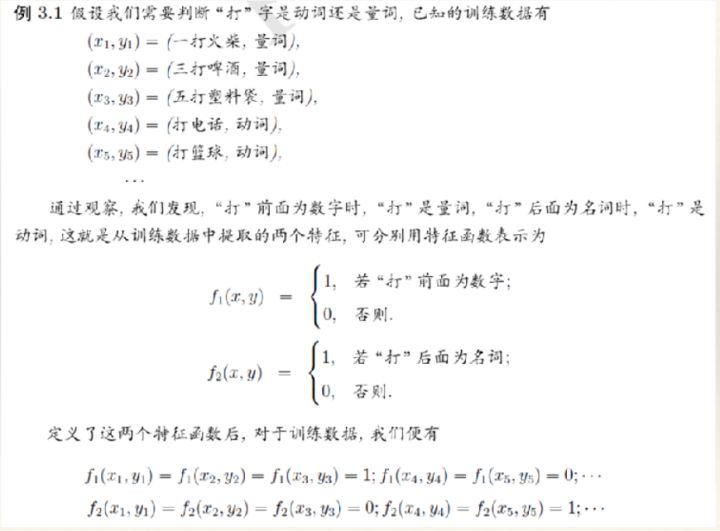

# 最大熵模型以及与指数族分布

最大熵原理是一种直觉性的思维方法，就是在没有更多信息的情况下，最大熵选择等可能的概率模型。等可能可以通过熵的最大化来选择。比如掷骰子，在没有更多信息的情况下（比如没有说明筛子质地是否均匀等），那么我们给出认为是最好模型就是均匀分布，即每一面出现的概率相等，这可以通过熵的最大化而得到。

熵的定义：
$$
H(p)=-\sum_x p(x)\log p(x)  \tag{1}
$$
现在考虑$x$是离散的，那么最大熵下的概率模型就是优化以下函数：
$$
\max-\sum_i^K p(x_i)\log p(x_i) \\
s.t. \ \ \ \sum_i^K p(x_i)=1   \tag{2}
$$
上面等价与：
$$
\min\sum_i^K p(x_i)\log p(x_i) \\
s.t. \ \ \ \sum_i^K p(x_i)=1   \tag{3}
$$
通过Lagrange方法，构造Lagrange 算子：
$$
L=\sum_i^K p(x_i)\log p(x_i)+\lambda (\sum_i^K p(x_i)-1)   \tag{4}
$$
上式对$p(x_i)$求导并令导数为0：
$$
\frac{\part L}{\part p(x_i)}=\log p(x_i)+1+\lambda=0  \tag{5}
$$
可以得出：
$$
p(x_i)=\exp(-1-\lambda)   \ \ \ i=1,...,K
$$
可见是均匀分布，也就是说最大熵和我们想让等可能的概率模型是一致的。

现在考虑最大熵模型如何应用到用到分类上，并由此推导出了指数族分布。

现在给定训练集，如何训练出最合适的概率分布呢？找到使得熵最大的概率分布就是我们要找的。但我们要找的这个概率分布还要满足既定事实的约束，既定事实就是已经观测的数据得到的。通过什么样的数学表达来说明我们要寻求的概率分布满足既定事实的约束？

比如给定数据集$T=\left\{(\bold x_1,y_1),...,(\bold x_N,y_N) \right\}$，我们通过训练集可以得到某些事实，一种事实可以用一种特征函数$f(x)$来表示，假设从训练集中得到n种事实，那么就需要n 种特征函数来表示，比如下面的例子：

在《最大似然函数、交叉熵和经验分布的关系》中已经介绍了经验分布，

现在我们考虑分类模型，$y$自然是离散的，这里我们的输入$\bold x$也考虑是离散的，因为

