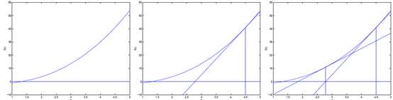

## 随机梯度下降和牛顿法

在机器学习中，要对损失函数进行求最值，最常用的方法是随机梯度下降法。

比如损失函数是$J(\theta)$，参数是$\theta$，则迭代公式如下：
$$
\theta_j:=\theta_j-\alpha \frac{\partial}{\partial \theta_j} J(\theta)  \tag{1}
$$
还有一种求解方法是从导数入手，假如$\theta ^*$是$J(\theta)$最大时解，那么$J'(\theta^*)=0$，所以我们转向求使得$J'(\theta)=0$的解。

而我们知道，求$f(\theta)=0$的解有牛顿法：
$$
\theta:=\theta-\frac{f(\theta)}{f'(\theta)}   \tag{2}
$$

牛顿方法的简单思想是：随便选择一个点，做切线，切线与$\bold x$轴的交点的横坐标就是下一次迭代的起点。

推导式$(2)$：

假设某一次迭代为$(\theta_n,f(\theta_n))$，其切线的斜率是$f'(\theta_n)$，该切线与$\bold x$轴交点为$(x_{n+1},0)$，那么：
$$
\frac{f(\theta)-0}{\theta_{n}-\theta_{n+1}}=f'(\theta_n)
$$
从而可以得出：
$$
\theta_{n+1}=\theta_n-\frac{f(\theta_n)}{f'(\theta_n)}
$$
现在再回到问题来，我们要求$J'(\theta^*)=0$，那么自然有：
$$
\theta:=\theta-\frac{J'(\theta)}{J''(\theta)}   \tag{3}
$$
也即是：
$$
\theta:=\theta-H^{-1}\triangledown_{\theta} J  \tag{4}
$$
其中$H$是$henssian$海森矩阵:
$$
H_{ij}=\frac{\partial^2 J(\theta)}{\partial\theta_i\partial\theta_j}
$$
总结一下：

牛顿法比随机下降法收敛快，迭代步数少，但因为要求海森矩阵的逆矩阵$H^{-1}$，所以计算量大，当数据集较大时，不适合。