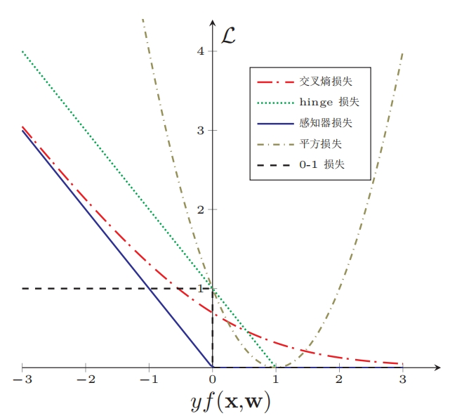

## 机器学习中损失函数构造的思考
    对于损失函数的构造，似乎有各种各样，其中之间有相互有交叉关系，本文进行梳理一下  
### 构造损失函数有没有模式？
* 我们先对各种常见算法的损失函数进行归纳：    

Algorithm | Loss function
-------- | -----------
最小二乘法 | 均方损失
线性回归 | MLE 、 交叉熵
Logistics | MLE 、MAP、交叉熵
softmax | MLE 、MAP、交叉熵
SVM | 硬软间隔距离、合页损失
多分类SVM | 合页损失
感知机 | 合页损失
naive Bayesian | 0-1损失、MAP

* 之间的关系说明  
    * loss function 的构造分为概率模型和非概率模型
    * 概率模型：
        1. MLE 等价于 交叉熵损失；
        2. MAP 等价于 交叉熵+正则化；
        3. 朴素贝叶斯因为对象是离散变量，所以要求解最大后验概率$p(y=c_k| x)$，要对$p(y)、p(x|y)$建模，又用到MLE进行参数估计，能否用交叉熵呢？不方便用。同时可以从0-1损失推导得到；
    * 非概率模型
        1. 均方损失也可以从概率模型推得，从概率模型的角度，构造MLE或交叉熵都可以推导出均方损失； 
        2. 间隔距离是完全从几何角度进行推导的，后面给出合页损失也能达到这个效果，这个损失的角度是什么意思呢？SVM的合页损失$max(0, 1-y_i(w^Tx_i+b))$，意思如果分错了，由于$y_i(w^Tx_i-b)<0$，那么损失就是max中的后一项，如果分对了，如果间隔小于1，那么也会有损失，只要分对了，且间隔大于1的才没有损失。**SVM软间隔构造的目标函数等价于合页损失+正则化** ；
        3. 感知机的合页损失，$max(0, -y_i(w^Tx_i+b))$，只有分错的时候才会有损失。
        4. 前面说的2,3是对二分而言的，当多分类的时候，(例如深度学习中图片分类，输出层可以使用SVM损失函数，也可以用softmax转换为概率后，再用交叉熵构造损失函数)，SVM的合页损失是：$L_i = \sum_{j\ne y_i}max(0, \delta + s_j - s_{y_i})$，这是对第i个样本而言的，其中，类别y用one-hot 编码，$y_i$是第i个样本的类别中是1的那个index。其实当是使用SVM损失的时候，可以不用one-hot编码，直接是用自然数编码，对应好关系就行。在用softmax的时候，因为要用交叉熵，用one-hot来代表真实的概率分布，这样来更方便；
    * 这里的关系并步复杂
        1. 如果建模的时候，既可以用概率来建模，也可以用几何来建模，或者其他物理特性来建模，那么最终的损失函数就是互通的；
        2. 对于连续变量概率模型而言，MLE和交叉熵是互通的，MAP和交叉熵+正则化是互通的；
        3. 对于不能用概率建模的，用几何推导的目标函数就一定可以用合页损失来表示和解释；
        4. 对于多分类问题，用合页损失和交叉熵损失都可以，这也是深度学习中输出层应用的损失函数，一般来说，交叉熵损失函数应用的更多。
* 一张损失函数比较图  

