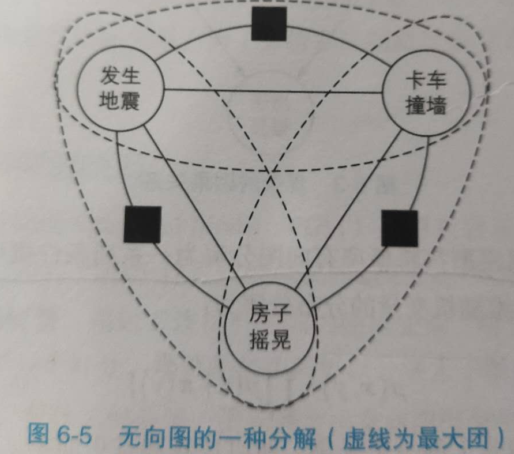
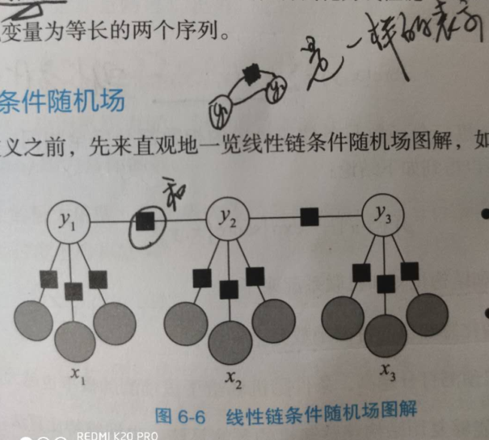
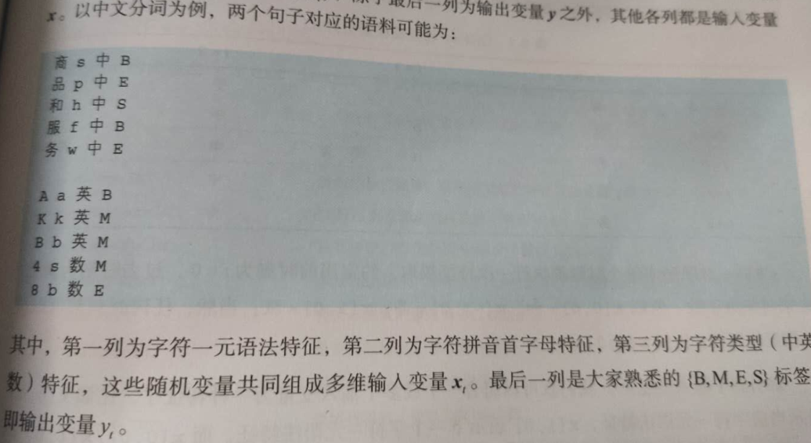

## 条件随机场(CRF)

### 无向图模型(马尔科夫随机场)
`马尔科夫随机场` 又叫 `概率无向图模型`，是一个可以由 `无向图` 表示的 `联合概率分布`。反之就是说，当联合概率可以用 `无向图` 表示，该联合概率所表示的模型就叫 `马尔科夫随机场`。  
对于 `概率无向图模型`， `联合概率分布`可以表示为 `所有最大团上某种函数的乘积`。  
给定概率无向图模型，设其无向图为 $G$， $C$ 为 $G$ 上最大的团， $Y_C$ 表示 $C$ 对应的随机变量， 那么概率无向图模型的联合概率分布为 $P(Y)$ 可以写作图中所有最大团 $C$上的函数 $\Psi_C(Y_C)$ 乘积后归一化：
$$
P(Y)=\frac{1}{Z}\prod_C \Psi_C(Y_C) 
$$
`概率有向图` 的 `联合概率分布` 是使用图中条件概率进行分解的，因为有向图已经给出了 `因果关系(依赖关系)`，而概率无向图只是说明相连的两个随机变量存在关系，并没有明确的 `因果关系`，也就不涉及条件概率分解。  
`最大团` 是满足所有结点相互连接的 `最大子图`，如果最大团里面 `结点数(随机变量数)`比较多，那么最大团所对应的 `特征函数` 也就非常大，学习起来就困难。为此，无向图模型定义了一些 `虚拟的因子结点`，(参见 何晗《自然语言处理入门》)，从而将最大团概率分布可以表示成更小的最大团的积。  
  
引入 `因子结点`(黑方框) ，原来最大的团 `发生地震、卡车撞墙、房子摇晃` (三个变量的团) 分为 `3个小型最大团来表示`， 每个最大团只有两个变量结点，当我们在表示联合概率时候，原来的最大团就不考虑了，只考虑带因子结点的最大团，也就是图中用虚线表示的 `3个最大团`。  
无向图模型的联合概率分布分解为 `一系列带分子结点的最大团中 **因子结点对应的函数** 之积`!!!：  
$$
p(x,y) = \frac{1}{Z} \prod_a \Psi_a(x_a, y_a)
$$
其中 `a` 是因子结点， $\Psi_a$ 是 **因子结点对应的函数!!!**， $x_a, y_a$ 是与因子结点相连的所有变量结点。  
常用的 `因子函数` $\Psi_a$ 是指数家族：
$$
\Psi_a(x_a, y_a) = \exp \{\sum_k w_{ak} f_{ak}(x_a, y_a)) \}
$$
其中， $k$ 是特征编号， $f_{ak}(x_a, y_a))$ 是特征函数， $w_{ak}$ 是特征权重。  

**这里的因子结点到底是什么?**，因子结点不是变量， **可以将 `因子结点` 看成是 `特征函数f`**。  

### 条件随机场(crf)
`CRF` 是给定一组输入随机变量下，另一组输出随机变量的概率。其特点是假设 **输出随机变量构成马尔科夫随机场**。  
用于 `序列标注`时，特例化为 `线性链条件随机场`，输入和输出是两个等长的随机变量，也就是一个输入对应一个输出。  
`线性链条件随机场` 如下图：   

其中 $x_t$ 上的 3 个灰点代表 $x_t$ 的 3 个特征(当然，特征数是任意的)， 相对于 `HMM` 对 $x_t$ 提取唯一特征， `CRF` 可利用的特征更加丰富。例如下图  

对照 `线性链条件随机场` 图，其定义如下：
$$
p(y|x) = \frac{1}{Z} \prod_{t=1}^T \exp\{ \sum_{k=1}^K w_k f_k(y_{t-1}, y_t, x_t)\}
$$

上面的特征函数和权重分别写成向量的形式 $\phi(y_{t-1}, y_t, x_t)， \bold w \in R^{K \times 1}$， 那么上式可以简化为
$$
p(y|x) = \frac{1}{Z} \prod_{t=1}^T \exp\{ \bold w \cdot \phi (y_{t-1}, y_t, x_t)\}  \\
= \frac{1}{Z} \exp \{ \sum_{t=1}^T  \bold w \cdot \phi (y_{t-1}, y_t, x_t)\}  \\  \tag{1}
$$
对比感知机打分函数：
$$
score(x, y) = \sum_{t=1}^T  \bold w \cdot \phi (y_{t-1}, y_t, x_t)
$$
打分函数和 `CRF` 指数部分完全相同， $(1)$ 可以写成
$$
p(y|x) = \frac{1}{z} \exp (score(x,y))
$$
于是 `CRF` 和感知机联系起来了：  
- 两者的特征函数完全相同
- 感知机对某预测打分越高， `CRF` 对该预测的概率越大

**最后一个关键问题，那就是特征函数 $f_k$ 如何构造？**  
其实很简单，那就是 
$$
f(y_{t-1}, y_t, x_t)=\left \{
\begin{aligned}
1 &&   预测结果和样本一致时 \\
0 &&  other \\
\end{aligned}
\right .
$$

