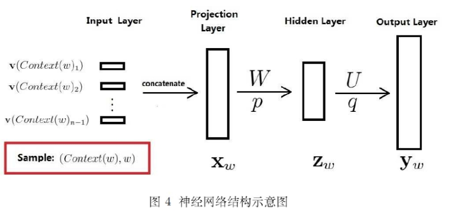
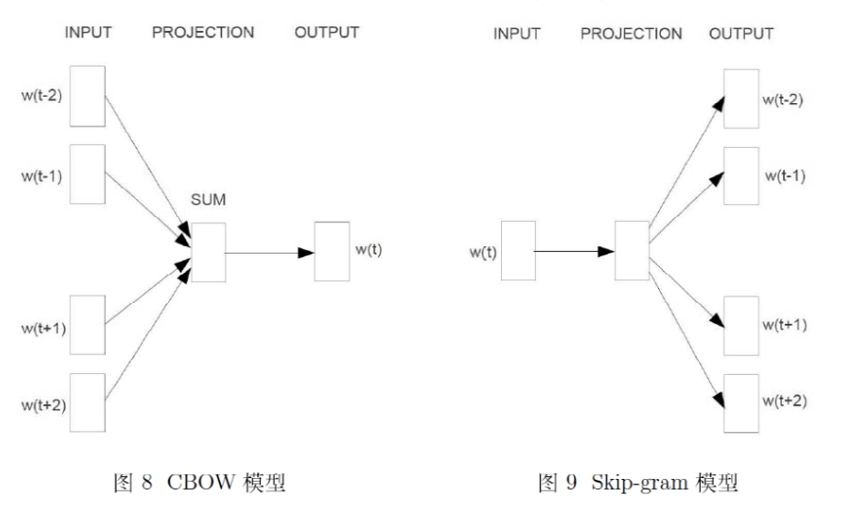
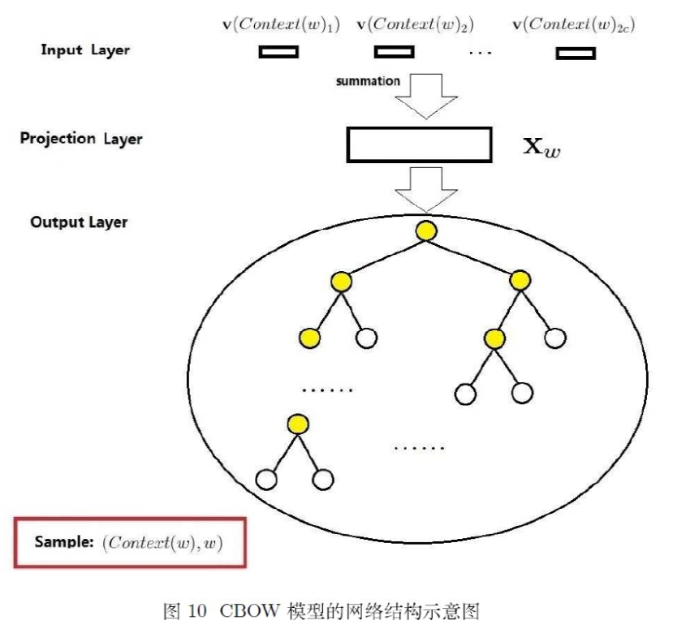
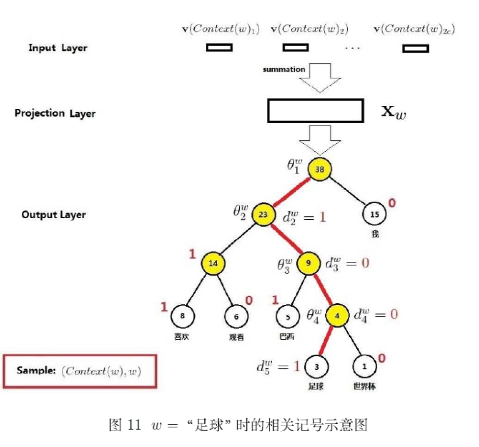
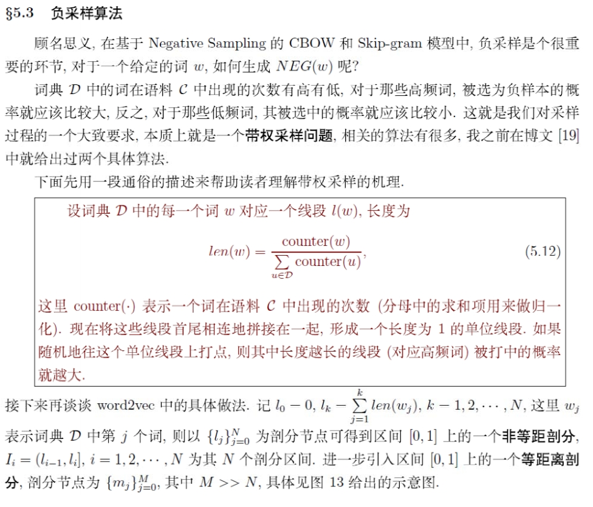
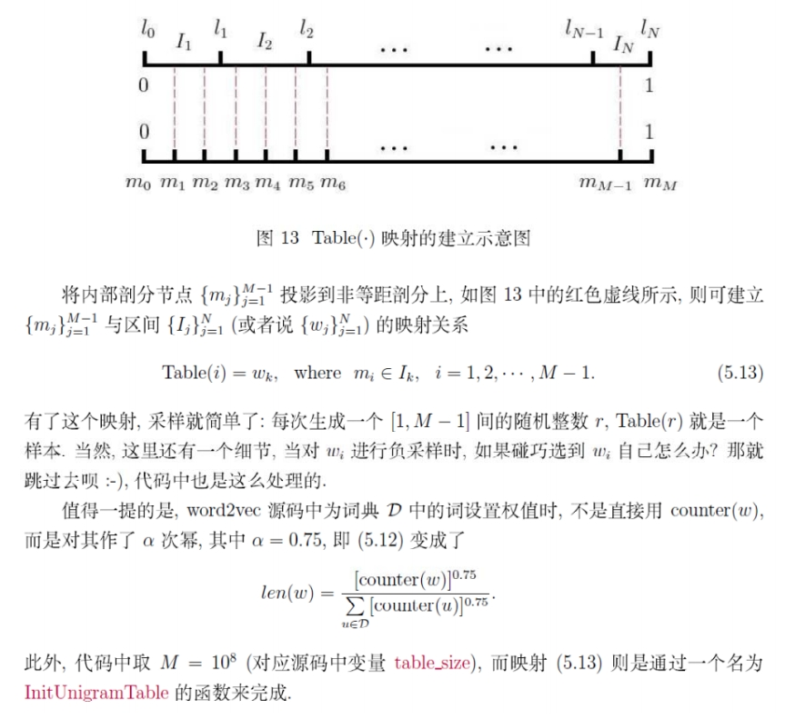

# word2vec 理论理解和确化
本文主要参照了[《word2vec中的数学原理详解》](https://www.cnblogs.com/peghoty/p/3857839.html)，但是文章中对负采样模型中关于目标函数理解的不够到位，后面会谈到。     
想要理解`word2vec`，要对神经网络要有清晰的理解，输出层主要用了 `softmax` 进行了概率化。
首先来说，`word2vec` 使用的是概率模型，和 `n-gram` 从思想上是一样的，都是预测某个词的概率，`n-gram` 模型是用统计的方法预测 $n$ 个连续词的概率，为了简化计算，会做出马尔科夫 $0$ 阶或 $1$ 阶或者 $2$ 阶假设。而 `word2vec` 中，是对条件概率进行建模，`cbow` 模型是求用词语 $w$ 周边的词来预测 $w$，也就是对 $p(w|context(w))$，而 `skip-gram` 模型则是对词 $w$ 周边的词进行预测，即求 $p(context(w)|w)$ 进行预测，具体如何实现，下面慢慢道来。  
要讲 `word2vec` 模型，则绕不开 `Benjio` 等人在《a neural probabilistic laguage model》中提出的语言模型（语言模型就是对词语的概率进行概率建模的模型），这是一个有监督问题，它是用词w的前n个词语（最多可做到n=5）来预测w。

## 神经概率语言模型
用神经网络对 $p(w|context(w))$ 进行建模，其中 $context(w)$ 是 $w$ 的前 $n$ 个词语。对于语料库 $C(corpus)$ 建立词典 $V$，$V$ 一般是语料库中不重复的单词，如果去除停用词，词典就不含停用词，但某些停用词不一定要去除，因为在某些场景下停用词也是有意义的。用 `ont-hot` 来表示词典中每一个词，假设词典 $V$ 的大小是 $N$，那么词典中第 $i$ 个词就是一个维度是 $N\times 1$ 的列向量，该向量中除了第 $i$ 个位置是 `1`，其他元素皆为 `0`。**这就化为了多分类问题，分类数就是 $N$。**    
其网络图是  
  
其中 $\bold v(context(w)_1)$ 是 $w$ 前面 $n$ 个词中第一个词的词向量，维度是 $R^{m\times 1}$。之前说用 `one-hot` 来表示词，为什么输入突然变成了这样一个词向量呢？其实很简单，主要是这个图省略了一步从原始输入(`one-hot`表示) 到 `input` 的这个层，那这个层具体怎么构建？ 将 $w$ 前 $n$ 个词的 `one-hot` 表示的列向量转置后，再一行行放到一个矩阵 $G$ 中，$G$ 的维度就是 $R^{n\times N}$，原始输入到 `input` 层的权重矩阵 $W_o$ 的维度为$R^{N\times m}$，那么`input` 层 $V=GW_o$ 维度就是 $R^{n\times m}$，就是前面说的 $w$ 前面 $n$ 词的词向量。其中要注意的是， $W_o$ 的第 $i$ 行就是第 $i$ 词的词向量，因为每个词都用 `one-hot` 表示，所以第 $i$ 位置处词的 `one-hot` 表示的 $h_i$ 和 $W_o$ 相乘后，正好把 $W_o$ 的第 $i$ 行给提取出来了。  
投影层就是将这 $n$ 个词向量转置后，再一行行的放到一个矩阵 $X_w$ 中。然后就是常规的神经网络的向前传递：  
$$
Z_w = \tanh(WX_w+p) \\
y_w = UZ_w+q
$$
$y_w$ 维度是 $R^{N\times 1}$，即是词典中每一个词的 `score`。通过 `softmax` 转换为概率，再通过交叉熵构造损失函数（和以前一样，词 $w$ 的真实概率可以用`one-hot` 来代替），然后通过梯度下降就可以进行训练了。关键是**由于词典空间 $N$ 很大，造成在输出层 $y_w$ 和 `softmax` 计算量非常大，严重制约了训练速度！**  

## Word2vec 
`word2vec` 是建立在 `Benjio` 算法的基础上，通过一些方法来减少计算量，从而能够很快的得到词向量。具体模型有两个：`CBOW model` 和 `skip-gram model`。在减少计算量上，方法有两种：`hierarchical softmax` 和 `negative sampling`。另外为了减少计算量，还将隐藏层给拿掉了。  

`CBOW` (连续词袋模型)，同样，输入层 $context(w)$ 词向量的由来也省略了原始层和输入层的映射，其权重矩阵的每一行就是对应单词的词向量。`input` 到 `projection`，是将 $context(w)$ 词向量求和，`projection` 到 `output` 没有用 `Benjio` 的全连接，直接就给出了词 $w$ 的预测，这当然是为了减少计算量，但这是怎么做到的？这就用到了 `hierarchical softmax` 和 `negative sampling`。

### CBOW + Hierarchical softmax

从图中可以看到，`projection` 到 `output` 构造了一棵 `Huffman` 树。`huffman` 树也叫最小加权路径算法。与堆的结构相似，但构造过程不同。找出词典中每一个词的词频，以词频作为权重，每个词作为节点，构造 `huffuman ` 树。例如：

以词频作为权重构造 `Huffman` 树是有原因的，明白如何从 `Huffman` 树中求得 $p(w|context(w))$，就知道为何使用词频为权重了。  
`Hierarchical softmax` 就是依靠 `Huffman` 树将原来应该是对 $N$ 个分类应用 `softmax` 的问题，转化为分层的 `Logistics` 问题。具体做法：  
就是给每个节点编码，左子树编码为 `1`，右子树编码为 `0`，这就是 `Huffman` 编码。可以将编码为 `1` 的认为是正类，编码为 `0` 的认为是负类。以上图中“巴西”为例子，令 $w=$ '巴西'，如何预测到 $w$ 呢？从根节点开始，先预测到权重为 `23` 节点正类，然后预测到权重为 `9` 的负类，然后在预测到正类就预测出 $w$ 的概率了。对同一个 $X_w$ 使用 `Logistics` 回归预测过程依次如下：
$$
p(node_{23}) = \sigma ((\theta_1^w)^TX_w) \\
p(node_{9}) = 1-\sigma((\theta_2^w)^TX_w) \\
p(w) = \sigma((\theta_3^w)^TX_w)
$$
那么$p(w|context(w))$ 如何求：
$$
p(w|context(w))=p(node_{23})p(node_9)p(w)
$$
可以看出如果 $w$ 离根节点越远，那么计算 $p(w|context(w))$ 的步骤就越多，不论 $w$ 周围的词怎么样，要计算 $p(w|context(w))$ 所需要的步数是一样的，假设计算步数为 $k$ (上面'巴西'概率计算需要`3`步，k=3)，$w$ 出现的频率为 $n_w$，那么总的计算步数就为 $kn_w$，为了减少计算量，我们将词频出现越高的，那么就离根节点越近，这就是用用词频构造 `Huffman` 的原因。  
计算出 $p(w|context(w))$ 之后，在用交叉熵就可以构造该窗口下的损失函数了，将所有窗口的损失函数求和就是总的损失函数，然后用梯度下降法就可以进行训练了。  

### skip-gram + Hierarchical softmax
有了 `CBOW` 的铺垫，该模型就很好理解了。
这里有一个条件独立假设：
$$
p(context(w)|w) = \prod_{u\in context(w)} p(u|w)
$$
而每一个 $p(u|w)$ 的求法和上面用 `Hierarchical softmax` 是一样的。

### CBOW + Negative sampling
`CBOW` 模型给定 $context(w)$ 预测 $w$，那么 $w$ 就是正样本，不是 $w$ 就是负样本。我们依照一定的采样方法，采样出一定个数的负样本，就叫负采样。
那么 $p(w|context(w))$ 怎么求呢？    

对与投影层的 $X_w$，可以给一个权重向量 $\theta_w$，从而得到分类为 $w$ 的 `score`，如果在给一个权重向量 $\theta_u$，得到分类为 $u$ 词时的 `score`，对字典中的每一个词赋予一个权重向量，就得到了分类关于该词的 `score`，这就右落入了投影层到输出层是全连接，然后用 `softmax` 问题的原点了。  
现在对与投影层的 $X_w$，给一个权重向量 $\theta_w$，得到分类为 $w$ 的 `score`，现在不是取字典中的所有词，而是取负采样的得到的词，对每一个词给一个权重向量 $\theta_u$，得到负采样中每个词的 `score`，接下来是对集合 $W_s=w\cup Neg(w)$ 使用 `softmax` 么？似乎可以，但作者没有这么做，可能是因为负采样过多，计算量也会很大的缘故（自己猜测）。  
~~将$W_s$看做是一个二分类的训练集，然后对这个训练集采用最大似然函数作为目标函数（完全当做二分类问题来做，集合$W_s$中除了w样本为1，其他皆为0)~~ 此处理解有误。
正确的理解是：**将每一个预测结果当成二分类，当预测是w时，其他不是w的都是负类，那么预测w的概率就是$\sigma(\theta_w^TX_w)$，预测负样本中的词u时，将其他不是 $u$ 的词当做负类，那么 $u$ 的概率就是 $\sigma(\theta_u^TX_w)$**，现在我们想要最大化预测 $w$ 词的概率，同时最小预测负采样中词的概率(反过来想，就是最大化 $1-\sigma(\theta_u^TX_w))$，那么很自然想到构造的目标函数就是:
$$
f(W_s)  = \sigma(\theta_w^TX_w) \prod_{u \in Neg(w)}(1-\sigma(\theta_u^TX_w))
$$
对其取负对数就是该窗口的损失函数了，将所有窗口的损失函数加起来，就是总的损失函数，然后用梯度下降法（向后传播）就可以训练了。

### skip-gram + Negative sampling
由中心词 $w$ 预测周围的词 $context(w)$，对每一个要预测的词 $a\in context(w)$，都对其进行负采样得到 $Neg(a)$，然后得到 $f(a\cup Neg(a))$，继而得到目标函数：
$$
F = \prod_{a\in context(w)} f(a\cup Neg(a))
$$
接下来的操作步骤就一样了。

### Negative sampling
上面没有说明是如何进行负采样的，摘录《word2vec中的数学原理详解》，本文大部分都来自这篇文章，并加入了自己的理解，其中关于负采样的部分，《详解》中的解释不对，但是公式是对的。

