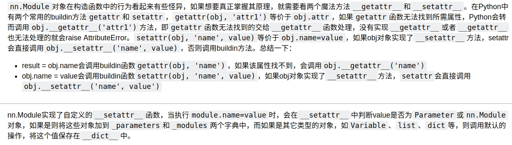

# pytorch 中网络层和权重参数的管理
pytorch 中使用container来管理网络层和权重参数。

## 权重参数

- torch.nn.Parameter()是继承了torch.Tensor类，Tensor类定义了各种关于tensor对象的属性和方法，Parameter对象都可以使用，因为Parameter是用来定义权重参数的，权重参数需要梯度更新，所以tensor中的.data,.grad,.grad_fn在这里很重要。那么Parameter又定义了哪些自己的东西？使得我们使用该类对象管理权重参数更方便呢？  
查看Parameter类源码：
```python
class Parameter(torch.Tensor):
    def __new__(cls, data=None, requires_grad=True):
        if data is None:
            data = torch.Tensor()
    return torch.Tensor._make_subclass(cls, data, requires_grad)
    ...
```
可见，通过Parameter创建的tensor默认实现了requires_grad=True。要注意的是，__new__()才是构造函数，__init__()是初始化函数，__new__()第一个参数是cls，是类，这是因为对象还没有创建，__init__()第一个参数是self，是对象，此时对象已创建，用来初始化函数。  
但是只是默认实现了求导属性，怎么实现管理的？  
权重在forward的时候，是用在各层的Module中的，我们来看看一个具体的例子，nn.Linear()的源代码：
```python
class Linear(Module):
    def __init__(self, in_features, out_features, bias=True):
        super(Linear, self).__init__()
        self.in_features = in_features
        self.out_features = out_features
        self.weight = Parameter(torch.Tensor(out_features, in_features))
        if bias:
            self.bias = Parameter(torch.Tensor(out_features))
        else:
            self.register_parameter('bias', None)
        self.reset_parameters()

    def reset_parameters(self):
        init.kaiming_uniform_(self.weight, a=math.sqrt(5))
        if self.bias is not None:
            fan_in, _ = init._calculate_fan_in_and_fan_out(self.weight)
            bound = 1 / math.sqrt(fan_in)
            init.uniform_(self.bias, -bound, bound)

    def forward(self, input):
        return F.linear(input, self.weight, self.bias)

    def extra_repr(self):
        return 'in_features={}, out_features={}, bias={}'.format(
            self.in_features, self.out_features, self.bias is not None
        )
```
可见，Linear层中对权重的创建使用Parameter来创建，并用何凯明初始化方法对其初始化，并实现了forward函数，实现了对线性层的模块化，不必自己创建权重，初始化权重，并forward。  
但是这还没有体现Parameter类的管理权重参数的优越性，Linear层要是用torch.Tensor来创建weight，不过就要多写一个requires_grad=True而已。  
这里有个问题，那就是我们想实现什么样的权重参数的管理？  
回答这个问题其实不难，那就是我们在哪里用到了权重参数，然后在用到权重参数的时候，如果不用Parameter类的权重对象，处理问题是不是麻烦？如果麻烦，那么就是Parameter类的优化的地方。
- 在forward时使用，我们以nn.linear为例，发现不用Parameter对象也没什么难处，其他层也对应一样。
- 在backward时使用，经过追踪和思考计算图发现，并不需要使用Parameter对象。
- torch.optim时使用，这是一个关键的点，我们要对各层中存在的权重参数进行更新，这个时候就需要一个容器来包含所有的权重参数，这个是用两个生成器.named_parameters()和.parameters()来做到的，前者包含了参数名称和参数数据，后者只是包含参数数据，用于torch.optim。既然是生成器，就可以用for ... in ...来迭代，假设a是某个神经网络：
```python
for name, data in a.named_parameters():
    ...
list(a.parameters())
optimizer = t.optim.SGD(a.parameters())
```

.parameters()和.named_parameters是如何生成的，在网络层管理会讲。

## 网络层管理
这个是理解nn.Module的核心。  
nn.Module 继承python基类object，nn.Module是其他module的基类，自己定义的module都要继承它。Module是什么呢？其实就是网络层的抽象概括，自己定义的类相当于具体的网络层。  
我们的目的是想搞清除，它是如何管理这么多层网络和各层的权重参数的。
我们看看nn.Module源代码初始化函数：
```python
class Module(object):
    def __init__(self):
        self._construct()
        # initialize self.training separately from the rest of the internal
        # state, as it is managed differently by nn.Module and ScriptModule
        self.training = True

    def _construct(self):
        """
        Initializes internal Module state, shared by both nn.Module and ScriptModule.
        """
        torch._C._log_api_usage_once("python.nn_module")
        self._backend = thnn_backend
        self._parameters = OrderedDict()
        self._buffers = OrderedDict()
        self._backward_hooks = OrderedDict()
        self._forward_hooks = OrderedDict()
        self._forward_pre_hooks = OrderedDict()
        self._state_dict_hooks = OrderedDict()
        self._load_state_dict_pre_hooks = OrderedDict()
        self._modules = OrderedDict()  #调用了__setattr__()方法，上面的也一样。

    ...
```
从上面可以看出，初始化函数定义了_parameters,_modules，显然这两个有序字典是来存储权重参数和各层网络的。其中_buffer是用来存储非权重参数，但是每一步都要保存一下，以供下一次使用，已知的就是batchnorm中的running_means，running_vars(用于获得整个训练集的均值和方差，以供测试时候使用)。  
还要知道的一点就是类的生成过程和__setattr__()方法的使用。类是靠__new__()方法来生成实例的(Module中没有定义__new__，那么继承object的)，__init__()是用来初始化的，类中属性的赋值会调用__setattr__()方法，所以在上面初始化中有属性赋值操作，都调用了__setattr__()方法。  
想看._parameters、._modules是如何添加元素的，就要看Module.__setattr__()方法，其源代码:
```python
def __setattr__(self, name, value):
    ...
    params = self.__dict__.get('_parameters')
    if isinstance(value, Parameter):
        ...
        self.register_parameter(name, value)
    else:
        modules = self.__dict__.get('_modules')
        if isinstance(value, Module):
            ...
            modules[name] = value
        ...
```
将上述中用于异常判断处理的用...省略，只是为了突出__setattr__中要实现的内容。从中可以看出，从属性字典__dict__中获得'_parameters'属性，如果是Parameter，符合一定条件就会执行register_parameter()，如果value不是Parameter类，从__dict__中取出'_modules'属性，判断value是Module属性，是的话，就将它加入到self._modules中。但是参数是如何添加到self._parameters中的，上面说道，是调用了register_parameter()，简单的看一下其源码：  

```python
    def register_parameter(self, name, param):
        ...
        if param is None:
            self._parameters[name] = None
        ...
        else:
            self._parameters[name] = param
```
省略了一些对错误的处理的判断语句，可以看出正常情况下，会将我们自己定义的Parameter对象的值添加到self._parameters中。  
举个实际的例子分析一下：
```python
import torch.nn as nn
import torch as t   
import torch.nn.functional as F

class Model(nn.Module):
    def __init__(self):
        super(Model, self).__init__()
        self.conv1 = nn.Conv2d(1, 20, 5)
        self.conv2 = nn.Conv2d(20, 20, 5)
        #self.p = nn.Parameter(t.randn(3,4))

    def forward(self, x):
        x = F.relu(self.conv1(x))
        return F.relu(self.conv2(x))
a = Model()
print(a.__dict__.get('_modules'))
print(a.__dict__.get('_parameters'))
结果：
OrderedDict([('conv1', Conv2d(1, 20, kernel_size=(5, 5), stride=(1, 1))),
             ('conv2', Conv2d(20, 20, kernel_size=(5, 5), stride=(1, 1)))])
OrderedDict()
```
这里a._parameters属性是一个空的有序词典，这个很好理解，a实例化的时候没有给其赋予Parameter类的对象，但是如果上面__init__中注释掉的没有注释的化，自然其结果是：
```python
OrderedDict([('p', Parameter containing:
tensor([[ 0.3750, -0.3608,  3.1453,  0.1194],
        [ 0.0200,  0.0987, -0.6633, -0.1521],
        [-1.1081, -0.7506,  0.9291,  0.7516]], requires_grad=True))])
```
但是conv1和conv2中的权重参数怎么处理的？我们用：
      ```python
        print(list(a.parameters()))  # a.parameters是一个生成器
        ```
发现里面有这两个层的权重参数，这是怎么做到的？  

查看Module类中parameter方法源代码：
```python
    def parameters(self, recurse=True):
        for name, param in self.named_parameters(recurse=recurse):
            yield param
```

显然是利用了self.named_parameters()，然后只取了其中的参数，把名字丢掉，构造出parameter生成器。那么看看self.named_parameters()原代码：
```python
    def named_parameters(self, prefix='', recurse=True):
        gen = self._named_members(
            lambda module: module._parameters.items(),
            prefix=prefix, recurse=recurse)
        for elem in gen:
            yield elem
```
这里用了self._named_members()，其中用了lambda module: module._parameters.items()，这里应该是将所有的模块(各网络层)中的parameter都添加进来。我们再来看看self._named_members()源代码：

```python
    def _named_members(self, get_members_fn, prefix='', recurse=True):
        r"""Helper method for yielding various names + members of modules."""
        memo = set()
        modules = self.named_modules(prefix=prefix) if recurse else [(prefix, self)]
        for module_prefix, module in modules:
            members = get_members_fn(module)
            for k, v in members:
                if v is None or v in memo:
                    continue
                memo.add(v)
                name = module_prefix + ('.' if module_prefix else '') + k
                yield name, v
```

这里可以看到，我们在上面调用的时候，将get_members_fn的实参用的是上面说的lambda函数。_named_members()先通过self.named_modules将所有子module取出来，然后通过lambda函数，将各个子module(各网络层)中的_parameters拿出来，构造生成器_named_members，这里面包含了所有子模块的_parameters，**也就是说，我们只要把所有的模块添加到self.named_modules中，便可以把所有模块的参数添加到_named_members生成器中，从而添加到self.named_parameters()中**。但是上面我们通过一个实例还有对register_parameter分析，a.parameters()中包含了所有层的权重参数，a.__dict__['_parameters']是为空OrderedDict，但是__dict__函数是分层管理属性的，就是父类中的属性父类有，子类中的属性只包含子类的，不包含父类的，子类的实例只是实例的属性，不包含子类中的类属性。所以a.__dict__就不会包含conv1.__dict__中的属性。  
```python
print(a.conv1._parameters)   # 几乎等同于a.conv1.__dict__['_parameters']
结果：
OrderedDict([('weight', Parameter containing:
            ...),
        ('bias', Parameter containing:
        ...)])
```
注释语句有个几乎等同的问题，后面会谈到。  
那么子模块权重参数是什么时候添加到._parameters中的？我们来看一下Conv2d的源代码：
```python
class Conv2d(_ConvNd):
    def __init__(self, in_channels, out_channels, kernel_size, stride=1,
                 padding=0, dilation=1, groups=1,
                 bias=True, padding_mode='zeros'):
        kernel_size = _pair(kernel_size)
        stride = _pair(stride)
        padding = _pair(padding)
        dilation = _pair(dilation)
        super(Conv2d, self).__init__(
            in_channels, out_channels, kernel_size, stride, padding, dilation,
            False, _pair(0), groups, bias, padding_mode)

    def conv2d_forward(self, input, weight):
        if self.padding_mode == 'circular':
            expanded_padding = ((self.padding[1] + 1) // 2, self.padding[1] // 2,
                                (self.padding[0] + 1) // 2, self.padding[0] // 2)
            return F.conv2d(F.pad(input, expanded_padding, mode='circular'),
                            weight, self.bias, self.stride,
                            _pair(0), self.dilation, self.groups)
        return F.conv2d(input, weight, self.bias, self.stride,
                        self.padding, self.dilation, self.groups)

    def forward(self, input):
        return self.conv2d_forward(input, self.weight)
```
这里conv2d继承了_ConvNd，它是各种卷积模块的父类，查看源代码会发现，它继承了nn.Module，所以也就是说，conv2d也继续了nn.Module，为了说明清晰，将_ConvNd代码阉割版放在下面：

```python
class _ConvNd(Module):
    def __init__(self, in_channels, out_channels, kernel_size, stride,
                 padding, dilation, transposed, output_padding,
                 groups, bias, padding_mode):
        super(_ConvNd, self).__init__()
        ...
        if transposed:
            self.weight = Parameter(torch.Tensor(
                in_channels, out_channels // groups, *kernel_size))
        else:
            self.weight = Parameter(torch.Tensor(
                out_channels, in_channels // groups, *kernel_size))
        if bias:
            self.bias = Parameter(torch.Tensor(out_channels))
```

可见，self.weight使用Parameter实例化的，赋值操作会调用Module中的__setattr__，然后调用其中的register_parameter，将权重参数weight和bias添加到模块的._parameters有序字典属性中。分析到这里，基本上一个神经网络，如何管理各层权重参数的就基本差不多了。  
但是如何管理各个模块的，在._named_members中提到了.named_modules，显然这是一个将一个神经网络所有的子模块都添加到其中的生成器，和.named_parameters是对应的，后者是将一个神经网络中各个子模块(各层)的要学习的权重参数都汇集在一起的生成器。各自对应的还有.modules和.parameters两个生成器，前者生成器包含了name,后者没有。  
我们来看一下.named_modules源代码：
  
```python
    def named_modules(self, memo=None, prefix=''):
        if memo is None:
            memo = set()
        if self not in memo:
            memo.add(self)
            yield prefix, self
            for name, module in self._modules.items():
                if module is None:
                    continue
                submodule_prefix = prefix + ('.' if prefix else '') + name
                for m in module.named_modules(memo, submodule_prefix):
                    yield m
```

首先是将本层加入到生成器中，是在._modules有序词典中，提出本模块._modules,然后通过递归，取出所有嵌套的子模块module。而._modules有序词典中各模块的加入，前面已经说过，是通过__init__初始化赋值操作调用了__setattr__，从而实现将各模块添加到有序词典中的。**那么就会形成modules管理的平行模式，这和类中的__dict__分层管理属性是不一样的！嵌套的模块是一个模块，内部的每一实例都有各自的.modules()，会平行的存在.named_parameters()生成器中**。以上面的例子，我们继续：
```python
print(list(a.named_modules()))
结果：
[('', Model(
    (conv1): Conv2d(1, 20, kernel_size=(5, 5), stride=(1, 1))
    (conv2): Conv2d(20, 20, kernel_size=(5, 5), stride=(1, 1))
  )),
 ('conv1', Conv2d(1, 20, kernel_size=(5, 5), stride=(1, 1))),
 ('conv2', Conv2d(20, 20, kernel_size=(5, 5), stride=(1, 1)))]

print(a)   #打印出a对应的module
结果：
Model(
  (conv1): Conv2d(1, 20, kernel_size=(5, 5), stride=(1, 1))
  (conv2): Conv2d(20, 20, kernel_size=(5, 5), stride=(1, 1))
)

print(a.conv1)   #打印出b对应的module
结果：
Conv2d(1, 20, kernel_size=(5, 5), stride=(1, 1))
```
可见，通过self.named_modules()将网络层平行管理。谈到nn.Sequential 这个容器的时候，还会谈到这一点。
现在回头来说这样一个问题，就是上面提到的a.conv1._parameters几乎等同于a.conv1.__dict__['_parameters']，这是因为Python中属性的调用，a.conv1._parameters就会调用Python的内置方法：getattr函数，该函数从a.conv1.__dict__中查找，但是如果属性不存在，那么就会调用.__getattr__函数处理。  
补充一点Python的知识：


## 梳理nn.Module的架构

## 关于nn.Sequential的理解
为了创建网络方便，我们会使用nn.Sequential 容器，我们来看看部分源码：
```python
class Sequential(Module):
    def __init__(self, *args):
        super(Sequential, self).__init__()
        if len(args) == 1 and isinstance(args[0], OrderedDict):
            for key, module in args[0].items():
                self.add_module(key, module)
        else:
            for idx, module in enumerate(args):
                self.add_module(str(idx), module)
    ...
    def forward(self, input):
        for module in self._modules.values():
            input = module(input)
        return input
```
nn.Sequential 继承了Module 类，初始化参数是*arg，在具体的时候就是一个网络的各个层，通过调用Module类中的.add_module()方法把各个层加入到.modules中，另外Sequential内部的各模块，在赋值都的时候会调用__setattr__，其中会把本module加入到对应各自的实例中。看一下.add_module() 源码：

```python
    def add_module(self, name, module):
        ...
        self._modules[name] = module
```

从上面可以看出，直接将各个类加入到Sequential的实例中。  
要清楚的事，最终还是要通过.named_modules()生成器将所有的module平行管理。下面看一个例子：
```python
class Net(nn.Module):
    def __init__(self):
        super(Net, self).__init__()
        self.layers = nn.Sequential(
                    nn.Conv2d(3,3,3),
                    nn.BatchNorm2d(3),
                    nn.ReLU())
a = Net()
print(list(a.modules()))
结果：
[Net(
  (layers): Sequential(
    (0): Conv2d(3, 3, kernel_size=(3, 3), stride=(1, 1))
    (1): BatchNorm2d(3, eps=1e-05, momentum=0.1, affine=True, track_running_stats=True)
    (2): ReLU()
  )
), Sequential(
  (0): Conv2d(3, 3, kernel_size=(3, 3), stride=(1, 1))
  (1): BatchNorm2d(3, eps=1e-05, momentum=0.1, affine=True, track_running_stats=True)
  (2): ReLU()
), Conv2d(3, 3, kernel_size=(3, 3), stride=(1, 1)),
    BatchNorm2d(3, eps=1e-05, momentum=0.1, affine=True, track_running_stats=True),
    ReLU()]
```

## 补充： pytorch 中计算图是如何构建的
tensor中有三个重要的属性：data,grad,grad_fn：
- data: 就是tensor中包含的张量数据
- grad : 是最终损失对tensor在取data时候的梯度
- grad_fn：记录tensor的运算操作依赖，对于叶子节点，因为没有依赖，所以grad_fn是None。
在forward的时候，记录了每一个运算得到的张量的grad_fn，直到损失函数，形成一张倒立的有向无环图，损失函数在最低端，箭头的指向就是靠grad_fn实现的。具体一个例子：
```python
a = t.rand(3,4, requires_grad=True)
print(a.grad_fn)  # None
b = t.randn(4,3)
c = a.matmul(b)
print(c.grad_fn)  #<MmBackward at 0x7f7d2b97eb70>
e = d.sum()
print(e.grad_fn)   # <SumBackward0 at 0x7f7d2b97e9b0>
e.backward()
a.grad
结果：
tensor([[-8.8376, -2.0713, -1.6496,  1.4591],
        [-8.8376, -2.0713, -1.6496,  1.4591],
        [-8.8376, -2.0713, -1.6496,  1.4591]])
a.data
结果：
tensor([[9.9019e-02, 9.3674e-01, 6.4009e-02, 4.3232e-01],
        [7.2350e-01, 3.0885e-01, 7.6169e-04, 5.3847e-01],
        [3.0793e-01, 1.4828e-01, 3.0258e-01, 8.2147e-01]])
c.grad
结果：
None
```
其中，中间节点的梯度(例如c.grad)在backward后会清除，要想获取中间节点梯度，有钩子技术。

