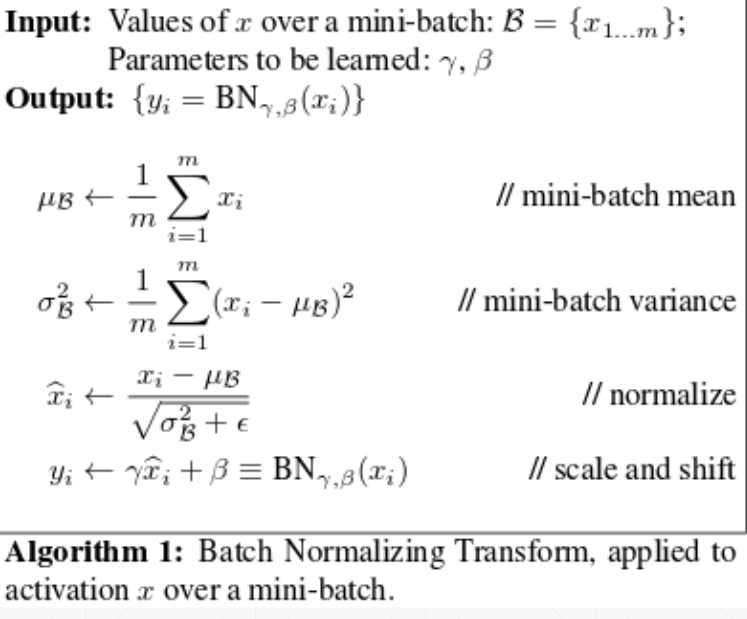
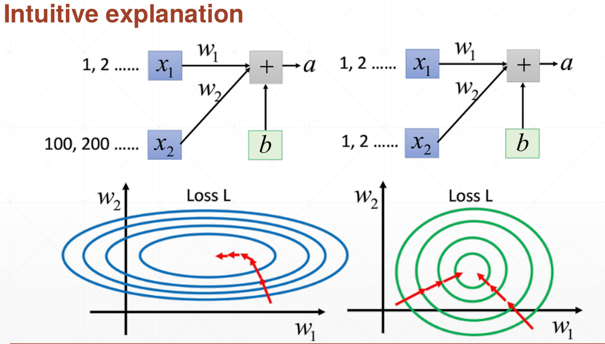

# 补充
- batch normalization 的作用：  
将数据标准化，使得数据规范化为均值为0，方差为1，然后通过缩放和平移，将数据变为方差是$\gamma$，均值是$\beta$。
在具体的实施中，我们是对批标准化的，在将数据标准化为(0,1)后，数据聚集在0附近，如果使用sigmoid型激活函数，在0附近的取值区间刚好是接近线性变化的，那么就减弱了神经网络的非线性性质。为了减弱归一化对网络表示能力的负面影响，可以通过附加的缩放和平移变换改变数据取值区间：

作用从两方面解释:
    - 如果激活函数是sigmoid函数，sigmoid 函数在(-6,6)以外的地方，梯度接近于0，这些节点对对应的权重参数更新幅度很小，会发生梯度消弭，但当把数据都标准化为在0附近的时候，就会缓解梯度消弭的问题；
    - 如果数据不做normalization，那么某一层中可能会出现各节点大小出现数量级的差距，那么在进行梯度更新的时候，有些梯度变化差距可能很大，这就找造成了损失函数与权重参数的的投影是一个扁平形状，参照下图。那么初始化位置的不同，造成优化的路径有长有短，收敛时间慢，有的甚至发散，标准化后，则会个方向同性，初始化在任何地方，都可以较快的收敛，见图例：

从图中可以看出，当不初始化的时候，在$w_1$方向梯度变化小，在$w_2$方向梯度变化大，可以看到，优化的路径初始在$w_2$方向较快，然后在$w_1$方向有一个较长的缓慢的过程，标准化后，数据量级接近，那么在梯度更新的时候，更新的步长差不多，在有好的权重初始化的情况下，那么在各个方向的梯度都接近，函数的等高线呈现的是一个圆形，从各个方向优化都比较快。

- pytorch中batch normalization 的实施
在训练集的时候按照上面方式进行标准化，其中上面的参数$\gamma$和$\beta$是要学习的，当训练完成以后，测试的时候，如何进行标准化呢？对于测试的操作，我们可以批处理，也可以单个单个的处理，其均值和方差使用什么呢？其实使用的是训练时候每一批均值和方差的滑动平均，在pytorch中是通过一个参数momentum保存每个连续计算的batch的均值和方差的：
$$
x_{new} = (1-momentum)\times x_{old} + momentum\times x_n
$$
其中$x_{old}$是上一批的滑动平均后的均值和方差，$x_n$是当前批的均值和方差，训练完成后，得到的$x_{new}$可以当做是整个训练集合的均值和方差，这个均值和方差就当做测试集合的均值和方差，在用上缩放和平移，就实现了测试集的标准化。
```python
x = t.rand(4,1,3,2)
layer = nn.BatchNorm2d(1)
out = layer(x)
vars(layer)
输出的结果：
{'_backend': <torch.nn.backends.thnn.THNNFunctionBackend at 0x7f7d2cae3ba8>,
 '_parameters': OrderedDict([('weight', Parameter containing:
               tensor([1.], requires_grad=True)),
              ('bias', Parameter containing:
               tensor([0.], requires_grad=True))]),
 '_buffers': OrderedDict([('running_mean', tensor([0.0590])),
              ('running_var', tensor([0.9063])),
              ('num_batches_tracked', tensor(1))]),
 '_backward_hooks': OrderedDict(),
 '_forward_hooks': OrderedDict(),
 '_forward_pre_hooks': OrderedDict(),
 '_state_dict_hooks': OrderedDict(),
 '_load_state_dict_pre_hooks': OrderedDict(),
 '_modules': OrderedDict(),
 'training': True,
 'num_features': 1,
 'eps': 1e-05,
 'momentum': 0.1,
 'affine': True,
 'track_running_stats': True}
```
其中，均值是0.059, rand是(0,1)均匀分布，均值应该是0.5，我们用的是生成的数据做均值，也应该在0.5附近，是0.059的原因是，running_mean是训练集的整体均值，第一批运算，就要用(1-moment)乘以当前的均值，以后的照着上面的公式运算。这里的weight是$\gamma$，bias是$\beta$，其中affine是说明当前有学习的仿射变化参数，就是weight和bias。

- batchnorm、dropout、instancenorm 在训练和测试阶段的区别
    - batchnorm : ~~批归一化的意义在于更新权重的时候，各节点的对应的权重更新步长不差距太大，对于测试阶段，不需要求梯度，也就没必要进行归一化了。~~ 在训练阶段，每一批要用自己的数据求出均值和方差，然后rescale和shift。其中rescale和shift对应的参数需要通过梯度更新进行学习；在测试阶段，均值和方差使用的是训练集整体的滑动平均的得到的均值和方差，rescale和shift参数使用训练得到的，所以训练和测试差别很大的。
    - dropout ： 目的是为了训练的时候通过随机失活从而训练的时候，相当于训练许多网络进行平均，从而避免过拟合；但是在测试阶段，我们没必要让某些权重的贡献为0，要是如此，何必训练那么多参数呢？训练出的参数代表了某一定的信息，如果在测试阶段还使用dropout，那么将丢失一部分信息，预测精度会比不使用的时候要低。

- nn.Module模块参数的初始化和nn.init的关系


- nn.Module 的训练和测试网络的转换
这个train和eval各自状态是什么？切换后哪些状态发生变化？
    - model.train()

    - model.eval()

- 模型的保存、加载
    - 保存：
    ```python
    torch.save(net.state_dict(), './xxx.mdl')  # model的扩展名写成.mdl值得学习
    ``` 
    - 加载：
    ```python
    net.load_state_dict(torch.load('./xxx.mdl'))
    ```

- nn 和 autograd 的关系

- 输入数据的存储格式和权重参数的格式
$$
y = XA^T + b
$$
这里的权重$A$布局为$(out_f, in_f)$，其中f表示特征数目，那么X布局就是$(N,*,in_f)$，其中N表示批中样本个数，*是通道数目。  
要注意，使用nn模块的时候，为了更好的看清forward，其输入参数是$(in_f, out_f)$：
```python
class Linear(Module):
    def __init__(self, in_features, out_features, bias=True):
        super(Linear, self).__init__()
        self.in_features = in_features
        self.out_features = out_features
        self.weight = Parameter(torch.Tensor(out_features, in_features))
        if bias:
            self.bias = Parameter(torch.Tensor(out_features))
        else:
            self.register_parameter('bias', None)
        self.reset_parameters()

    def reset_parameters(self):
        init.kaiming_uniform_(self.weight, a=math.sqrt(5))
        if self.bias is not None:
            fan_in, _ = init._calculate_fan_in_and_fan_out(self.weight)
            bound = 1 / math.sqrt(fan_in)
            init.uniform_(self.bias, -bound, bound)

    def forward(self, input):
        return F.linear(input, self.weight, self.bias)
    ...
```
从上面可以看到，self.weight维度恰好是Linear.__init__中参数反过来的。     
forward 中使用了nn.functional.linear()函数，linear函数是定义在functional.py中的一个函数：linear()
```python
def linear(input, weight, bias=None):
    if input.dim() == 2 and bias is not None:
        # fused op is marginally faster
        ret = torch.addmm(bias, input, weight.t())
    else:
        output = input.matmul(weight.t())
        if bias is not None:
            output += bias
        ret = output
    return ret
```
运算的时候进行了转置

- torch.Tensor.backward 和 torch.autograd.backward的关系：
```python
class Tensor(torch._C._TensorBase):
    ...
    def backward(self, gradient=None, retain_graph=None, create_graph=False):
        torch.autograd.backward(self, gradient, retain_graph, create_graph)
    ...
```
可见是前者的backward中调用了后者。值得注意的是，Tensor类(pytorch中最基本的类，继承的不是python中的基类object，而是像是用C来编写的一个类)
autograd 是 torch 下的一个包，其中定义了两个求导函数：
```python
def backward(tensors, grad_tensors=None, retain_graph=None, create_graph=False, grad_variables=None):
    ...

def grad(outputs, inputs, grad_outputs=None, retain_graph=None, create_graph=False,
         only_inputs=True, allow_unused=False):
    ...
```
前者是用于计算图中对叶子节点(权重参数)求导，后者是计算outputs对输入inputs求导。
